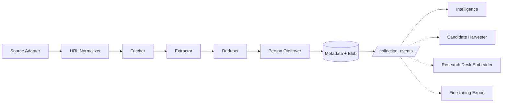
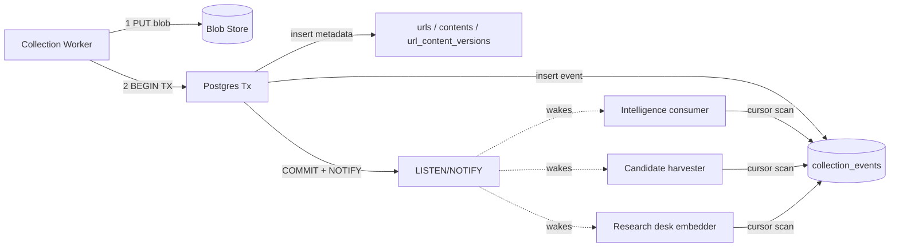

# Collection

Herald's collection layer is the foundation of the entire system. It continuously ingests content from across the C++ ecosystem - web pages, RSS feeds, mailing lists, GitHub, Reddit, Discourse, Slack - and stores it in a form that every downstream layer can consume. Collection is pure Python with no LLM involvement. It fetches, extracts, deduplicates, detects changes, observes person mentions, and emits a stream of events that downstream consumers (intelligence, source curation, the research desk, the fine-tuning pipeline) read at their own pace.

This document is written for the engineer who will implement the collection layer. It covers what we collect, how the pipeline flows, what the data looks like, which libraries we use and why, and how the code is organized.



## What we collect and why

### Scope: everything, public and private

Herald ingests from every source class relevant to the C++ ecosystem:

- General web (news, blogs, vendor pages, conference sites, GitHub)
- RSS / Atom feeds
- Sitemaps
- Public mailing lists (Boost dev, std-proposals, std-discussion)
- **Private mailing lists / reflectors** (WG21 ext, lib-ext, core, numbered SGs)
- MCP servers (existing `user-pinecone-search-private`, `user-slackdump`, `user-github`)

Herald has no qualms about private sources because it is operated by the principal, not by a third party. The collection layer treats all sources uniformly: each produces `(canonical_url_or_uri, raw_bytes_or_text, content_type, metadata)`. Source adapters live behind a common interface so adding "another reflector" or "another MCP index" does not touch the rest of the system.

Private-source content carries a `visibility` column (`public`, `private`, or `restricted`) from the moment it enters the system. Collection does not gate on visibility - it stores everything. Downstream layers (the writer, the fine-tuning pipeline) are responsible for respecting visibility when they decide what to quote, what to publish, and what to train on.

### No LLM in collection

The fetcher, URL normalizer, deduper, change detector, RSS parser, mailing-list ingester - all classical Python. **LLMs enter only at the writer layer and at the source-curation Feed Proposer.** This matches the existing wg21-paperflow discipline: mechanical parts are mechanical, analytical parts are LLM, the seam between them is explicit.

### Operating model

Herald is one of paperflow's continuous outputs, alongside Agora and per-person Dossiers. Three properties inherited from paperflow's operating model shape how collection works:

**Always-on, never bursty.** Herald's primary workers are long-lived Python processes, not cron-fired scripts. They block on Postgres `LISTEN/NOTIFY` against the `collection_events` channel, wake on events, drain a batch, and go back to sleep. Procrastinate is still useful for periodic crawls (nightly sitemap sweep, hourly RSS poll) but those are secondary; the main loop is event-driven.

**Hardware is owned and runs 24/7.** Throughput, reliability, and data sovereignty are the optimization targets; cost-per-token is not a decision input. Replaying all `collection_events` from id=0 after an extractor upgrade is fine - throughput exists for it.

**Continuous ingestion is also the fine-tuning corpus.** Every input Herald collects is dual-use: it serves the writer in near-real-time AND it is training data for the specialist fleet. The `visibility` column on `contents` becomes load-bearing here - private reflector posts may feed internal-use specialist training while being forbidden from public articles. Aging out old `collection_events` is a question about training-data retention, not just operational hygiene.

## How the pipeline works

The collection pipeline breaks down into nine components, each with a single responsibility. None of them touches an LLM. All depend only on `StorageBackend`, the abstract base class that lets collection run against SQLite in dev and Postgres in prod without code changes.

| Component | Responsibility |
|---|---|
| Source adapter | Turn a source (RSS, sitemap, mbox, MCP, raw URL) into a stream of fetch candidates |
| URL normalizer | Syntactic + canonical-form normalization, alias resolution |
| Fetcher | Polite HTTP with conditional GET, robots.txt, per-host rate limiting |
| Extractor | HTML/email -> clean text + structured metadata (title, byline, publish date) |
| Deduper | Content-hash-based dedup, mirror collapse |
| Person observer | Mechanical name/handle lookup against person tables; insert pending candidates for downstream identity resolution |
| Metadata store | URL records, content records, fetch history, watches, person observations |
| Blob store | Raw bytes by sha256 |
| Scheduler | Decides what to fetch next, when to revisit |

The following sections describe the three most architecturally significant contracts in the pipeline: how we detect that content has changed, how we tell downstream consumers about it, and how we observe person mentions.

### Change detection

Every time the fetcher checks a URL, the result falls into one of four categories. This contract is the foundation of the event system - everything downstream depends on the fetcher classifying correctly.

- **Unchanged** - the server returned 304, or the fetched body hashes to the same `content_hash_raw` we already have. We update `last_checked_at` and move on. Nothing else changes.

- **Cosmetic change** - `content_hash_raw` differs (the raw bytes changed) but `content_hash_text` matches (the extracted plaintext is identical). This happens constantly: ad rotation, view counters, session tokens in the HTML, layout tweaks. We update timestamps but do not insert a new `url_content_versions` row, because the meaningful content has not changed.

- **Real change** - `content_hash_text` differs. This is the interesting case. We insert a new `contents` row (or link to an existing one if the same text appeared at a different URL), append to `url_content_versions`, bump `change_count`, and blob-store the new raw bytes.

- **Failure** - non-2xx status, timeout, or robots-disallowed. We update `status_last` and schedule a retry with exponential backoff.

The key design choice here is that **change detection operates on canonicalized plaintext, never on raw HTML.** We adopt the urlwatch/changedetection.io pattern: filter first (strip ads, navigation, boilerplate via the extractor), then diff. Diffing raw HTML produces nothing but noise. For detecting what specifically changed within a real change, we use paragraph-hash diffing on the canonicalized text, plus a correction-keyword regex to flag "correction," "update," "editor's note" insertions.

### Collection events

The collection layer's outputs are consumed by multiple downstream systems: the intelligence layer, the source-curation candidate harvester, the research desk embedder, and the fine-tuning export pipeline. All of them need to answer the same question: "what's new since I last looked?" Rather than have each consumer poll `url_content_versions` and figure out what changed, the collection layer emits an explicit **event log** using the transactional outbox pattern.

Every meaningful thing that happens during a fetch produces an event row in `collection_events`:

| Kind | When emitted | Payload |
|---|---|---|
| `content_first_seen` | A new content_hash never seen before | url_id, content_hash_text, source_id |
| `content_changed` | An existing URL now has a different content_hash_text | url_id, old_hash, new_hash |
| `url_disappeared` | A URL that previously returned content now 404s / 410s | url_id, status |
| `url_resurrected` | A previously-disappeared URL returns content again | url_id, new_content_hash |
| `candidate_observed` | An outbound link or feed reference seen in extracted content | candidate_url, observed_in_content_hash, source_id |
| `content_re_extracted` | A batch reprocess upgraded an extractor on existing raw bytes | content_hash_old, content_hash_new |
| `person_candidate_observed` | A name/handle in extracted content matched or partially matched a person | candidate_id, person_id (nullable), content_hash_text |

**The order of operations within a single fetch matters.** Getting this wrong means consumers see inconsistent state.



1. **Write the blob first**, content-addressed by sha256. This is idempotent: if the hash already exists, it's a no-op.
2. **Then a single Postgres transaction** writes the metadata rows (urls, contents, url_content_versions) AND the corresponding event row(s), then commits.
3. **Postgres NOTIFY** wakes any listening consumers.

This is **atomic at the consumer boundary**: a consumer never sees an event whose blob is missing, and never sees metadata without a matching event. The only failure mode is "blob exists but no metadata" (the transaction failed after the blob write), which is a harmless leak. A periodic GC sweep deletes any blob whose hash does not appear in any `contents` row after N days.

**Every consumer follows the same loop:**

```python
def consume_collection_events(name):
    cursor = get_cursor(name)
    while True:
        events = (
            collection_events
            .where(id > cursor)
            .order_by(id)
            .limit(BATCH_SIZE)
        )
        if not events:
            wait_for_notify_or_timeout(60)
            continue
        for event in events:
            process(event)
            cursor = event.id
        update_cursor(name, cursor)
```

This shape has four properties that matter:

- **Adding a new consumer is trivial.** Insert a row into `consumer_cursors`, write a `process(event)` function. The collection layer does not change at all.
- **Replays work for free.** Reset a consumer's cursor to 0 and it reprocesses the entire history. This is how you handle "we changed the topic-clustering heuristic, re-derive all topics" or "extractor upgrade, re-emit everything."
- **Lag is observable.** `MAX(collection_events.id) - cursor` per consumer is a Prometheus gauge. If intelligence falls behind by 50k events, the dashboard shows it immediately.
- **No backpressure needed.** A 100k-event backfill produces 100k more rows; the consumer catches up over minutes or hours; nothing breaks. Old events can be partitioned by month if the table grows past tens of millions of rows.

**The known consumers are:**

| Consumer | Cursor name | Reads events | What it does |
|---|---|---|---|
| Intelligence | `intelligence` | `content_first_seen`, `content_changed` | Fires watches, builds topics, assembles evidence packages |
| Candidate harvester | `candidate_harvester` | `content_first_seen` | Scans extracted content for outbound links, populates `candidate_sources` for the source-curation pipeline |
| Research desk embedder | `research_desk` | `content_first_seen`, `content_changed` | Paragraph-chunks extracted text, embeds each chunk, inserts into the `research_chunks` table (pgvector). This builds the semantic index that the writer's brief builder and journalist personas query during article generation |
| Fine-tuning export | `finetune_export` | `content_first_seen` | Filters on `contents.visibility`, writes batched training files for the specialist fleet. Private content may train internal-use specialists but is gated for public-corpus training sets |

### Person observation

After extraction, the collection layer runs a mechanical person-observation pass. This is pure Python, no LLM. The goal is to notice when a known person appears in content and flag it for downstream identity resolution.

1. Scan extracted text for names and handles.
2. Query `person_name_variant` and `person_handle` for candidates.
3. Unique-handle matches (GitHub username, ORCID) or email-domain + exact family name are strong enough to auto-link without further verification.
4. Ambiguous matches (common names, partial matches) produce a `person_pending_candidate` row. The intelligence layer's fine-tuned classifier does the actual identity resolution - collection just flags the candidates.
5. Emit a `person_candidate_observed` event so the intelligence layer knows to look.

After identity is confirmed by the intelligence layer, collection records the consequences:

6. `record_person_event(person_id, event_kind, headline, content_id)` - append to the person's event history.
7. `update_affiliation(person_id, organization_id, role, content_id)` - insert or close affiliation rows.
8. `update_committee_role(person_id, group_code, role, content_id)` - same pattern for WG21 roles.

Collection never writes `person.one_line_summary` or `person_claim` - those are writer-layer concerns that require an LLM.

## Data model

### Storage split: metadata vs blobs

Herald stores two fundamentally different kinds of data, and they live in different places for good reasons.

**Metadata** is the structured stuff you query against: URLs, titles, content hashes, timestamps, person records, editorial state. It lives in Postgres (shared with wg21.org in production, SQLite locally via the `StorageBackend` ABC). It is small, indexed, and queryable.

**Blobs** are opaque piles of bytes: raw HTML, PDFs, mbox files, Slack JSON exports. They live in a content-addressed blob store - a filesystem folder in dev (`blobs/ab/cd/abcdef...`), Cloudflare R2 in prod. The database row holds a sha256 pointer to the blob, not the blob itself. `fsspec` abstracts the storage backend; swapping dev to prod is one config line.

Herald uses R2 in production primarily as an off-site disaster-recovery copy of the corpus, given that paperflow otherwise runs entirely on owned hardware. R2's egress-free pricing is a side benefit, not the reason for choosing it.

| What | Where | Why |
|---|---|---|
| Raw HTML / mbox / RSS XML / PDFs / images / Slack JSON | Blob store (R2) | Big, immutable, rarely re-read |
| LLM traces and debug transcripts | Blob store (R2) | Big, immutable, only for retrospection |
| URL metadata, content hashes, fetch status | Postgres | Small, queryable, indexed |
| Extracted article text (post-trafilatura) | Postgres | Small, full-text-searchable |
| Briefs, drafts, published articles | Postgres | Small markdown, queryable, edited |
| Topics, persons, sources, editorial actions | Postgres | Pure metadata |

We keep raw bytes after extraction for two reasons: (a) extractors improve, and re-running a future trafilatura over the archive needs the originals; (b) provenance - "show me the exact bytes we extracted this quote from" requires the raw HTML.

### Schema

The schema below covers the tables that collection owns and writes to. Non-collection tables (topics, briefs, drafts, editorial actions) are defined in the writer and editorial specs but included here for completeness because they share the same database.

```
collection_events
  id              BIGSERIAL PK
  kind            (content_first_seen | content_changed | url_disappeared
                   | url_resurrected | candidate_observed | content_re_extracted
                   | person_candidate_observed)
  payload_jsonb
  created_at
  -- idx: (id), (kind, created_at)

consumer_cursors
  consumer_name   PK
  last_processed_event_id
  last_processed_at

sources
  id              SERIAL PK
  kind            (web | rss | sitemap | mbox | mcp | reflector)
  config_json
  enabled         BOOLEAN
  last_swept_at
  access_state    (open | partial | blocked-by-edge | blocked-by-robots | requires-signed-requests)

urls
  id              SERIAL PK
  url_syntactic   UNIQUE
  url_canonical
  source_id       FK -> sources
  first_seen_at
  last_fetched_at
  last_checked_at
  etag
  last_modified
  fetch_count
  change_count
  status_last
  revisit_after
  robots_allowed  BOOLEAN

contents
  content_hash_text   PK (sha256 of extracted text)
  content_hash_raw    (sha256 of raw bytes)
  title
  byline
  publish_date
  language
  content_type        (post | email | announcement | discussion | transcript | paper | release)
  extracted_text_blob_key
  raw_blob_key
  source_kind
  first_seen_at
  visibility          (public | private | restricted)

url_content_versions
  url_id          FK -> urls
  content_hash_text   FK -> contents
  seen_at
  -- one row per observed change at a URL
```

The `urls` / `contents` split is the key structural decision. It gives dedup-across-mirrors for free: 40 outlets reprinting the same wire story produce 40 `urls` rows all pointing to 1 `contents` row. This matters because syndication is pervasive in news and the alternative (storing the same extracted text 40 times) wastes space and makes dedup queries expensive.

**Person tables** (collection writes to these; full schema is in the people-tracking design):

```
person
  person_id       UUID PK
  canonical_name
  preferred_prose_name
  status          (active | lapsed | emeritus | deceased | unknown)
  deceased_on     DATE nullable
  primary_domain
  one_line_summary
  tsv             tsvector

person_name_variant
  person_id       FK -> person
  variant_text
  variant_kind    (legal | nickname | byline | transliteration | former)
  -- unique on variant_text_normalized (generated: lowercase, diacritics stripped)

person_handle
  person_id       FK -> person
  platform        (github | mastodon | bluesky | x | linkedin | orcid | website)
  handle
  -- unique on (platform, handle)

person_pending_candidate
  candidate_id    SERIAL PK
  observed_name
  observed_context
  observed_handles
  observed_email_domain
  content_id      FK -> contents
  first_seen
  last_seen
  resolution_status

person_event
  event_id        SERIAL PK
  person_id       FK -> person
  occurred_on
  event_kind
  headline
  body_md
  content_id      FK -> contents
  article_id      FK nullable
  created_at

person_affiliation
  person_id       FK -> person
  organization_id FK -> organization
  role
  started_on
  ended_on        nullable
  content_id      FK -> contents

person_committee_role
  person_id       FK -> person
  group_code
  role
  started_on
  ended_on        nullable
  content_id      FK -> contents

watches
  id              SERIAL PK
  person_id       FK -> person
  query_terms_json
  cadence
  last_run_at

watch_snapshots
  id              SERIAL PK
  watch_id        FK -> watches
  taken_at
  content_hashes_json

candidate_sources
  id              SERIAL PK
  candidate_url
  observed_in_content_hash
  first_observed_at
  observation_count
```

### Cross-source identity

The same piece of content often arrives through multiple channels: an email shows up in the mailing-list mbox and is also linked from an RSS feed; a paper is announced on std-proposals, posted to Reddit, and tweeted. Collection needs to recognize these as the same item without discarding the different source paths (each source relationship is valuable metadata).

Every content item gets two identifiers, both stored:

**canonical_id** is a namespace-prefixed natural key that preserves the item's identity within its native platform:

| Namespace | Format |
|---|---|
| email | `email:<Message-ID>` (angle brackets stripped, lowercase domain) |
| atom | `atom:<atom:id verbatim>` (RFC 4287: char-by-char compare) |
| rss | `rss:<feed_url>#<guid>` or `rss:<guid>` (permalink) |
| web | `url:<canonical-form URL>` |
| slack | `slack:<team_id>:<channel_id>:<ts>` |
| discourse | `discourse:<host>:<topic_id>:<post_number>` |
| github | `gh:<owner>/<repo>#<number>` or `gh-disc:<owner>/<repo>:<discussion_id>` |
| reddit | `reddit:<subreddit>:<id36>` |

**fingerprint** is `sha256(canonical_url || normalized_title || first_500_chars_of_body)`. This collapses the same content arriving via different sources even when the canonical_ids differ (e.g. a blog post seen via RSS and via a direct web crawl). When a fingerprint matches an existing item, we merge sources rather than discarding the new arrival - we want to know that 8 sources carried the same story.

## Tooling

This section covers the specific libraries and techniques chosen for each concern in the collection pipeline. Where a runner-up is listed, treat it as a fallback or a future swap candidate. The reasoning behind each choice is included because "why not X?" is the first question any new engineer will ask.

### Fetch strategy

**Before scraping HTML, always look for the front door.** Most sources we care about offer structured access that is faster, more reliable, and more polite than scraping:

1. RSS / Atom feed - use it
2. Sitemap - use it
3. JSON / REST / GraphQL API - use it
4. Bulk dumps - use them
5. Only then: scrape HTML

For Wikipedia specifically: never scrape. They publish full dumps at `dumps.wikimedia.org`, the MediaWiki Action API at `/w/api.php`, and a REST API at `/api/rest_v1/`. Most sources we care about (isocpp.org, Stroustrup's blog, Boost, conference sites) fall into tiers 1-4 and never require scraping. Adapter selection happens at source-registration time, not per-request.

**When scraping is unavoidable**, sites have layered bot defenses. We escalate only as far as necessary:

| Tier | Tooling | What it defeats |
|---|---|---|
| 1 | aiohttp + real UA + full header set | UA blocks, header checks (~80% of sites) |
| 2 | curl_cffi (Chrome TLS / HTTP/2 fingerprint) | JA3/JA4 fingerprinting (~95%) |
| 3 | playwright (real headless Chromium) | JS challenges, Cloudflare interstitials |
| 4 | Commercial scraping API or residential proxies | CAPTCHAs, IP-reputation blocks |

Most of our workload lives in tier 1 with tier 2 as an occasional fallback. Tier 3 is reserved for sources we genuinely need and cannot access any other way. Tier 4 is a last resort and probably means we should question whether we really need that source.

### HTTP clients and the polite-crawling stack

We use **two HTTP clients**, each for a different role. There is no penalty for using both in the same process.

- **aiohttp** for the crawler workers. It has a 10-30% throughput advantage over httpx at scale in 2026 benchmarks, and crawl throughput is the one thing we optimize for in the fetch path.
- **httpx** for Django, the trigger API, and any FastAPI-adjacent surface. It offers sync+async unified and better ecosystem cohesion with the web-framework world.

The rest of the polite-crawling stack:

| Concern | Pick | Runner-up | Notes |
|---|---|---|---|
| Async HTTP client (tier 1) | aiohttp | niquests | `dict[netloc, AsyncLimiter]` + `asyncio.Semaphore` + backoff-with-jitter |
| Browser-fingerprint (tier 2) | curl_cffi | niquests with impersonation | JA3/JA4 + HTTP/2 fingerprinting bypass |
| Headless browser (tier 3) | playwright (Chromium) | selenium | JS challenges, Cloudflare interstitials. Reserve for sources we genuinely need |
| URL canonicalization | w3lib.url.canonicalize_url + yarl | url-normalize v3 | Pair with `url_query_cleaner` seeded from ClearURLs rules |
| robots.txt | protego | robotspy | Google-spec compatible; stdlib `urllib.robotparser` is inadequate |
| Per-host rate limit | aiolimiter + `asyncio.Semaphore` | pyrate-limiter (if multi-worker) | Keyed on registered domain via `tldextract` |
| Retries | stamina (wraps tenacity) | tenacity directly | Honor `Retry-After` on 429/503 before exp-backoff-with-jitter |
| Conditional GET | DIY: store `(etag, last_modified, body_sha256)`, set headers manually | hishel / aiohttp-client-cache | DIY gives the clean "unchanged - skip" signal we need for the change-detection contract |
| User-agent | `CPPHeraldBot/0.1 (+https://herald.example.org/bot)` | n/a | Plus a docs page per IETF `draft-illyes-aipref-cbcp` |

### Content extraction and dedup

The extractor turns raw fetched bytes into clean text and structured metadata. We use two extractors because no single one handles all cases well:

| Concern | Pick | Runner-up | Notes |
|---|---|---|---|
| Article extraction | trafilatura (primary) + resiliparse (fast fallback) | newspaper4k | Trafilatura wins on metadata extraction; resiliparse is ~3x faster on hard pages. Both are Lexbor-backed |
| Structured metadata rescue | extruct | trafilatura built-in | Covers JSON-LD, OpenGraph, Microdata, RDFa. Use when trafilatura misses author or date |
| HTML parsing (custom DOM) | selectolax (Lexbor) | resiliparse.parse.html | ~20-30x faster than BeautifulSoup. Use for any custom DOM traversal |
| Language ID | fastText `lid.176.bin` (long text) + lingua-py (titles) | cld3-py | fastText is the production default |

**Deduplication** operates at two levels. Exact dedup uses two `sha256` columns on the `contents` table: a strict hash (NFC-normalized + whitespace-collapsed text) and a fuzzy hash (NFKC + casefold + zero-width-strip + punctuation-strip). The strict hash catches identical content; the fuzzy hash catches content that differs only in formatting or Unicode normalization.

For near-duplicate detection (the "40 outlets reprinting the same wire story with minor edits" problem), we use **datasketch MinHashLSH** with 128 permutations, 5-token shingles, and a threshold of 0.9. MinHash beats SimHash on news-domain F1 (0.95 vs 0.79) and is 9x faster. We chose datasketch over text-dedup because text-dedup is a collection of scripts meant to be vendored, not a library meant to be depended on.

### Source ingestion

Each source kind has its own adapter with source-specific polling cadence. The adapter's job is to produce a stream of fetch candidates; the fetcher, extractor, and everything downstream are source-agnostic.

| Source class | Library / technique | Polling cadence |
|---|---|---|
| RSS / Atom | feedparser 6.x, dedup on `atom:id` / `(feed_url, guid)`, honor ETag + Last-Modified | 15 min |
| Sitemaps | ultimate-sitemap-parser (GPL-3, watch licensing), diff by `<lastmod>` | 6 h index, daily news sitemaps |
| Feed/sitemap discovery | feedsearch-crawler + `usp.tree.sitemap_tree_for_homepage` | Source intake + monthly refresh |
| Public Mailman 2 (Boost, isocpp.org public, ACCU) | `requests.Session` + session-cookie auth, cumulative mbox at `mailman/private/LISTNAME.mbox/LISTNAME.mbox`, stdlib `mailbox`, byte-offset incremental sync | Daily |
| Private WG21 reflectors | Same recipe as Mailman 2 | Daily |
| Mailman 3 / HyperKitty | HyperKitty JSON views for thread index, raw mbox per thread | Hourly |
| mbox / email | stdlib `mailbox.mbox` + `email.parser.BytesParser(policy=email.policy.default)` | On ingest |
| Email threading | jwzthreading (FreeDiscovery fork) or hand-rolled ~250 lines | Per import batch |
| Slack | ~150-line walker over slackdump Standard format | Re-run slackdump daily, diff exports |
| Discourse | pydiscourse | 10 min |
| GitHub | githubkit (REST for issues/PRs, GraphQL for discussions) | 5 min |
| Reddit | asyncpraw, `subreddit.new()` | 5 min |

**WG21 reflectors deserve a special note.** `lists.isocpp.org` runs Mailman 2.1.34 with a thin PHP wrapper over Pipermail. The Mailman maintainer (Mark Sapiro) [has confirmed](https://mail.python.org/pipermail/mailman-users/2017-January/081862.html) that every Mailman 2 list, public or private, serves a single cumulative raw mbox at `mailman/private/LISTNAME.mbox/LISTNAME.mbox` to any authenticated member. Auth is session-cookie via the standard private-archive login form. [philgyford/mailman-archive-scraper](https://github.com/philgyford/mailman-archive-scraper) is working precedent. We do not need per-month `.txt.gz` files - one URL gives us the entire archive, incrementally syncable by byte offset.

### Infrastructure

| Concern | Pick | Runner-up | Notes |
|---|---|---|---|
| Metadata DB (dev) | Raw `sqlite3` + DDL strings + dataclass row types (paperstore pattern) | n/a | No ORM dependency means devs run and test on Windows with stock Python, no Django, no Docker |
| Metadata DB (prod) | Django ORM + Django migrations | n/a | Schema source of truth in prod. Herald's DDL is hand-mirrored from Django models, kept consistent by a CI schema-equivalence test |
| Blob storage | fsspec + s3fs against Cloudflare R2 in prod, LocalFileSystem in dev | AWS S3, obstore | Off-site DR copy of the corpus. MinIO was removed per 2026 field reports counter-recommending it for new platforms |
| Content-addressed store | Hand-rolled ~30 lines: `sha256` -> `blobs/ab/cd/abcdef...` via fsspec | hashfs, evercas | Constrained by R2's documented S3-API gaps (path-style only, no `ListMultipartUploads`, no unbounded `bytes=0-` ranges). Keep the blob interface narrow: PUT, GET full, exists, list-with-prefix |
| Scheduling + jobs | procrastinate (Postgres-backed, async, periodic tasks) | APScheduler 3.11 | Reuses Postgres, no Redis needed |
| Crawler framework | Hand-roll on aiohttp + asyncio | Scrapy (rejected) | Scrapy's Twisted reactor fights an asyncio stack and we do not need its frontier; our sources are polled, not crawled |
| Logging | structlog to JSON stdout, bind `source_id` + `crawl_run_id` in context | loguru | |
| Metrics | prometheus_client | OpenTelemetry (later) | `herald_fetches_total{source,status}`, `herald_fetch_duration_seconds{source}`, queue-depth gauge |

### Bot etiquette (the 2026 landscape)

The "polite crawler with a real UA and a docs page" pattern is no longer sufficient against edge providers, even when robots.txt explicitly allows you. This is a significant enough shift that it affects architectural decisions in the fetcher.

**What changed:**

- **Cloudflare AI Crawl Control** now defaults new free zones to block AI scrapers outright. Customizable HTTP 402 responses for paid customers; Pay Per Crawl in beta. Roughly 1 billion 402s per day. Unsigned bots are dropped at the edge regardless of what robots.txt says.
- **Web Bot Auth** is becoming the de-facto bypass: Ed25519 keypair, JWK-formatted public key at a registered URL, every request signed with `Signature-Agent`, `Signature-Input`, `Signature` headers.
- **IETF AIPREF** (`draft-illyes-aipref-cbcp`) codifies the new baseline: RFC 9309 robots.txt + `X-Robots-Tag`, unique UA token, docs page, published IP ranges, and separate identities by purpose (training vs live-retrieval).
- Edge providers (Cloudflare, AWS WAF, Fastly) frequently 403 AI user-agents before the origin ever sees the request. robots.txt validators pass while real fetches fail.

**What this means for Herald's fetcher:**

- **Two user-agents, two identities.** Distinct UAs for collection-for-LLM-input ("training/research") vs any live-retrieval done from inside the writer ("live-retrieval"). Both link to a docs page. Both publish their IP ranges.
- **Plan for Web Bot Auth from the start.** Ed25519 keypair, JWK hosted at a stable URL (likely on wg21.org), sign outbound requests when supported. The request layer should be sign-capable from v1 even if no source requires it yet.
- **The policy question is real.** Herald reads pages to inform LLM-generated articles. From an edge classifier's perspective that is closer to GPTBot than Googlebot. Be honest in the UA declaration.
- **Graceful tier-down.** When a source is behind an AI-hostile edge, the crawler records the block in `sources.access_state` and demotes the source rather than escalating to tier 2/3. We do not want an arms race with Cloudflare; we want to ingest from sources that welcome us and surface "this source is blocked" to the editor.

### Procrastinate gotchas

Procrastinate is the right pick for job scheduling (Postgres-backed, async, periodic tasks, no Redis), but the May 2026 research surfaced three concrete failure modes the implementation must account for:

1. **Bus-factor warning.** The README explicitly notes "looking for additional maintainers." The project is active in 2026 (3.7.3 in March) but has a single point of human failure. Mitigation: pin to a vendored fork if upstream stalls; the codebase is small enough to maintain ourselves.

2. **Periodic-task drop rule.** Periodic tasks are deferred by workers, not by a separate beat process. If workers are saturated, any tick more than 10 minutes late is silently dropped. Mitigation: dedicate a queue for periodic firings so long crawler jobs cannot block them, or drive deferral from systemd timers with `queueing_lock` to prevent backlog. Pick one from day one.

3. **Django sync-task connection leak** ([#1316](https://github.com/procrastinate-org/procrastinate/issues/1316)). procrastinate-django sync tasks run with `thread_sensitive=False`, so Django DB connections opened inside tasks leak unless tasks call `close_old_connections` explicitly or Django 5.1+ pooling is enabled. Manifests as memory growth and `OperationalError` on closed connections. Mitigation: pin Django >= 5.1 with pooling, or wrap every sync task in a context manager that closes connections on exit. Codify this in the Herald task base class.

### What we are deliberately not using

Every "why not X?" question should be answerable from this list:

- **Scrapy** - Twisted-vs-asyncio worldview mismatch. We are an asyncio shop.
- **Redis** - procrastinate uses Postgres. No second stateful service to operate.
- **Celery / dramatiq / arq / rq** - procrastinate covers it without Redis.
- **Prefect / Dagster / Airflow / Temporal** - wrong shape for a continuous polling crawler. These are DAG-of-batch-jobs tools.
- **BeautifulSoup in the hot path** - 20-30x slower than Lexbor-backed parsers (selectolax, resiliparse).
- **newspaper3k / readability-lxml / goose3** - clearly behind trafilatura on 2026 benchmarks.
- **SimHash** - MinHash is better and faster for news near-dup detection.
- **A separate HTTP cache layer** (hishel, etc.) - we want explicit conditional-GET control, not transparent caching. The change-detection contract requires us to distinguish "unchanged" from "cosmetic change."
- **SQLAlchemy / Alembic in Herald** - dropped in favor of raw `sqlite3` to preserve the no-Django, no-Docker dev experience.
- **MinIO as a blob-store candidate** - 2026 field reports counter-recommend for new platforms.

## Code shape

Herald follows the existing `paperstore` / `assay` pattern from wg21-paperflow. **The Herald package is ORM-agnostic and database-agnostic.** The Django integration is a separate adapter that lives in the wg21.org repo, not in this package.

**Why the ABC, not Django everywhere?** Two reasons, in order of weight:

1. **Dependency minimization per subsystem.** The scraper has no business depending on Django. The URL normalizer has no business depending on Django. Each subsystem should pull in exactly what it needs - `aiohttp`, `trafilatura`, `feedparser` - and nothing else. Django is the wg21.org website's framework; Herald's collection layer is not the wg21.org website. **Depending on less is strictly better**: smaller install footprint, faster test startup, fewer ways for unrelated changes to break things, narrower attack surface, and the subsystem stays portable to any other host (a CLI, a different framework) that might want it later. The ABC (`StorageBackend`) is the seam that lets every Herald subsystem depend on plain Python instead of on Django.

2. **Developer experience on Windows.** Django on Windows is a pain that resists fixing - a robust Django dev environment generally requires Docker, and Docker on Windows has its own failure modes. The ABC + `SqliteBackend` means a developer (on Windows or anywhere) can `pip install herald`, run tests with SQLite, and exercise the entire collection stack with zero Django setup. This is downstream of #1: even on Linux where Django works fine, the scraper should still not import Django.

An **ORM (Object-Relational Mapper)** is a library that maps database tables to Python objects. Herald's core uses raw `sqlite3` with DDL strings and dataclass row types (the paperstore pattern). The Django ORM is used only in the wg21.org adapter, where it owns the production schema and migrations.

**The schema is declared twice** - as a DDL string in Herald's `SqliteBackend` and as Django model classes in the adapter. A CI schema-equivalence test introspects both and fails the build if they drift. The maintenance cost is real but bounded; the alternative ("you need Docker working on Windows to test Herald") would be a recurring cost on every contributor.

**Package layout:**

```
wg21-paperflow/packages/herald/   (in-tree alongside agora, assay, paperstore, pipeline)
  |- records (Pydantic / dataclass row types)
  |- backend (StorageBackend ABC)
  |- sqlite_backend (raw sqlite3 + DDL strings, paperstore pattern)
  |- collection workers
  |- writer (uses pipeline)
  |- intelligence
  |- source curation (Feed Proposer)
  +- cli

wg21-org/                         (website repo, has Django)
  |- (existing Django app)
  +- herald-django-adapter       (Django app)
       |- Django models (schema source of truth in prod)
       |- DjangoBackend(StorageBackend) implementation
       |- editor views (gated by an editor permission)
       |- reader views
       |- Atom feed view
       |- trigger API endpoints
       +- migrations
```

Herald lives inside `wg21-paperflow` as a peer to `agora` and `assay`. The `pipeline` package (LLM framework) is consumed as a workspace dependency. The Django adapter lives in the wg21.org repo and imports `herald` as an installed package.

Workers are standalone always-on Python processes consuming `collection_events` via Postgres `LISTEN/NOTIFY`. They are not Django management commands and they are not cron jobs.
