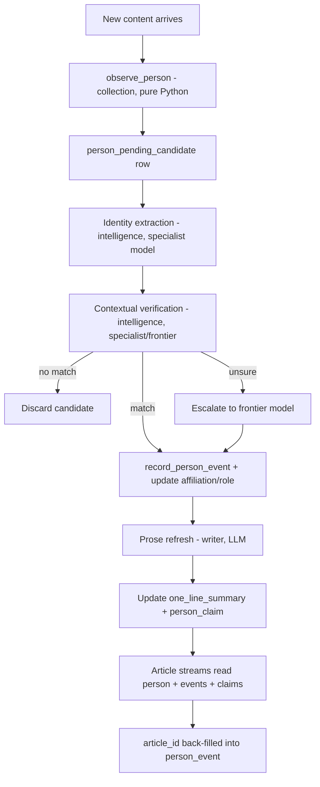

# People Tracking

Herald maintains a per-person knowledge base - a dossier - on every individual relevant to the C++ ecosystem: committee members, library authors, conference speakers, vendor engineers, national-body delegates. The people store answers "who is this name and why do they matter" for every article stream Herald produces. It runs continuously on self-hosted infrastructure, processing identity resolution as new content arrives from the collection layer.

This document covers what we track about a person, how we figure out that two mentions in different sources refer to the same human, how the data flows from raw observation to dossier entry to published article, and what the schema looks like.

## What we track

The people store has a deliberate boundary. Everything on the "in" side is relevant to C++ and tech-industry journalism. Everything on the "out" side is private life that has no business in a dossier.

**In scope:** committee roles, papers authored, talks given, libraries maintained, employer changes, public statements (mailing lists, blog posts, conference talks), conference attendance, ISO and national-body work, tech-industry transitions, deaths.

**Out of scope:** marriages, degrees, hobbies, family, religion - anything irrelevant to C++ or tech-industry news.

**Death** is explicitly in scope for two reasons. First, the writer must never talk about a dead person as if they are alive - this is a hard constraint on every article stream. Second, the people store already holds the accumulated event history and profile claims that serve as feedstock for a high-quality obituary. Death is recorded as a `person_event` with kind `death`, and the `person.status` field flips to `deceased` with `deceased_on` set.

## How data flows through the system

Before diving into identity resolution or the schema, it helps to see the full path from "a name appeared in some content" to "an article cites this person's dossier." Every step in this pipeline has a clear owner (collection layer, intelligence layer, or writer layer) and a clear boundary.

**Collection-layer operations** are pure Python with no LLM involvement:

- `observe_person(name, context_snippet, handles, email_domain, content_id)` - looks up candidates in `person_name_variant` and `person_handle`, inserts a `person_pending_candidate` row with the candidate list. This is the entry point.
- `record_person_event(person_id, event_kind, headline, content_id)` - appends to the person's event log. Called only after identity resolution confirms the match.
- `update_affiliation(person_id, organization_id, role, content_id)` - inserts a new affiliation row or closes an existing one (sets `ended_on`).
- `update_committee_role(person_id, group_code, role, content_id)` - same pattern as affiliation, for WG21 committee roles.

Collection never writes `person.one_line_summary` or `person_claim` - those require an LLM and belong to the writer layer.

**Prose refresh** is a writer-layer operation. It is idempotent: it reads at most N recent events for a person, generates (or regenerates) `person.one_line_summary` and updates `person_claim` rows. The refresh runs periodically and whenever a person accumulates enough new events to warrant it.

**Article streams** read from `person`, `person_event`, and `person_claim` to build the people-related sections of articles. When a published article cites a person event, the `article_id` is back-filled into the `person_event` row, creating a bidirectional link between the dossier and the published output.

## Identity resolution

This is the hardest problem in the people store. The same person shows up under different names ("Vinnie Falco" vs "Vincent Falco"), on different platforms (a GitHub handle, a mailing-list email, a conference speaker bio), and common names collide constantly ("John Smith" in a WG21 context vs "John Smith" in a baseball article). The system must resolve these correctly without human intervention in the common case, and must fail safely (flag for review) in the ambiguous case.

Identity resolution has three phases, each handled by a different layer:

### Phase 1: Mechanical lookup (collection layer, pure Python)

A name appears in content. The collection layer queries `person_name_variant` (all known name spellings) and `person_handle` (GitHub, ORCID, etc.) for candidates.

- **Unique-handle matches** (a GitHub username, an ORCID) are strong enough to auto-link immediately. These skip phases 2 and 3.
- **Email-domain + exact family name** is also strong enough to skip. If the email domain matches a known employer and the family name is an exact match, link directly.
- **Name-only matches** are never auto-linked. "John Smith" matching a `person_name_variant` row is not enough - it produces a `person_pending_candidate` row and moves to phase 2.

### Phase 2: Identity extraction (intelligence layer, fine-tuned specialist)

A sentence-level classifier runs over the content that triggered the pending candidate. It tags which sentences carry **identity-defining signals** - sentences that combine a name with a role, employer, domain, project, or affiliation.

"John Smith, concurrency expert at NVIDIA" is identity-defining. "John Smith walked to the podium" is not. Only the identity-defining sentences are extracted. This classifier is a small fine-tuned specialist (~7-32B) running on self-hosted hardware, processing continuously as content arrives.

### Phase 3: Contextual verification (intelligence layer, specialist or frontier)

The extracted identity-defining sentences are paired with the candidate's existing profile (name, domain, employer, roles, recent events) in a short prompt. The model returns `yes`, `no`, or `unsure`, with reasoning and an optional `suggested_new_variants[]` list.

The prompt is narrow enough that a small specialist handles it at higher throughput than a frontier model. The frontier model is the fallback for `unsure` verdicts.

### Worked examples

- **John Smith test.** Phase 2 extracts "hit a home run." The candidate is a C++ committee member. Phase 3 verdict: not the same person. The pending candidate is discarded.
- **Vincent/Vinnie test.** Phase 2 extracts "Vincent Falco, The C++ Alliance, Boost.Beast author." The candidate is Vinnie Falco. Phase 3 verdict: same person. "Vincent" is added to `person_name_variant` so future lookups resolve mechanically without needing the model.

### Merge and split

Sometimes two `person` rows turn out to be the same human (discovered after the fact, or created by two different sources before resolution linked them). **Merge** rewrites all FKs to a survivor row and logs the decision in `person_alias_resolution`. **Split** is the inverse - rare, but necessary when a person row turns out to conflate two different people. Both operations are audited.

### The feedback loop

Every confirmed match that produces a new name variant (like "Vincent" -> Vinnie Falco) is inserted into `person_name_variant`. This means the mechanical lookup in phase 1 catches it next time, and the model is never asked about the same variant twice. The system gets cheaper to run over time as the variant table grows.

## Schema

The people tables live in the same Postgres database as the collection tables (`contents`, `urls`, `sources`) and FK to them freely. There is **no polymorphic `entities` table** - `person` is the entity directly. This is a deliberate rejection of the generic-entity pattern: people have specific attributes (names, handles, affiliations, committee roles) that do not generalize to other entity types, and a polymorphic table would force everything into JSON blobs.

**`person`** - one row per canonical human. Fields: `person_id` (UUID PK), `canonical_name`, `preferred_prose_name` (what the writer should call them in articles), `status` (`active` / `lapsed` / `emeritus` / `deceased` / `unknown`), `deceased_on` (date, nullable), `nationality`, `location`, `primary_domain` (what area of C++ they are known for), `one_line_summary` (writer-generated text, refreshed periodically), `tsv` (tsvector for full-text search). Watches attach directly to `person_id`.

**`person_name_variant`** - every known spelling of a person's name. Fields: `person_id` FK, `variant_text`, `variant_kind` (`legal` / `nickname` / `byline` / `transliteration` / `former`). A generated column `variant_text_normalized` (lowercase, diacritics stripped) carries a unique index. This table is the first thing the mechanical lookup queries.

**`person_handle`** - platform identities. Fields: `person_id` FK, `platform` (`github` / `mastodon` / `bluesky` / `x` / `linkedin` / `orcid` / `website`), `handle`. Unique on `(platform, handle)`. A GitHub username match is strong enough to skip identity resolution entirely.

**`person_email_domain`** - domains (not full addresses) associated with a person. Fields: `person_id` FK, `domain`, `first_seen`, `last_seen`. Used in mechanical lookup: email-domain + exact family name is a strong match signal.

**`person_affiliation`** - employer and organizational relationships. Fields: `person_id` FK, `organization_id` FK, `role`, `started_on`, `ended_on` (nullable - `NULL` means current), `content_id` FK (the collection content that evidenced this affiliation). Transitions are also recorded as `person_event` rows with kind `affiliation_change`.

**`organization`** - companies, national bodies, standards groups. A lightweight lookup table. Whether this eventually becomes its own deep entity (like `person`) or stays lightweight is an open question.

**`person_committee_role`** - WG21 and subgroup roles. Fields: `person_id` FK, `group_code` (`WG21` / `SG14` / `LEWG` / etc.), `role` (`chair` / `vice-chair` / `convener` / `member` / `secretary` / `head-of-delegation`), `started_on`, `ended_on` (nullable), `content_id` FK. Same temporal pattern as affiliation.

**`person_event`** - the append-only event log that is the backbone of the dossier. Fields: `event_id` PK, `person_id` FK, `occurred_on`, `event_kind` (`paper_filed` / `paper_adopted` / `talk_given` / `library_released` / `affiliation_change` / `committee_role_change` / `public_statement` / `conference_attended` / `news_subject` / `death`), `headline`, `body_md`, `content_id` FK (the collection content that triggered this event), `article_id` FK (nullable - back-filled when a published article cites this event), `created_at`. Indexed on `(person_id, occurred_on)` and `(event_kind, occurred_on)`.

**`person_claim`** - writer-generated profile assertions. These are the LLM's synthesis of a person's accumulated events into prose-level claims about who they are. Fields: `claim_id` PK, `person_id` FK, `claim_kind` (`domain_expertise` / `design_philosophy` / `headline_accomplishment` / `rhetorical_posture` / `relationship_phase`), `claim_text`, `confidence`, `content_id` FK, `last_verified_at`. The `last_verified_at` timestamp drives the prose-refresh schedule - claims that have not been re-verified against recent events are stale and get refreshed.

**`person_relationship`** - directional relationships between people. Fields: `person_id` FK, `other_person_id` FK, `relationship_kind` (`collaborator` / `mentor_of` / `mentee_of` / `antagonist` / `co_author` / `successor_of`), `started_on`, `ended_on` (nullable), `content_id` FK, `body_md`. These are directional: "A mentors B" is stored once, not twice.

**`person_alias_resolution`** - audit log for merge and split decisions. Fields: `decision_id` PK, `decided_at`, `decided_by`, `evidence_jsonb`, `outcome`, `merged_into_person_id`, `split_from_person_id`. Every merge or split is recorded here so it can be reviewed and reversed.

**`person_pending_candidate`** - the holding pen for unresolved identity matches. Fields: `candidate_id` PK, `observed_name`, `observed_context`, `observed_handles`, `observed_email_domain`, `content_id` FK, `first_seen`, `last_seen`, `resolution_status`. Rows enter here from the collection layer's mechanical lookup and are resolved by the intelligence layer's classifier.

## Visibility and republication

The people store ingests from all sources, public and private. **The gate is not ingestion but republication.** The `contents.visibility` column (from the collection schema) governs what the writer may cite in a published article.

Private-source evidence (reflector posts, Slack messages) informs the dossier - it can shape `one_line_summary`, influence importance ranking, and trigger events. But it **cannot be directly quoted** in a published article. The writer must paraphrase or find a parallel public source before citing private-source information. This constraint is enforced at the writer layer, not in the people store itself; the people store records everything and lets the writer decide what to surface.

## Article-stream consumer matrix

Every table in the people schema exists because at least one article stream reads from it. If a table has no consumer, it is a removal candidate. The matrix below maps tables to the article streams that use them.

| Table | Monthly Anchor | Conference Coverage | News Response | People | Standing Features |
|---|---|---|---|---|---|
| `person` | names, roles | speaker bios | who is involved | profiles | "The Temperature" personas |
| `person_event` | paper/role changes | talks given | triggering event | timeline | trend signals |
| `person_claim` | context for analysis | speaker expertise | background | profile text | posture tracking |
| `person_affiliation` | employer context | speaker affiliation | org connection | career history | movement tracking |
| `person_committee_role` | role changes | speaker authority | committee context | role history | power mapping |
| `person_relationship` | co-author networks | collaborators | faction context | relationship web | alliance tracking |
| `person_name_variant` | - | - | - | byline matching | - |
| `person_handle` | - | - | - | cross-platform links | - |

## Open questions

- **Subjects who request omission.** Default position: keep public-record facts (papers filed, talks given, committee roles - these are part of the ISO record), drop `person_claim` entries (the LLM-generated assertions), freeze the event log (no new events recorded). This is a policy decision, not a technical one.

- **Name changes.** The mechanism is `person_name_variant.variant_kind = 'former'`. The open question is policy: should `former` variants participate in matching? If someone changes their name, do we still resolve their old name to them? Probably yes for public-record contexts (papers, committee roles) and no for personal contexts.

- **Retention on `person_event`.** How far back do we keep events? The event log is append-only and cheap to store, but some events become irrelevant after years. Policy TBD.

- **Public exposure.** Is the people store exposed on wg21.org as a browsable directory, or is it internal-only with published articles as the only public surface? Both are architecturally possible (the data is in the shared Postgres either way).

- **Organization depth.** Does `organization` eventually become its own deep table (like `person`, with events, relationships, and claims) or does it stay a lightweight lookup? The answer depends on whether Herald covers organizations as first-class subjects or only as attributes of people.

- **Postgres-specific choices.** `jsonb` vs typed columns for event payloads. `pg_trgm` extension for fuzzy name matching. `tsvector` regeneration strategy (trigger vs batch).
