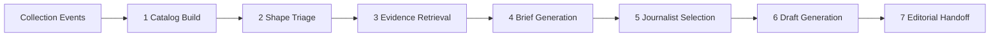

# Article Generation

Herald's writer subsystem takes the collection layer's continuous output and turns it into publishable drafts for editorial selection. It runs a seven-step pipeline daily: build a lightweight catalog of what's new, identify which stories exist, retrieve the evidence, generate structured briefs, select journalist personas, produce multiple drafts per story, and hand the slate to the editor. The diversity mechanism is journalist personas - each persona writes the same brief differently because they have different angles, voice, and domain focus. The editor picks a winner.

This document covers the full pipeline from collection events to editorial handoff, the article-shape registry that defines what kinds of stories Herald can write, the research desk that provides historical context during generation, and the journalist-persona interface.



## The daily catalog

The first problem is scale. The collection layer might produce hundreds of new content items per day across all sources - new blog posts, mailing-list threads, Reddit discussions, GitHub activity, RSS updates, conference announcements. The raw text of all that easily exceeds any context window. But its metadata is small.

The catalog is a structured list of lightweight entries built mechanically from collection events within the pipeline's time window. Each entry is roughly 50-100 tokens:

- Source name and kind (RSS, mailing list, Reddit, blog, GitHub, etc.)
- URL
- Title
- Date
- Named entities mentioned (people, papers, libraries, companies)
- Content type (post, email, announcement, discussion thread, transcript, paper, release)
- One-liner summary (extractive: first sentence or headline)

This metadata mostly already exists in the `urls` and `contents` tables. Building the catalog is a database query against recent `collection_events` plus joining on `contents` for title, entities, and content type. The only generation required is a one-liner for items that lack a clean title - a small fast model handles those.

**Expected throughput.** A busy day with 500 new items produces 25,000-50,000 tokens of catalog. That fits in a single context window. No RAG is needed for the triage step - the catalog is the input, whole.

## Shape triage

The catalog goes to a model alongside the shape registry (the full list of article types Herald can produce). The question is: "Which clusters of items here constitute a publishable story for any of these shapes? For each proposed story, cite the item IDs, name the shape, and give a one-sentence story hypothesis."

The output is a list of `(shape, item_ids[], hypothesis)` triples. Structured output, Pydantic-typed.

**Hybrid trigger logic.** Not every shape needs an LLM to decide whether it fires:

- **Hard-trigger shapes** fire deterministically before the LLM call. "A new mailing dropped" always fires Mailing Political Analysis. "Conference X starts today" always fires Conference Daily. These are pure Python checks on the catalog metadata - date comparisons, source-kind filters, entity matches.
- **Soft-trigger shapes** go through the LLM triage. "Is this paper contentious?" "Is this person event newsworthy enough for a profile update?" The model assesses.

The triage model is a gatekeeper, not a writer. It should be fast, cheap (small model, structured output), and conservative. Better to miss a story today - it will still be in the catalog tomorrow if it matters - than to fire on insufficient evidence and waste tokens on brief generation that fails the sufficiency gate.

### Deduplication against active stories

Before emitting a triage hit, the pipeline checks whether an active brief already exists for a substantially overlapping evidence cluster (same shape + overlapping item IDs, or same primary entity within the same shape). Three outcomes:

- **No overlap.** New story. Proceed normally.
- **Partial overlap, new material.** The story is developing - conference day 2, paper advances to next stage, new reactions arrive. Merge new evidence into the existing brief and re-run brief generation. If the existing slate has not been picked yet, the system supersedes it with the updated version. If the editor already picked from the old slate, the new evidence produces a new slate (a follow-up story, not a duplicate).
- **Full overlap.** Duplicate. Suppress. Log for observability.

This prevents the pipeline from generating a second brief for the same story on consecutive days while still allowing developing stories to accumulate evidence over time.

## Evidence retrieval

For each proposed story from triage, pull the full extracted text of the cited items from the content store. The catalog gave us item IDs (references into `contents`); now we fetch the actual documents.

The output is a focused evidence package per story - typically 5-20 full documents instead of the 500 in the raw catalog. This is bounded and fits comfortably in context for the next step.

## Brief generation

The brief is the factual backbone of the story - shared across all journalists who will write it. It is shape-aware (different shapes produce differently-structured briefs) but journalist-agnostic.

**Inputs:**

- Shape definition (required evidence fields, output constraints)
- Full evidence texts from the previous step (the immediate material)
- Research desk queries for background, history, and context the immediate evidence lacks
- Relevant person data from the people store (person events, claims, affiliations)

**The research desk is used here.** The brief builder queries the research desk to fill in context that the day's evidence alone cannot provide. "What's the history of P2900?" "What committee role does this person hold?" "Have we covered this topic before?" "What did the community say about this paper's previous revision?" The research desk returns chunks with full provenance - source URL, publish date, title - so the brief can carry citations all the way through to the published article.

**Output:** A structured brief (Pydantic object):

- Shape identifier
- Who, what, when, where
- Key quotes (from evidence, with source attribution)
- Background context (from research desk, with provenance)
- Source list with visibility tags (`public` vs. `private` - what can be cited in a published article vs. what informed the brief but cannot be directly quoted)
- Suggested angles (plural - the journalist will pick their own, but the brief surfaces what angles the evidence supports)
- Constraints: word count range, embargo dates, visibility restrictions

**Not in the brief:** angle, tone, voice. Those come from the journalist persona. The brief is a factual package - it says what happened and provides the evidence. How to present it is the journalist's job.

**Sufficiency gate.** The brief builder either succeeds (enough material to produce a publishable story) or returns "insufficient." If the hypothesis from triage does not hold up once the full text is read - the paper is not actually contentious, the person event is not actually newsworthy, the evidence is too thin - discard. No partial briefs. It either clears the bar or it does not.

Failed briefs are logged (story hypothesis, shape, item IDs, reason for insufficiency) so the triage model's false-positive rate is observable and the triage prompts can be tuned over time.

## Journalist selection

Given a `(shape, brief)` pair, filter the journalist roster by beat compatibility. Each journalist declares which article-shape categories they cover via beat tags.

- If 4 journalists match the beat, all 4 write it.
- If more than the cap (configurable, probably 4-6) match, subset by randomization or weighted by past editor pick rate.
- The editor sees all drafts from all selected journalists.

Selection is mechanical. No LLM involved. The logic is a tag-intersection filter followed by a cap.

## Draft generation

Each selected journalist generates one draft. The generation call:

```
system: [journalist system prompt - persona, angles, voice, constraints]
user:   [the brief - structured evidence, context, shape constraints]
tools:  [research_desk - the journalist can look things up mid-draft]
```

**Tool access during drafting.** The journalist persona has access to the research desk as a callable tool during generation. This is the `pipeline.tools.wrap_source` pattern - the LLM gets a tool that queries the research desk and returns chunks with provenance metadata. The journalist might look up: "what did X say about this at CppCon last year?" or "what was the vote count on the previous revision?" or "when did this person join the committee?" The tool returns text chunks with source URLs and dates, which the journalist can cite.

**Output:** A structured `Draft` (Pydantic-typed):

- Headline
- Lede (first paragraph, standalone - readable without the rest of the article)
- Body (markdown)
- Pull quotes (extracted from evidence, attributed)
- Internal source references (which evidence items and research desk chunks were used)
- Word count

Each draft is stored immediately with `journalist_id`, `shape_id`, `brief_id`, `state=draft`. The **slate** for a story is all drafts sharing a `brief_id`.

All LLM calls go through `pipeline.run_agent` with determinism invariants and prompt-injection defense intact. Web-sourced evidence is untrusted input; `pipeline.tools.wrap_source` handles the injection boundary.

## Editorial handoff

The editor sees, per story:

- The brief (the shared factual input - what the journalists were given)
- N drafts side-by-side, each with a journalist byline
- The editor picks one (that journalist gets the byline on the published piece), rejects all, or defers

Unpicked drafts age out per the topic's freshness window. Pick rates accumulate per journalist per shape as a feedback signal. Over time, certain journalists will dominate certain beats because the editor consistently prefers their take. That is fine - the losing drafts are not wasted; they are signal for whether to keep that journalist on that beat, and they serve as a latent training corpus for future journalist-persona tuning.

---

## Article shapes

An article shape is a named template that defines what kind of story Herald can write. It answers: "what evidence triggers this shape, what must the brief contain, which journalists can write it, and what does the output look like?"

Each shape defines:

- **Name** - e.g. "Contentious Paper", "Conference Talk Analysis", "Version Release"
- **Trigger type** - hard (deterministic event) or soft (LLM-assessed)
- **Trigger condition** - for hard triggers: a Python predicate on catalog metadata (date match, source-kind filter, entity presence). For soft triggers: a natural-language description of when this shape fires, included in the triage prompt
- **Required evidence fields** - what the brief must contain for this shape. "Conference Talk Analysis" requires: speaker, talk title, transcript or summary, conference name, date. "Contentious Paper" requires: paper number, author, working group, at least two sources with opposing reactions
- **Eligible beats** - which journalist beats cover this shape
- **Output constraints** - word count range, structure expectations (headline style, whether it needs pull quotes, section structure)

The shape catalog is a static registry - Python dataclasses or YAML. It grows slowly and deliberately. Adding a new shape is an editorial decision, not a code change. Each new shape requires: a trigger condition, a brief schema, at least one journalist with a matching beat, and an editorial decision that Herald should cover this kind of story.

### Initial shapes

Mapped to the five content streams from the Herald brief:

**Monthly Anchor** (hard trigger: mailing deadline passes):
- Mailing Political Analysis - the flagship. What the mailing's paper advances and stalls reveal about institutional dynamics
- Mailing Data Summary - paper counts by working group, author concentration, revision distribution, new-vs-returning author ratio
- Paper Spotlight - individual paper analysis through the political lens

**Conference Coverage** (hard trigger: conference dates match):
- Talk Analysis - political analysis of a conference talk's framing and implications
- Conference Daily - daily summary during the conference
- Hallway Report - the political temperature of the event

**News Response** (soft trigger: LLM assesses newsworthiness):
- Government Mandate - memory-safety regulations, language mandates
- Vendor Announcement - compiler releases, platform decisions, language migrations
- Competitor Development - Rust ecosystem developments bearing on C++'s position
- CVE/Incident - security incidents involving C++ code

**People** (soft trigger: LLM assesses significance):
- Profile Update - a person does something notable enough to warrant coverage
- Public Statement Analysis - political analysis of a public figure's public speech
- Career Transition - someone changes employer, role, or status in a way that matters

**Standing Features** (hard trigger: cadence-driven):
- The Temperature - monthly Reddit/HN sentiment analysis
- The Queue - paper pipeline tracking, which papers advanced or stalled
- The Gap - PRAGMA ballot data vs. committee priorities

---

## The research desk

The research desk is Herald's internal reference library - a semantic index over the entire accumulated corpus, queryable during brief generation and during draft writing. It answers background questions: "what do we know about this person?", "what's the history of this paper?", "have we covered this before?", "what was the community reaction last time?" Every answer comes with provenance (source URL, date, title) so the journalist can cite it.

### Implementation: pgvector in shared Postgres

Herald already has a shared Postgres database with wg21.org. The research desk is a pgvector extension on that same database - `CREATE EXTENSION vector;` and it exists. No new service, no new ops surface, no new backup strategy.

**Why this works for Herald:**

- **Relational joins are free.** A single SQL query filters by date, source, person, visibility, content type AND ranks by semantic similarity. With a separate vector database you would need a second hop and duplicate metadata.
- **Scale is fine.** Herald's corpus will be thousands to low-millions of documents over years. pgvector with pgvectorscale handles 50M vectors comfortably. Herald will not hit that ceiling for a very long time.
- **Transactional consistency.** When collection inserts a new `contents` row, the research desk embedding can be generated and inserted in a follow-up event-consumer transaction. The research desk embedder is a `collection_events` consumer (cursor name `research_desk`) that chunks and embeds new content as it arrives.
- **Hybrid search built-in.** Postgres `tsvector` (keyword search) and pgvector (semantic search) in one query. Keyword search catches exact names, paper numbers, and library names that semantic search might miss.
- **Provenance for free.** Every chunk returned carries source URL, publish date, title, and visibility via FK joins back to `contents`. No metadata duplication.

Dev equivalent: `sqlite-vec` for the SqliteBackend, giving the same interface for local testing without Postgres.

### What the research desk indexes

The research desk embedder consumes `collection_events` and maintains embeddings for:

- All `contents` extracted text (the entire historical corpus, chunked at paragraph level)
- `person_event` entries (what happened to whom, when)
- `person_claim` entries (writer-generated profile assertions - domain expertise, accomplishments, posture)
- `published_articles` (Herald's own past output - for editorial memory and consistency checking)
- Past `briefs` and `topics` (for "have we covered this before?")

### Schema

```
research_chunks
  chunk_id         BIGSERIAL PK
  content_hash     FK -> contents.content_hash_text
  chunk_sequence   INT (paragraph number within the source document)
  chunk_text       TEXT (the paragraph)
  embedding        vector(N)  -- dimension depends on embedding model choice
  tsv              tsvector GENERATED ALWAYS AS (to_tsvector('english', chunk_text))
  source_kind      (content | person_event | person_claim | article | brief)
```

### Query pattern

Cosine distance (`<=>`) is the default operator - appropriate for normalized embeddings from standard embedding models. The query combines semantic similarity with relational filters in a single statement:

```sql
SELECT rc.chunk_text, c.title, c.source_url, c.publish_date, c.visibility
FROM research_chunks rc
JOIN contents c ON rc.content_hash = c.content_hash_text
WHERE rc.embedding <=> $query_embedding < $threshold
  AND c.publish_date > $since
  AND c.visibility = 'public'
ORDER BY rc.embedding <=> $query_embedding
LIMIT 20;
```

Provenance comes back in the same result set. The journalist gets chunks with full citation metadata. No second hop, no metadata duplication, no eventually-consistent index.

For hybrid search (semantic + keyword), combine with a `tsv @@ plainto_tsquery($keywords)` clause. This catches exact paper numbers (P2900), library names (Boost.Beast), and person names that semantic search alone might rank poorly.

### When the research desk is queried

- **During brief generation (step 4).** The brief builder queries for background, history, and prior coverage. "Give me everything we know about P2900." "What's this person's committee history?" "Has Herald covered this topic before - if so, what angle did we take?" This fills in the context that the day's evidence alone cannot provide.

- **During draft generation (step 6).** The journalist persona has the research desk as a callable tool. It can look things up mid-draft to verify facts, find quotes, or add historical context. The tool returns chunks with provenance, and the journalist includes source citations in the draft.

### Internet fallback

Restricted. The research desk is the primary source. Internet search is a fallback only for: (a) checking if something is currently true that might have changed since collection last fetched ("is this person still at NVIDIA?"), (b) filling a gap the editor explicitly flags ("we need the exact date of this announcement and it's not in our corpus"). Not a general-purpose search during drafting. The journalist works from the research desk the way a newspaper journalist works from the morgue file - the curated, verified archive is the first source. The open web is a last resort.

---

## Journalist personas

A journalist is a persistent identity stored as a structured data object. It is not code - it is configuration that the draft-generation step loads as a system prompt. The persona carries everything the model needs to write in a distinct, recognizable voice with a consistent editorial perspective.

**Fields:**

- **Name** - byline name (the name that appears on published articles)
- **Avatar** - AI-generated headshot (generated once, stable across all publications)
- **Bio** - 2-3 sentence public-facing backstory (what the reader sees on the "about" page)
- **Beat** - which article-shape categories this journalist covers. A set of shape tags. Determines eligibility in step 5
- **Angles** - how this journalist approaches stories. A short list of characteristic framings. "Always asks who benefits." "Focuses on the technical trade-off the committee ignored." "Contextualizes within industry trends." "Reads scheduling decisions as power moves."
- **Voice** - prose style descriptors. "Terse, declarative, no hedging." "Discursive, draws historical parallels, longer sentences." "Data-forward, leads with numbers." "Sardonic, notes what was not said."
- **System prompt payload** - the actual LLM instructions that encode beat, angles, and voice into generation behavior. This is the load-bearing artifact. Everything above is human-readable documentation of what the system prompt does.

The roster is small and curated - 4-6 total. Not one journalist per shape; journalists cover multiple shapes through their beat. The variety comes from having 2-4 eligible journalists per story, each producing a recognizably different take on the same brief.

Over time, the editor's pick patterns reveal which journalist voice works best for which shape. That is a feedback signal for future tuning - potentially adjusting system prompts, rotating beats, or retiring a journalist whose take never gets picked. But that is a v2 concern. For v1, the roster is static and curated by hand.

Detailed journalist design (lifecycle events, email personas, backstory development, avatar generation) is a separate document.

---

## Open questions

1. **Catalog window.** 24 hours? Rolling? Configurable per shape? Conference coverage might want a shorter window (a few hours during an active conference). Monthly Anchor waits for the full mailing to drop. The Temperature aggregates over a month.

2. **Shape triage call structure.** One LLM call for all shapes at once (cheaper, but the model has to attend to many shape definitions simultaneously), or one call per shape (more expensive, but each call is focused and simpler)? The catalog fits in context either way.

3. **Research desk embedding model.** Which model, what dimension? Trade-off: larger dimensions give better retrieval quality but cost more storage and compute. Smaller models embed faster (important for the embedder consumer keeping up with collection throughput). The embedding model can be swapped later by re-embedding the corpus - the `research_chunks` table is a materialized view, not source data.

4. **Brief structure.** Uniform across all shapes (one Pydantic model with optional fields), or shape-specific brief schemas (more boilerplate to maintain, but each shape gets exactly the fields it needs and no more)?

5. **Journalist cap per story.** Generate drafts from all eligible journalists, or cap at N? More drafts = more variety for the editor but more token spend and more review fatigue. Instinct says 3-4 is the sweet spot.

6. **Research desk tool budget.** Should the journalist's research desk access during drafting be unrestricted, or budget-limited (max N queries per draft) to control cost and prevent the model from using tool calls as a crutch for poor prompt comprehension?

7. **Shape catalog format.** Python dataclasses in code (type-safe, version-controlled, requires a deploy to change), or YAML/JSON config files (editable without a deploy, but no type checking)?

8. **Triage model.** Same model as the writer (simpler infrastructure), or a cheaper/faster model for the classification pass (lower per-run cost but another model to manage)?

9. **Journalist count.** 4-6 total, with 2-4 eligible per story. Too few means no real variety in the slate. Too many means editor fatigue reviewing drafts. The right number emerges from experience.

10. **Editorial feedback loop.** Track editor pick rates per journalist per shape and use that to weight journalist selection (more-picked journalists get priority)? This is a v2 optimization. For v1, all eligible journalists are equally weighted.

11. **Journalist lifecycle events.** The "goes on maternity leave" or "gets fired" flavor - entertaining, humanizing, creates narrative around the publication itself. Deferred to v2 or later. Not load-bearing.

12. **Story continuation policy.** When new evidence arrives for an active story whose slate has not been picked yet, supersede the old slate unconditionally (editor only ever sees the latest version), or present both (editor can compare how the story developed)? Superseding is simpler. Presenting both is more informative but adds UI complexity.
