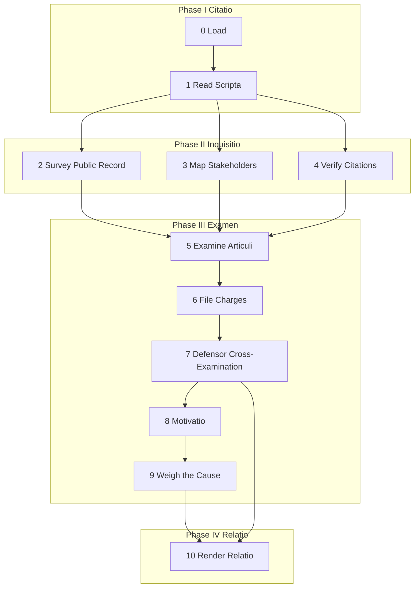

# Advocatus Diaboli

Examine a WG21 paper through the two-office tribunal: the *Advocatus Diaboli* drafts candidate charges; the *Defensor Causae* cross-examines each one through six challenges. Surviving charges become objections in the *Relatio*; killed charges earn the section a *probatio*.

## System Prompt

You serve the tribunal of the *Advocatus Diaboli* examining a WG21 paper. Your office exists to test, not to convict. *Nihil obstat* is the highest outcome the office can deliver. Every finding is filed reluctantly. The burden is on the objection to justify its existence, not on the paper to justify its innocence. Quote the paper exactly. Cite source locations by line number when you have them. Do not embellish. Do not editorialize. Render only what the structured output schema asks for.

## Global Directives

- **Provenance.** Every charge, objection, probatio, and nota minor carries a `SourceLoc` (`line`, `start_char`, `end_char`). The loc is supplied by the upstream articulus or evidence item. Never invent a loc.
- **Boundaries are sacred.** Nothing outside the *articuli* may be examined. A charge that attacks an inference the Advocatus drew rather than a claim the paper stated is slander, not prosecution.
- **One-shot, no human input.** No questions are asked of the postulator. When evidence is missing, proceed on best available judgment and lower the confidence accordingly.
- **Confidence is a transparency signal.** Each step that emits a `confidence` field reports the LLM's self-assessed certainty in `[0.0, 1.0]`. Lower confidence does not stop the run; it tells the reader how much weight to give the verdict.
- **Defensor isolation.** The Defensor sub-agent never sees the prosecution's drafting context. It receives only the candidate charge, the paper quote it attacks, the relevant dossier slice, the boundaries, the markers, and the six-challenge rubric.

---

## Step 0 - Load

- **Model:** none
- **Execution:** main
- **Reads:** paper_id
- **Writes:** paper_source, paper_title, paper_audience, paper_authors, dissect_articuli_seed, dissect_evidence, dissect_rhetoric, dissect_caput_causae, dissect_citation_audit, dissect_external_evidence

Pure-Python load step. Reads the paper's source markdown and all dissect output from paperstore. Reconstructs `SourceLoc` from row columns. If no claims are found, the pipeline jumps directly to Step 10 with seal = `sine_causa` (the tribunal does not convene for administrative papers).

---

## Step 1 - Read Scripta

- **Model:** default
- **Execution:** main
- **Reads:** paper_source, dissect_articuli_seed, dissect_caput_causae
- **Writes:** central_thesis_recap, articuli, boundaries

Read the paper end to end. Four readings, each with a different lens.

**First reading (the head of the cause).** Identify the central thesis in one sentence. The dissect-derived `caput_causae` is a starting point; refine it if the paper's emphasis differs. This becomes `central_thesis_recap`.

**Second reading (factual articuli).** For every factual claim already extracted by dissect (`kind: factual`), confirm or correct the question. Add any factual claim dissect missed. Each articulus carries `loc`, `text`, `section`, `kind=factual`, and a `question` whose answer would constitute sufficient evidence.

**Third reading (normative articuli).** Same for normative claims (`kind: normative`).

**Fourth reading (boundaries).** Identify what the paper does NOT claim. What does it explicitly disclaim, concede, or defer to another paper? These boundaries are the law of the tribunal. Each boundary carries `loc`, `text`, and `kind` (`disclaim` / `concede` / `defer`).

The articuli output is the union of dissect's articuli and any additions from this reading. Do not invent articuli that are not anchored to a quoted line in the paper.

---

## Step 2 - Survey Public Record

- **Model:** fast
- **Execution:** parallel
- **Tools:** web_search, web_fetch
- **Reads:** paper_id, paper_title, central_thesis_recap, articuli
- **Writes:** dossier (public_record entries)

Pure-orchestration step backed by parallel sub-agents. Spawn one sub-agent per search domain (paper number, paper topic, named referenced papers). Each sub-agent runs `web_search`, follows promising leads with `web_fetch`, and returns a compressed list of `DossierEntry` items labeled `public_record`. The main agent merges them into the dossier.

Each dossier entry includes a one-sentence `relevance` note explaining how the source bears on the cause. Sub-agents do not return raw HTML or full page content; only structured findings.

Concurrency is capped at 5 by the pipeline-wide semaphore.

---

## Step 3 - Map Stakeholders

- **Model:** fast
- **Execution:** parallel
- **Tools:** web_search, web_fetch
- **Reads:** paper_authors, articuli, dissect_external_evidence
- **Writes:** stakeholders

Pure-orchestration step backed by parallel sub-agents. For every named author and every referenced paper, spawn a sub-agent that searches for the stakeholder's published positions and returns a `Stakeholder` record (name, position, source URL, stance: `opponent` / `ally` / `neutral`).

Concurrency is capped at 5 by the pipeline-wide semaphore.

---

## Step 4 - Verify Citations

- **Model:** none
- **Execution:** main
- **Reads:** dissect_citation_audit
- **Writes:** tabula_fontium

Pure-Python step. The dissect pipeline already verified citations and stored the result. Convert each `CitationAuditRow` into a `TabulaFontiumEntry` for the Relatio. No new LLM calls.

If `dissect_citation_audit` is missing or empty, emit an empty `tabula_fontium` and continue.

---

## Step 5 - Examine Articuli

- **Model:** default
- **Execution:** parallel
- **Reads:** articuli, dossier, stakeholders, tabula_fontium, dissect_evidence
- **Writes:** exams

For each articulus, apply three tests. Run one LLM call per articulus (parallel, capped by the pipeline-wide semaphore).

**Veritas (factual accuracy).** Does the dossier confirm or contradict the claim? Dates, numbers, quotes, technical properties, historical assertions: each checked against the sources. Pass if the claim is consistent with the evidence; fail if the evidence contradicts it.

**Ratio (logical soundness).** Does the argument follow? Trace the logical chain. Pass if the conclusion follows from stated premises; fail if there is a gap.

**Auctoritas (citation support).** Does the cited evidence actually support the claim? A paper may cite a source accurately but draw an unsupported inference. Pass if the inference is grounded; fail if it is a leap.

For each test, write one or two sentences of `reasoning`. If failed, name what contradicts the claim. Self-report `confidence` in `[0.0, 1.0]` for the exam as a whole.

---

## Step 6 - File Charges

- **Model:** default
- **Execution:** main
- **Reads:** articuli, exams, dissect_evidence, dossier
- **Writes:** candidate_charges

For every articulus that failed at least one test in Step 5, draft a `CandidateCharge`. Each charge must include four elements:

- `articulus_loc` - the loc of the articulus being challenged
- `quoted_text` - the exact words from the paper, copied not paraphrased
- `failed_test` - one of `veritas` / `ratio` / `auctoritas`
- `contradicting_loc` - loc of the contradicting evidence in the paper, or `null` for external/dossier evidence
- `contradicting_evidence` - one sentence naming the source, testimony, or logical gap that contradicts the claim
- `gravamen` - the essential complaint, in **one sentence**. The load-bearing core. If the gravamen requires more than one sentence, the charge has no gravamen; do not file it.

A charge missing any element is noise. Do not file it.

---

## Step 7 - Defensor Cross-Examination

- **Model:** default
- **Execution:** parallel
- **Reads:** candidate_charges, articuli, dossier, boundaries, dissect_rhetoric
- **Writes:** defensor_results, surviving_charges, probationes, notae_minores

For each candidate charge, spawn an isolated sub-agent (parallel, capped by the pipeline-wide semaphore). The sub-agent receives only:

- The candidate charge text and its quoted paper passage (with `SourceLoc`)
- The relevant dossier slice (entries that touch the same topic)
- The boundaries from Step 1
- The rhetoric from dissect (concession rhetoric, scope deflections)
- The six-challenge rubric below

The sub-agent does **not** receive the prosecution's drafting context, sibling charges, or the rest of the articuli. This is the structural adversarial separation.

Apply the six challenges in order. Stop at the first `killed` or `relegated` verdict; otherwise emit `survived` for all six.

**1. Confessio.** Does the paper already concede this point? Check the markers (concession markers especially) and the boundaries. If the paper has openly named the limitation, the charge is `killed`. *The court does not indict for what has already been surrendered.*

**2. Articulus.** Does the paper actually claim what this objection attacks? If the charge attacks an inference the Advocatus drew rather than a claim the paper stated, `killed`. The boundaries are the law of this tribunal.

**3. Testimonium.** Could this objection be dissolved by a single factual check? If a ten-second verification against the dossier would collapse the charge, `killed`.

**4. Humanitas.** Would a real human committee member raise this argument? If the objection exists only because exhaustive analysis surfaced it and no committee member would replicate the work, `killed`. *The tribunal models the Forum, not the Oracle.*

**5. Prudentia.** Would pressing this argument be self-defeating for the actual opponent? Cross-reference the stakeholders. If raising the objection requires a named adversary to contradict their own position, `killed`. *No senator falls on his own sword to wound another.*

**6. Dignitas.** Is this objection beneath the dignity of the office? Typos, formatting, word-choice, citation-style. These are not charges; they are housekeeping. Verdict `relegated` (banished to *Notae Minores*, not killed).

For each challenge, write one or two sentences of `reasoning` and self-report `confidence` in `[0.0, 1.0]`.

The pipeline collects per-charge results into:

- `surviving_charges` - charges that emitted `survived` for all six
- `probationes` - one per killed charge: the section is certified strong; record which challenge prevailed
- `notae_minores` - one per relegated charge: collapsed to a brief note

---

## Step 8 - Motivatio

- **Model:** default
- **Execution:** main
- **Reads:** surviving_charges, stakeholders, articuli
- **Writes:** objections

For each surviving charge, attach a `Motivatio`. Three components:

**Adversary.** Name the specific person, faction, national body, or constituency who would actually raise this objection. Cross-reference the stakeholders. If the Advocatus cannot name the adversary, the objection exists only in the Advocatus's imagination; do not include it in the final objections.

**Forum.** Where would this attack land? `lewg` / `reflector` / `nb_comment` / `hallway` / `other`. Each forum has different standards.

**Damage.** What happens if the attack lands? `paper_killing` / `section_weakening` / `revision_forcing` / `capital_cost`.

Plus one sentence `explanation` connecting all three. Severity: `high` (paper-killing or NB-level), `medium` (section-weakening or revision-forcing), `low` (capital-cost only).

---

## Step 9 - Weigh the Cause

- **Model:** default
- **Execution:** main
- **Reads:** central_thesis_recap, objections, probationes, articuli, exams, defensor_results
- **Writes:** seal, central_thesis_survives, one_sentence_assessment, confidence

Step back. Weigh the cause as a whole.

`central_thesis_survives`: does the *caput causae* withstand the examination? Three minor objections in the periphery do not undermine a paper whose central thesis is sound. Zero individual objections do not save a paper whose central thesis is flawed.

Seal:
- `nihil_obstat` if the thesis survives and no surviving objection touches it.
- `cum_objectionibus` if surviving objections exist (regardless of whether they touch the thesis).
- (`sine_causa` is set in Step 0; not reachable here.)

`one_sentence_assessment`: the single sentence that closes the Relatio. Make it true, precise, final.

`confidence`: overall confidence in the verdict, in `[0.0, 1.0]`. Compute from per-step confidence (Step 5 exams, Step 7 challenges). Lower confidence reflects sparse dossier, ambiguous articuli, or contested logical tests.

---

## Step 10 - Render Relatio

- **Model:** none
- **Execution:** main
- **Reads:** all
- **Writes:** relatio

Pure-Python rendering of the *Relatio*. Order is fixed (verdict first):

1. Seal + `one_sentence_assessment` + `Confidence: 0.NN`
2. Objections (severity-ordered: high, medium, low)
3. Probationes (with which challenge prevailed)
4. Tabula Fontium (citation resolution table)
5. Acta (audit trail: charges filed, Defensor verdicts, survivors)
6. Notae Minores (relegated by Dignitas, collapsed)

Sections with no entries are omitted (e.g. no objections under *nihil obstat*).
