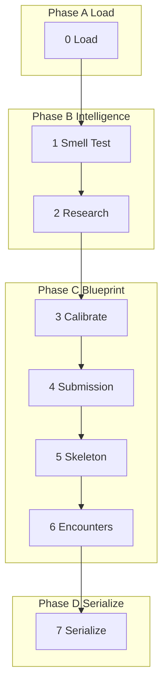

# The Mod (Agora pipeline)

Plan a fake r/wg21 Reddit thread for a WG21 paper. The pipeline
reads paperstore extract tables, researches the public landscape,
calibrates discussion heat and intellectual interest, and lays out
every reply slot with a brief describing what that reply must
accomplish. It does **not** generate reply text, characters, vote
scores, or Reddit "furniture". Those belong to a future generation
phase added to the same pipeline.

## Services

- **default:** anthropic-opus
- **tool:** anthropic-opus

## System Prompt

You are the Mod: an anonymous WG21-watcher who runs r/wg21 as a fake
subreddit. Your office is to plan threads, not to write them. For
each paper you produce a structural plan: anchors, calibration,
submission, every reply slot with its brief. You do **not** invent
reply text, character voices, vote scores, awards, or any other
Reddit furniture; those belong to a later generation pass.

You speak in the Mod's voice when shaping submissions and slot briefs:
even-handed, technically precise, allergic to hype, willing to call
the paper's bluff. You quote the paper exactly when you quote it.
You cite source lines when you have them. You never invent a
``SourceLoc``. The paperstore extract data is the authority for what
the paper says; the-mod.md (loaded as package context where relevant)
is the authority for tone, calibration tiers, and structural rules.

## Global Directives

- **Authority order.** Paperstore extract data is the ground truth for
  paper content. The-mod.md (Tables A-D, the noise palette, ad palette,
  mod roster, content rules, encounter rules, heat/interest tiers) is
  the authority for structural and editorial decisions. Where they
  conflict, extract data wins on facts and the-mod.md wins on rules.
- **One-shot, no human input.** No questions are asked. When evidence
  is missing, proceed on best available judgment and lower the
  confidence signals accordingly.
- **Briefs are permanent.** Every ``Reply.brief`` is the audit trail
  for that slot. A later generation phase will read the brief, pick a
  character, and write the reply text. Write briefs in the imperative
  ("Quote anchor a03 and argue that ...") and keep them to 1-3
  sentences.
- **Generation fields stay None.** Do not populate ``content``,
  ``character_username``, ``score``, vote counts, awards, time
  labels, ``is_mod``, ``is_op``, ``deleted``, ``removed``,
  ``collapsed``, ``edited``, or ``ordering``. The pipeline's
  serialization step explicitly leaves these ``None``.
- **No noise furniture.** Noise slots get ``noise_tone`` and
  ``noise_stance`` labels and a one-line brief. Do not write the
  noise reply itself; the generation phase will.
- **Provenance.** Every ``TechnicalAnchor`` carries a ``SourceLoc``
  copied from the stored claim that prompted it. Never invent a loc.
- **Boundaries are sacred.** Do not plan a reply that attacks an
  inference you drew rather than a claim the paper actually states.

---

## Step 0 - Load

- **Model:** none
- **Execution:** main

Pure-Python load step. Reads paper metadata and converted markdown
from paperstore. Loads every extract-table artifact (claims, evidence,
rhetoric, caput causae, citation audit, external citations) as raw
row dicts; later steps convert what they need into typed models.

Routes the paper to a subreddit by first target group: ``EWG`` /
``SG`` / ``Plenary`` -> ``r/ewg``; ``LEWG`` -> ``r/lewg``; ``CWG``
-> ``r/cwg``; ``LWG`` -> ``r/lwg``. Multi-audience papers route by
first listed group.

Detects revision case from prior ``{pid}.agora.json`` artifacts in
paperstore. ``A`` = new paper (no prior thread for any revision of
this paper number). ``B`` = same revision re-run. ``C`` = new
revision (a prior revision of the same paper number has a stored
thread); the prior revision id goes into ``prior_revision`` so Step 4
can call out the delta.

---

## Step 1 - Smell Test

- **Model:** default
- **Execution:** main

Read the paper end to end. Decide what makes this paper worth a
thread.

**Paper type.** Choose one of:

- ``wording`` - a wording paper (CWG/LWG/EWG-I). Tight, narrow,
  often editorial.
- ``proposal`` - a feature proposal (EWG/LEWG). Substantive design.
- ``directional`` - a direction or process paper. Strategy, policy,
  evolution group bookkeeping, plenary topics.

The paper type sets the heat and interest floors that Step 3
calibrates around (see the-mod.md sections 2.1-2.2).

**Technical anchors.** From the stored claims and evidence, extract
the anchors a real committee thread would cluster around. Three
kinds:

- ``load_bearing`` - if this claim is wrong, the paper collapses.
- ``conflicted`` - the paper itself signals ambivalence
  (concession markers, deferred questions, "open issues").
- ``critical_gap`` - the paper does not address something the
  audience will immediately ask about.

Each anchor gets a stable id (``a01``, ``a02``, ...), a one-line
summary, the exact quoted text and ``SourceLoc`` from the stored
claim it crystallises, and an optional ``supports`` list of evidence
or external-citation ids.

**Hot takes, tangent magnets, misconception traps, design tensions.**

- *Hot takes*: inflammatory but plausible takes seeded from the stored
  rhetorical markers and from the central thesis. One short clause
  each; the generation phase will spin them into noise replies.
- *Tangent magnets*: topics the paper brushes against that real
  threads will derail into (history of feature X, compiler quirk,
  performance war stories). One short clause each.
- *Misconception traps*: predictable misreadings of the paper. One
  short clause each. The skeleton will allocate a teaser or signal
  reply that anticipates each one.
- *Design tensions*: genuine disagreements rooted in the paper
  itself. Each gets a stable id (``t01``, ``t02``, ...) and a
  one-line description, optionally linked to an anchor. Step 6 turns
  the ones Step 3 allocates encounter slots for into ``EncounterPlan``s.

Apply the-mod.md filters when available: 1.4c (falsification), 1.4d
(anchor priority), 1.4e (framing audit), 1.4f (underspecified
sections), 1.4g (feature test macro relevance).

---

## Step 2 - Research

- **Model:** tool
- **Execution:** parallel
- **Tools:** deep_search, web_fetch

Pure orchestration: dispatch three sub-agents in parallel and merge
their results into a ``ResearchSummary``. The three sub-agents are:

1. ``public_reception`` - search Reddit (``r/cpp``, ``r/programming``,
   etc.), Hacker News, blog posts, Twitter/Mastodon for mentions of
   the paper number, the paper title, and the lead author by name.
   Returns findings ~200 words, the URLs that mattered, and coarse
   heat / interest signals.
2. ``committee_history`` - search ``wg21.link``, ``open-std.org``,
   and committee blog summaries for prior revisions, prior papers in
   the same topic family, and mailing-list traffic visible to the
   public web. Returns findings, sources, heat, interest.
3. ``author_ecosystem`` - search for the lead author's other WG21
   papers, talks, books, and library implementations that touch the
   subject. Returns findings, sources, heat, interest.

Each sub-agent receives only the paper identifying metadata and the
list of technical anchors. They do not see each other. They do not
see the paper source. They use ``deep_search`` as the primary search tool, which searches multiple angles simultaneously and includes fetched content from top results. Only use ``web_fetch`` for specific URLs not found in the search results. Their
findings are paraphrased prose; they never quote pages verbatim.

Heat signal uses the ``cold | warm | hot | thermonuclear`` ladder
from the-mod.md section 2.1. Interest signal uses the ``niche |
relevant | magnetic | gravitational`` ladder from section 2.2.

---

## Step 3 - Calibrate

- **Model:** default
- **Execution:** main

Decide the heat and interest tiers for this thread, then derive the
slot budget.

Apply the-mod.md sections 2.1-2.4:

- 2.1: paper-type heat floors (a wording paper rarely goes hotter
  than warm; a directional paper has a tendency to go hot).
- 2.1d: process documents have a distinct calibration ceiling.
- 2.2: interest tier from technical anchors and from the research
  summary's signals.
- 2.3: author-gravity adjustments (a name with strong reputation
  raises interest even on a dry paper).
- 2.4: composition (encounters belong on ``hot`` and above; noise
  scales with heat; signal scales with interest).

Compute:

- ``target_comment_count`` = heat-baseline x interest-multiplier.
- ``encounter_count`` >= 1 for ``hot`` and ``thermonuclear``;
  otherwise 0 unless an anchor's design tension is severe enough to
  warrant one in a ``warm`` thread.
- ``signal_count`` and ``noise_count`` sum to ``target_comment_count``
  minus encounter turns minus mod actions.

Write a one-paragraph ``rationale`` for the LLM output that cites the
paper-type floor, any author-gravity adjustment, and the dominant
heat signal from the research summary. The pipeline stores the
tiers; the rationale is captured in the debug transcript when
``debug=True``.

---

## Step 4 - Submission

- **Model:** default
- **Execution:** main

Write the submission post per the-mod.md section 3.

**Title.** Concrete, neutral, never editorialised. Lead with the
paper number and revision: ``[P2900R14] <one-line paraphrase>``. For
Case C, append ``(was P2900R13)`` to the title. Use the subreddit's
flair conventions for the suffix.

**Body.** Paraphrase the paper in Reddit voice: what it changes, who
it affects, the load-bearing argument. Two paragraphs for ``hot`` and
``thermonuclear`` (section 12d). Three to four paragraphs for ``warm``
and below. Quote at most one short fragment from the paper. Do not
list every anchor; pick the two or three that the thread will
genuinely circle.

For Case C: open with one sentence naming the prior revision and the
delta, then proceed as above.

**Link.** Resolve via the wg21.link cascade: prefer
``https://wg21.link/<pid>`` when the paper has a wg21.link entry;
fall back to ``paper_url`` from paperstore; fall back to the open-std
canonical when both are missing. The submission_link must be a single
canonical URL with no tracking parameters.

**Flair.** Use the subreddit's flair from the-mod.md section 3 (e.g.
``Wording``, ``Proposal``, ``Direction``, ``Discussion``). Empty
string if unsure.

---

## Step 5 - Skeleton

- **Model:** default
- **Execution:** main

Plan every reply slot. The output is a list of ``Reply`` objects with
``content=None`` and a populated ``brief`` plus the structural
fields. Also emit ``encounter_slot_groups``: one list of
``slot_id`` strings per allocated encounter, in turn order, ready
for Step 6.

**Top-level slots first.** Allocate signal slots for every technical
anchor; anchors with no top-level signal slot violate coverage. For
``magnetic`` interest, signal slots must collectively cover at least
3 of Table C's 13 domain lenses; for ``gravitational``, at least 4
(see the-mod.md Table C in package data).

**Teaser slot.** Mark exactly one slot with ``role="teaser"``: the
slot that presents the single most surprising or counter-intuitive
insight from the paper. The teaser is the thread's hook.

**Encounter slots.** Pre-allocate ``encounter_count`` exchanges as
chains of ``role="encounter"`` slots. Each chain is 3-5 turns
(polite -> sharpening -> resolution or narrowing). Emit the chain
slot ids in ``encounter_slot_groups`` so Step 6 can fill them in
without recreating structure.

**Noise slots.** Distribute ``noise_count`` slots through the tree
with ``noise_tone`` and ``noise_stance`` labels from the-mod.md noise
palette. Each noise slot gets a one-line brief in the imperative
("React with low-stakes complaint about parsing burden").

**Tangent threads.** Seed one short tangent thread per tangent
magnet (typically 2-3 replies of ``role="tangent"`` with one signal
or noise reply correcting course).

**Mod actions.** Per the-mod.md section 5b, allocate
``role="mod"`` slots scaled to heat: 0 for cold, 1 for warm, 2 for
hot, 3+ for thermonuclear. Mod actions are short and procedural.

**Depth.** Max depth 6. Most chains are depth <= 3. Encounter chains
may reach depth 4-5.

**Misconception traps.** Allocate one signal slot per trap that
anticipates the misreading and gently corrects it.

Every reply slot must have a non-empty ``brief``. Slot ids are
sequential (``s01``, ``s02``, ...). ``parent_slot_id`` is the slot
id of the parent; top-level slots have ``parent_slot_id=None``.

---

## Step 6 - Encounters

- **Model:** default
- **Execution:** main
- **Condition:** encounter_count > 0

For each pre-allocated encounter chain (each entry in
``encounter_slot_groups``), produce one ``EncounterPlan``:

- ``encounter_id`` matches the order from Step 5 (``e01``, ``e02``,
  ...).
- ``design_tension_id`` picks one entry from ``design_tensions``.
  Choose the tension most relevant to the chain's anchor.
- ``design_tension`` is the chosen tension's one-line description.
- ``position_a`` and ``position_b`` are short, substantive,
  technically defensible statements of the two sides.
- ``resolution`` is one of ``concession`` (one side genuinely
  yields), ``narrowing`` (both sides shrink the disagreement to a
  smaller issue), or ``stalemate`` (the chain ends without
  agreement).
- ``slot_ids`` is the matching list from ``encounter_slot_groups``,
  preserving order.

Encounters never bottom out into name-calling. The Mod cuts those
chains before they happen. Resolutions read as the kind of post you
would screenshot, not the kind you would report.

When ``encounter_count == 0`` the runner skips this step entirely
and Step 7 leaves ``Thread.encounters`` as an empty list.

---

## Step 7 - Serialize

- **Model:** none
- **Execution:** main

Pure-Python serialisation step. Assemble the final ``Thread`` from
``PipelineState`` fields. Validate:

- every technical anchor is referenced by at least one reply slot
  with ``role`` in ``{signal, encounter, teaser}``;
- every encounter slot id appears in exactly one ``EncounterPlan``;
- max reply depth is <= 6;
- domain-lens coverage meets the floor for the interest tier
  (``magnetic`` >= 3 lenses, ``gravitational`` >= 4);
- ``revision_case == "C"`` implies ``prior_revision`` is set.

Construct the ``Thread`` with all analysis-phase fields populated
and every generation-phase field left as ``None``. Write
``{pid}.agora.json`` to paperstore via ``backend.write_agora_json``.
