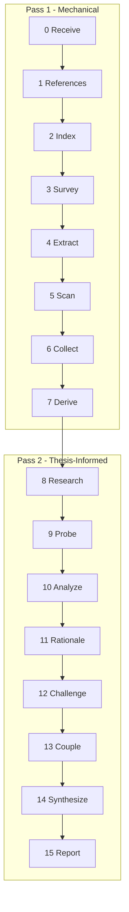

# Assay

Two-pass structural analysis of WG21 proposals. Six lenses: Performance, Design, Specification, Usability, Ecosystem, Rationale.



## Services

- **fast:** b200x2-gemma4
- **tool:** b200x2-gemma4
- **default:** b200x2-gemma4
- **frontier:** anthropic-opus

## Config

- **concurrency:** 2

## System Prompt

You are analyzing a C++ standards proposal (WG21 paper). Write plain technical English.

## 0. Receive

1. Validate the paper exists in paperstore.
2. Load metadata and converted markdown.
3. Blank frontmatter and revision history (preserving line numbers).
4. Build FrontMatter from metadata (document, title, date, audience, authors, intent).
5. Store paper source and metadata in state.

## 1. References

1. Line scan for all D/P/N paper numbers and URLs.
2. Paperstore cross-check: verify cited papers exist, detect stale revisions, flag self-citations.

## 2. Index

1. For each reference in inventory where in_paperstore=True (excluding the paper under analysis), load markdown.
2. Chunk each paper (heading-aware split, ~400 tokens per chunk).
3. Embed all chunks via configured embedder.
4. Store index on state for downstream query by Research and Challenge.

## 3. Survey

- **chunk-tokens:** 1000

1. Section chunking via assay.chunker.chunk_paper with coalescing.
2. Wording signal: scan headings for "Wording"/"Proposed Changes", check CWG/LWG audience.
3. Triage: skip wording-dominant or reference documents.

## 4. Extract

- **model:** fast
- **max-output:** 32768
- **thinking-budget:** 8192
- **concurrency:** 8

You are extracting items from one section of a WG21 paper. Extraction is mechanical. Extract (type):

- claim - any assertion the paper makes
- evidence (benchmark, complexity analysis, implementation, example, citation, formal proof, formal definition, concept specification, comparative, precedent) - what supports claims
- concession (limitation, disclaimer, deferral, tradeoff, open question) - what the paper surrenders
- question - questions the paper raises
- dependency - external dependencies
- scope - scope statements
- ask - only when text explicitly requests committee action

For each item: exact quote, line number.

Code blocks defining concepts, structs, or classes are formal definitions (evidence).

References: the paper's reference inventory is injected into the prompt. For each reference appearing in this chunk, annotate: relationship (companion, dependency, predecessor, citation, background, tool) and one sentence describing what the paper says about it. Do not discover new references - only annotate the ones provided.

---

Per-chunk extraction with concurrency from ## Config. Reference inventory injected per chunk from Survey's mechanical extraction. Output: ChunkExtractOutput per chunk.

## 5. Scan

- **model:** fast
- **max-output:** 8192
- **thinking-budget:** 16384
- **concurrency:** 8

Pattern:

- A performance claim (fast, efficient, zero-cost, low-overhead) with no benchmark, measurement, or complexity analysis
- A design decision with no rationale for why alternatives were rejected
- A compatibility or safety claim with no analysis of what could break
- An implementation claim with no code, link, or deployment evidence
- A "future work" deferral with no assessment of feasibility
- A normative assertion with no specification wording or formal definition backing it
- A comparison ("better than X", "unlike Y") with no data or citation supporting it
- A claim about existing practice with no survey, corpus analysis, or citation

Each breadcrumb:
- gap: name the specific absence in one sentence.
- severity: significant if it undermines a section-level argument, minor otherwise.

Example breadcrumb:
  gap: "No benchmark data provided to support the claim that type erasure overhead is negligible for I/O operations."
  why_important: "The performance claim is central to the design choice of using type-erased executors."
  primary_lens: Performance
  severity: significant

---

Per-chunk scan. Independent of Extract. Output: ScanOutput per chunk.

## 6. Collect

Pure Python aggregation. Dedup claims (exact quote + substring absorption), group breadcrumbs by lens, aggregate asks, build reference registry, decide active lenses.

## 7. Derive

- **model:** default
- **max-output:** 8192
- **thinking-budget:** 4096

You receive all collected claims and evidence from a WG21 paper. Perform:

1. Thesis compression: read all claims and compress into one sentence (the central thesis - what the paper actually argues, derived bottom-up from claims).
2. Problem statement: one sentence describing what deficiency the paper addresses.
3. Scope boundary: what the paper does and does not cover.
4. Load-bearing identification: for each claim, if retracting it would break the thesis, mark it as load-bearing (include id and quote).
5. Ask calibration: from the asks, determine the most demanding ask type.

---

One sub-agent. Receives all collected claims and evidence. After return, main context upgrades breadcrumb severities (touches thesis -> critical). Output: DeriveOutput.

## 8. Research

- **model:** tool
- **max-output:** 8192
- **thinking-budget:** 4096
- **Tools:** web_search, web_fetch

You are researching external technical context for one analytical lens of a WG21 paper. Budget: 3 web searches maximum. After each search, check relevance to the paper's thesis. Stop early if first 2 searches return nothing relevant. Return only direct hits. Every finding must connect to the paper's thesis or scope.

---

Six sub-agents (one per lens), run serially. Each uses web search to find external technical context. Output: ResearchLensOutput per lens.

## 9. Probe

- **model:** none

---

Pure Python. Compares mechanical reference inventory (from Survey) against LLM-annotated reference registry (from Collect):

1. Cited-but-not-referenced: inventory entries the LLM did not annotate.
2. Referenced-but-not-cited: LLM registry entries with no inventory match.
3. Companion detection: references tagged "companion" flagged for future ingestion.
4. Surface stale/self-cite/paperstore flags from Survey verification.

Future LLM expansion:

Verify Citations: fetch or read one cited paper via ensure_paper_md + make_read_paper_tool. Check whether quoted or paraphrased claims match the cited source. Report evidence relevant to the citing paper's claims.

Web Search: search for public external evidence on critical gaps not covered by citation evidence. Prefer primary sources, implementation docs, standards papers, benchmarks.

Resolve External: integrate citation and web evidence back into the load-bearing classifications. Reclassify a critical_gap as externally_anchored only when external evidence supports the exact claim.

## 10. Analyze

- **model:** default
- **max-output:** 16384
- **thinking-budget:** 32768
- **concurrency:** 8

You are analyzing one section of a WG21 paper in Pass 2. You have:
- The thesis (central_claim, problem_statement, scope_boundary)
- Load-bearing claims
- Cross-chunk breadcrumbs from OTHER chunks
- Research context from all 6 lenses
- The 25 test patterns

Read the chunk. For each item, check against the thesis and breadcrumbs. Apply relevant test patterns. Produce findings (with severity, explanation, test name, examiner role, damage statement, confidence) and strengths (load-bearing claims well-supported by evidence with no breadcrumbs against them).

---

C sub-agents (one per chunk), run serially. Each chunk sub-agent reads its chunk with the thesis, cross-chunk breadcrumbs, research context, and 25 test patterns. Output: ChunkAnalyzeOutput per chunk.

## 11. Rationale

- **model:** default
- **max-output:** 8192
- **thinking-budget:** 16384

You assess the paper's rationale completeness. Two layers:

Layer 1 - SD-4 mechanical checklist (5 items):
  SD4-1: Motivating Examples - does paper show problem today + improvement?
  SD4-2: Design Principles - does paper articulate principles or connect to C++ philosophy?
  SD4-3: Alternatives Considered - are alternatives discussed with reasons?
  SD4-4: Cost Acknowledgment - does paper address committee time, impl burden, docs, teaching, compat?
  SD4-5: Beneficiary Identification - does paper name specific use cases or stakeholders?

Layer 2 - Quality findings when checklist passes structurally but content is shallow.

Also assess evidence sufficiency using quality tiers and ask calibration.

---

One sub-agent. Receives all claims, evidence, scope coverage, asks, and chunk map. Runs the SD-4 checklist and produces quality findings. Output: RationaleOutput.

## 12. Challenge

- **model:** default
- **max-output:** 8192
- **thinking-budget:** 0

You are cross-examining findings from a structural analysis of a WG21 paper. Your job is to kill findings that should not have been filed. The burden is on the finding to justify its existence, not on the paper to justify its innocence. Apply five challenges in order. A finding killed at any challenge skips the rest.

**1. Concession.** Does the paper already concede this point? If the paper openly acknowledges the limitation this finding describes, the finding wastes the reader's time. Kill it.

**2. Phantom.** Does the paper actually claim what this finding attacks? If the finding attacks an inference the analyzer drew rather than a statement the paper made, it attacks a phantom. The paper's own words are the boundary. Kill it.

**3. Resolution.** Does the paper's own text, read as a competent reviewer would, resolve or answer this concern? If the answer is in the paper - even in a different section, even implicitly through a described mechanism - the finding failed to read the paper. Kill it.

**4. Plausibility.** Would a real committee reviewer raise this concern? If the finding exists only because exhaustive mechanical analysis produced it, and no human reading the paper would notice or care, the finding is noise. Kill it.

**5. Substance.** Is this finding substantive at its assigned severity? If it is editorial, formatting, or stylistic rather than structural, kill it.

For each finding, return: the finding title, whether it survived, which challenge killed it (if any), and one sentence of reasoning.

---

LLM cross-examination replaces the former Python bag-of-words kill filters. Findings are batched by lens. Each batch includes the findings, relevant paper source lines, concessions, and scope boundary. Output: CrossExamBatchOutput.

## 13. Couple

- **model:** default
- **max-output:** 8192
- **thinking-budget:** 0

Identify compound dynamics where multiple findings combine.

For each compound: name, constituent titles, mechanism (one factual sentence per link), cross-lens flag. No speculation.

---

One sub-agent. Receives only surviving findings organized by lens. Output: CoupleOutput.

## 14. Synthesize

Pure Python verdict derivation. Promote findings to Major (compound constituent or touches thesis). Compute dominant dynamic. Apply verdict scale: Sound, Weakened, Undermined.

## 15. Report

```jinja
# {{ pid }} Assay

Title: "{{ title }}"

{{ central_thesis }}

---

## Verdict

{{ verdict }} ({{ confidence }})


The paper argues: {{ thesis_statement }}

Thesis survives: {{ "Yes" if thesis_survives else "No" }}.
Findings: {{ critical_count }} critical, {{ significant_count }} significant, {{ minor_count }} minor.

---

## Asks


- {{ a.quote }} (line {{ a.line }})


Requests committee action (declared intent)

Informational (declared intent)

Inferred: {{ ask_calibration }} ({{ wording_lines }} lines of wording, targets CWG/LWG)

No asks found.



---


## Structural Assessment


The dominant dynamic is **{{ dominant_dynamic }}**.



{{ structural_summary }}


---



## Compound Dynamics


### {{ c.name }}

**Constituents:** {{ c.constituents | join(", ") }}
**Mechanism:** {{ c.mechanism }}


{{ c.emergent_risk }}



---



## Major Findings

{{ major_findings | length }} findings promoted to Major. {{ total_survived }} survived challenge, {{ total_killed }} killed.


### {{ f.number }}. {{ f.title }}

**Severity:** {{ f.severity }}
**Lens:** {{ f.lens }}
**Test:** {{ f.test }}


> {{ f.quote }}

(line {{ f.line }})


{{ f.explanation }}


**Examiner:** {{ f.examiner }}



**Damage:** {{ f.damage }}



---



## Findings


### {{ f.number }}. {{ f.title }}

**Severity:** {{ f.severity }}
**Lens:** {{ f.lens }}
**Test:** {{ f.test }}


> {{ f.quote }}

(line {{ f.line }})


{{ f.explanation }}


---



## Strengths


### {{ s.title }}

> {{ s.quote }}

(line {{ s.line }})

{{ s.explanation }}


---



## Rationale Checklist

| # | Item | Pass | Location | Note |
|---|------|------|----------|------|

| {{ c.id }} | {{ c.name }} | {{ c.passed_str }} | {{ c.location }} | {{ c.note }} |


**Score:** {{ checklist_passed }}/{{ checklist_total }}

---



## Reference Table

| Ref | Tier | Status | Notes |
|-----|------|--------|-------|

| {{ r.label }} | {{ r.tier }} | {{ r.link }} | {{ r.mention_count }} mentions |


---


## Inventory

**Items:**
- Claims: {{ inventory.claim_count }}
- Evidence: {{ inventory.evidence_count }}
- Concessions: {{ inventory.concession_count }}
- Questions: {{ inventory.question_count }}
- Dependencies: {{ inventory.dependency_count }}

**Breadcrumbs:** {{ inventory.breadcrumb_total }} ({{ inventory.breadcrumb_critical }} critical, {{ inventory.breadcrumb_significant }} significant, {{ inventory.breadcrumb_minor }} minor)

**Findings:** {{ inventory.findings_generated }} generated, {{ inventory.findings_survived }} survived, {{ inventory.findings_killed }} killed

- Killed by: {{ inventory.killed_breakdown }}

- Major: {{ inventory.major_count }}
- Regular: {{ inventory.regular_count }}

**Compounds:** {{ inventory.compound_count }}
**Strengths:** {{ inventory.strength_count }}

---

## Methodology

- Paper: {{ pid }}, "{{ title }}"
- Model: {{ model_name }}
- Service: {{ service_name }}
- Chunks: {{ chunk_count }}
```

---

Render the final markdown report from the Jinja template above. All data is pre-sorted and pre-computed by prepare_report_data() before reaching the template.
