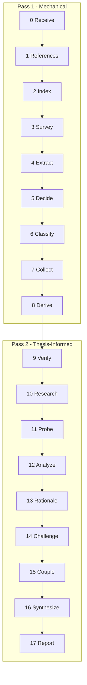

# Assay

Two-pass structural analysis of WG21 proposals. Six lenses: Performance, Design, Specification, Usability, Ecosystem, Rationale.



## Services

- **gemma:** b200x2-gemma4
- **deepseek:** h200x8-deepseek-v4-pro
- **default:** h200x8-deepseek-v4-pro

## Config

- **concurrency:** 2

## System Prompt

You are analyzing a C++ standards proposal (WG21 paper). Write plain technical English.

## 0. Receive

- **model:** none

1. Validate the paper exists in paperstore.
2. Load metadata and converted markdown.
3. Blank front matter, revision history, acknowledgements (keep line numbers).
4. Store paper markdown and metadata fields (date, audience, authors, intent) in state.

## 1. References

- **model:** none

1. Line scan for all D/P/N paper numbers and URLs.
2. Paperstore cross-check: verify cited papers exist, detect stale revisions, flag self-citations.

## 2. Index

- **model:** none

1. For each reference in inventory where in_paperstore=True (excluding the paper under analysis), load markdown.
2. Chunk each paper (heading-aware split, ~400 tokens per chunk).
3. Embed all chunks via configured embedder.
4. Store index on state for downstream query by Research and Challenge.

## 3. Survey

- **model:** none
- **chunk-tokens:** 1000

1. Section chunking via assay.chunker.chunk_paper with coalescing.
2. Wording signal: scan headings for "Wording"/"Proposed Changes", check CWG/LWG audience.
3. Triage: skip wording-dominant or reference documents.

## 4. Extract

- **max-output:** 8192
- **thinking-budget:** 2048
- **concurrency:** 8

You are extracting items from one section of a WG21 paper. Extraction is mechanical.

If the item is a code block, classify as evidence. Quote the code body. Omit the triple-backtick markers and the language tag. Stop.

Otherwise, apply this funnel to prose. Stop at the first match:

1. ask - text explicitly requests committee action ("we ask", "Poll.", "we propose to LEWG", "we recommend")
2. question - text is an interrogative (ends with "?")
3. dependency - text introduces or names an external paper, standard, or library the proposal builds on ("companion to", "built on", "see [P####]"). Bare citation markers like "[10,11]" are NOT dependencies; they fall through to evidence.
4. scope - text states inclusion or exclusion ("what follows is the minimum", "this paper does not propose", "out of scope")
5. concession - text acknowledges a limitation, disclaimer, deferral, tradeoff, or open issue
6. evidence - benchmark, table, citation, formal definition, concept specification, or worked example
7. claim - any remaining declarative sentence that meets ALL of: (a) makes a verifiable assertion about behavior, performance, design, specification, or rationale; (b) is grammatically self-contained when read in isolation; (c) is not a definition, label, header, or table caption; (d) is not a stage-direction phrase such as "What follows is...", "Here we show...", or "Consider the following...".

For each item: an exact verbatim substring of the source, plus the line number.

---

Per-chunk extraction with concurrency from ## Config. Output: ChunkExtractOutput per chunk.

## 5. Decide

- **max-output:** 4096
- **thinking-budget:** 4096
- **concurrency:** 8

You judge whether claims in a section of a WG21 paper are supported by evidence SEPARATE FROM the claim itself.

A claim restating itself is NOT support. The question is: does the chunk contain something OTHER than the claim that backs it up?

You receive:
- the chunk text (a section of the paper)
- a list of claims Extract identified in this chunk, each with an ID and quote

For each claim, look for support DISTINCT from the claim. Support means:
- benchmark or measurement data (for performance claims)
- code, implementation, or worked example (for implementation claims)
- citation or formal definition (for specification claims)
- comparative data or table (for comparison claims)
- explanatory mechanism with technical detail (for design claims)

NOT support:
- the claim's own text repeated or paraphrased
- a bare assertion without backing ("X is Y" alone is not support for "X is Y")
- another claim that depends on the same unsupported premise

Output per claim: {claim_id, supported: true|false, reason: one-line explanation}.

If supported, cite the specific evidence (e.g., "table at line 199 gives 3.10x speedup").
If unsupported, state what is missing (e.g., "no benchmark for the cited 1-2ns figure").

---

Per-chunk decide with concurrency from ## Config. Output: ChunkDecideOutput per chunk.

## 6. Classify

- **max-output:** 16384
- **thinking-budget:** 4096
- **concurrency:** 8

You receive the claims judged unsupported in one chunk of the paper, each with a reason.

For each unsupported claim, produce a GapOutput:

- item_quote - the claim's exact quote
- line - the claim's line number
- gap - the question a reviewer would ask to surface the missing support
- why_important - one sentence on why the missing support matters
- primary_lens - one of: Performance, Design, Specification, Usability, Ecosystem, Rationale
- secondary_lens - optional second lens or null
- severity - "significant" if retracting the claim breaks the paper's argument, "minor" otherwise

Lens definitions:
- Performance - speed, latency, overhead, allocation, scaling
- Design - protocol shape, type structure, API ergonomics
- Specification - normative wording, conformance, what an implementation must do
- Usability - learnability, error messages, common mistakes
- Ecosystem - interaction with existing libraries, vendors, deployments
- Rationale - the why behind design decisions

---

Per-chunk call with concurrency from ## Config. Receives one chunk's unsupported claims from Step 5. Output: ChunkClassifyOutput per chunk (model authors semantic fields only; the orchestrator assigns chunk_index and pipeline-managed id/closed_by). Gaps are merged and deduped in Step 7 Collect.

## 7. Collect

- **model:** none

1. Dedup claims (exact quote + substring absorption)
2. Group gaps by lens, aggregate asks
3. Decide active lenses.

## 8. Derive

- **max-output:** 8192
- **thinking-budget:** 4096

You receive all collected claims and evidence from a WG21 paper. Perform:

1. Thesis compression: read all claims and compress into one sentence (the central thesis - what the paper actually argues, derived bottom-up from claims).
2. Problem statement: one sentence describing what deficiency the paper addresses.
3. Scope boundary: what the paper does and does not cover.
4. Load-bearing identification: for each claim, if retracting it would break the thesis, mark it as load-bearing (include id and quote). `LoadBearingClaim.id` is an integer matching the collected claim's global ID (not a string like "C1").
5. Ask calibration: from the asks, determine the most demanding ask type.

---

- Receives all collected claims and evidence.
- After return, main context upgrades gap severities (touches thesis -> critical).
- Output: DeriveOutput.

## 9. Verify

- **max-output:** 8192
- **thinking-budget:** 4096

You have an `explore_{pid}` tool that searches a companion paper by the same author(s) via semantic similarity. Use it to:

1. Verify claims made in the paper under analysis against the companion.
2. Find evidence that supports or contradicts the thesis.
3. Identify relevant context not previously surfaced.

Pass natural-language queries describing what to look for. The tool returns numbered lines from matching passages wrapped in guard delimiters. Cite specific line numbers when reporting findings.

Gaps are listed as `[N]` with severity and the question text. The `closes` field takes a list of `GapResolution` objects (`gap_id`, `evidence_quote`, `evidence_line`). A gap is closed only if the companion paper provides direct evidence answering the question.

Output: VerifyOutput (confirmations, contradictions, new_evidence).

---

## 10. Research

- **max-output:** 8192
- **thinking-budget:** 4096
- **tools:** web_search, web_fetch

You are researching external technical context for one analytical lens of a WG21 paper. Budget: 3 web searches maximum. After each search, check relevance to the paper's thesis. Stop early if first 2 searches return nothing relevant. Return only direct hits. Every finding must connect to the paper's thesis or scope.

When researching the Specification lens and standard-lookup tools are available, use them instead of web search for normative questions. Tool selection:
- Not sure which tool? -> guide_query (describe what you need)
- Does mechanism X exist? -> verify_mechanism
- Fetch a specific section [label] -> lookup_section
- Library API specs -> lookup_declaration
- Definition of a term -> lookup_definition
- Broader search -> search_standard or search_index
- Grammar rules -> search_grammar
- Related sections -> get_cross_references
Web search remains available for non-normative context (implementations, benchmarks, blog posts).

---

- Six sub-agents (one per lens)
- Each uses web search to find external technical context.
- Output: ResearchLensOutput per lens.

## 11. Probe

- **model:** none

Surfaces flags from the mechanical reference inventory (Step 1):

1. Stale references: inventory entries pointing to a superseded revision.
2. Author overlap: Jaccard similarity between the analyzed paper's authors and each referenced paper's authors.

Future LLM expansion:

Verify Citations: fetch or read one cited paper via ensure_paper_md + make_read_paper_tool. Check whether quoted or paraphrased claims match the cited source. Report evidence relevant to the citing paper's claims.

Web Search: search for public external evidence on critical gaps not covered by citation evidence. Prefer primary sources, implementation docs, standards papers, benchmarks.

Resolve External: integrate citation and web evidence back into the load-bearing classifications. Reclassify a critical_gap as externally_anchored only when external evidence supports the exact claim.

## 12. Analyze

- **max-output:** 16384
- **thinking-budget:** 32768
- **concurrency:** 8


You are analyzing one section of a WG21 paper in Pass 2. You have:
- The thesis (central_claim, problem_statement, scope_boundary)
- Load-bearing claims
- Cross-chunk gaps from OTHER chunks
- Research context from all 6 lenses
- The 25 test patterns

Read the chunk. For each item, check against the thesis and gaps. Apply relevant test patterns. Produce findings (with severity, explanation, test name, examiner role, damage statement, confidence) and strengths (load-bearing claims well-supported by evidence with no gaps against them).

If a finding maps to one or more entries in "Gaps already raised on THIS chunk", include those IDs in `from_gap_ids` and elaborate beyond the gap text. Findings without an upstream gap leave `from_gap_ids` empty.

Do NOT set `id` on FindingOutput or StrengthOutput - the pipeline assigns IDs after collection.

---

C sub-agents (one per chunk), run serially. Each chunk sub-agent reads its chunk with the thesis, cross-chunk gaps, research context, and 25 test patterns. Output: ChunkAnalyzeOutput per chunk.

## 13. Rationale

- **max-output:** 8192
- **thinking-budget:** 16384

You assess the paper's rationale completeness. Two layers:

Layer 1 - SD-4 mechanical checklist (5 items):
- SD4-1: Motivating Examples - does paper show problem today + improvement?
- SD4-2: Design Principles - does paper articulate principles or connect to C++ philosophy?
- SD4-3: Alternatives Considered - are alternatives discussed with reasons?
- SD4-4: Cost Acknowledgment - does paper address committee time, impl burden, docs, teaching, compat?
- SD4-5: Beneficiary Identification - does paper name specific use cases or stakeholders?

Layer 2 - Quality findings when checklist passes structurally but content is shallow.

Also assess evidence sufficiency using quality tiers and ask calibration.

Do NOT set `id` on ChecklistItem - the pipeline assigns IDs after collection.

---

- Receives all claims, evidence, scope coverage, asks, and chunk map.
- Runs the SD-4 checklist and produces quality findings.
- Output: RationaleOutput.

## 14. Challenge

- **max-output:** 8192
- **thinking-budget:** 16384

For each finding, apply six challenges in order. Kill at the first failure.

1. **Concession.** The paper already concedes this point.
2. **Phantom.** The finding attacks an inference, not a statement the paper made.
3. **Resolution.** The paper's own text, read competently, resolves the concern. If the paper names a standard C++ mechanism (e.g., `await_transform`, `operator co_await`, symmetric transfer, `allocator_arg_t`) as the means by which a concern is addressed, and the "Standard verification" block confirms the mechanism exists, the resolution succeeds. The paper is not required to show the full implementation of the mechanism.
4. **Technical accuracy.** Does the finding claim a language change, ABI change, or standards defect is required? Check the "Standard verification" block for whether the standard library or an existing language feature already provides the mechanism. A finding that asserts a language change is needed when the verification block shows a library-level solution exists is technically inaccurate and must be killed.
5. **Plausibility.** No committee reviewer would raise this.
6. **Substance.** Editorial, formatting, or stylistic - not structural.

Return: finding_id, survived (bool), which challenge killed it (if any), one sentence of reasoning. `CrossExamVerdict` uses `finding_id: int` to reference findings by their `[N]` ID, not by title string.

---

LLM cross-examination replaces the former Python bag-of-words kill filters. Findings are batched by lens. Each batch includes the findings, relevant paper source lines, concessions, and scope boundary. Output: CrossExamBatchOutput.

## 15. Couple

- **max-output:** 8192
- **thinking-budget:** 16384

A compound exists when A's consequence is the input condition that triggers B, or fixing A alone fails because B blocks the same path. Thematic similarity is not a compound. Return an empty list if no causal links exist.

- **name:** short lowercase phrase describing the causal chain.
- **constituents:** `list[int]` of finding IDs (the `[N]` numbers), not title strings.
- **mechanism:** one sentence per link: why A's consequence triggers or amplifies B.
- **cross_lens:** true only if constituents span different lenses.
- **emergent_risk:** a concrete consequence neither finding produces alone, or null.

---

One sub-agent. Receives only surviving findings organized by lens. Output: CoupleOutput.

## 16. Synthesize

- **model:** none

1. Promote findings to Major if they are a compound constituent or share content words with the thesis (stop words excluded).
2. Pick the dominant dynamic: the compound with the most constituents.
3. Build a verdict statement from the dominant dynamic's emergent risk (if any) or the top major finding's damage statement, plus surviving severity counts.
4. Verdict scale:
   - **Sound** - no surviving findings.
   - **Weakened** - surviving significant or critical findings, but no critical finding overlaps the thesis.
   - **Undermined** - at least one critical finding overlaps the thesis.

## 17. Report

```jinja
# {{ pid }} {{ title }}


{{ thesis_statement }}


{{ verdict_statement }}

---

## Verdict

{{ verdict_label }} ({{ confidence }})

Thesis survives: {{ "Yes" if thesis_survives else "No" }}.
Findings: {{ critical_count }} critical, {{ significant_count }} significant, {{ minor_count }} minor.

---

## Asks


- {{ a.quote }} (line {{ a.line }})


Requests committee action (declared intent)

Informational (declared intent)

Inferred: {{ ask_calibration }} ({{ wording_lines }} lines of wording, targets CWG/LWG)

No asks found.



---


## Structural Assessment


The dominant dynamic is **{{ dominant_dynamic }}**.



{{ structural_summary }}


---



## Compound Dynamics


### {{ c.name }}

{{ c.mechanism }}


**Risk:** {{ c.emergent_risk }}


Involves: {{ c.constituents | join(", ") }}.


---



## Major Findings

{{ major_findings | length }} findings promoted to Major. {{ total_survived }} survived challenge, {{ total_killed }} killed.


### {{ f.number }}. {{ f.title }}

**Severity:** {{ f.severity }}
**Lens:** {{ f.lens }}
**Test:** {{ f.test }}


> {{ f.quote }}

(line {{ f.line }})


{{ f.explanation }}


**Examiner:** {{ f.examiner }}



**Damage:** {{ f.damage }}



---



## Findings


### {{ f.number }}. {{ f.title }}

**Severity:** {{ f.severity }}
**Lens:** {{ f.lens }}
**Test:** {{ f.test }}


> {{ f.quote }}

(line {{ f.line }})


{{ f.explanation }}


---



## Strengths


### {{ s.title }}

> {{ s.quote }}

(line {{ s.line }})

{{ s.explanation }}


---



## Rationale Checklist

| # | Item | Pass | Location | Note |
|---|------|------|----------|------|

| {{ c.id }} | {{ c.name }} | {{ c.passed_str }} | {{ c.location }} | {{ c.note }} |


**Score:** {{ checklist_passed }}/{{ checklist_total }}

---



## Paper References

| Paper | Resolved | Count | Status |
|-------|----------|-------|--------|

| {{ r.link }} | {{ r.pid }} | {{ r.count }} | {{ r.status }} |


---



## Hyperlinks

| URL | Line |
|-----|------|

| {{ u.link }} | {{ u.line }} |


---


## Inventory

**Items:**
- Claims: {{ inventory.claim_count }}
- Evidence: {{ inventory.evidence_count }}
- Concessions: {{ inventory.concession_count }}
- Questions: {{ inventory.question_count }}
- Dependencies: {{ inventory.dependency_count }}

**Gaps:** {{ inventory.gap_total }} ({{ inventory.gap_critical }} critical, {{ inventory.gap_significant }} significant, {{ inventory.gap_minor }} minor)

**Findings:** {{ inventory.findings_generated }} generated, {{ inventory.findings_survived }} survived, {{ inventory.findings_killed }} killed

- Killed by: {{ inventory.killed_breakdown }}

- Major: {{ inventory.major_count }}
- Regular: {{ inventory.regular_count }}

**Compounds:** {{ inventory.compound_count }}
**Strengths:** {{ inventory.strength_count }}

---

## Methodology

- Paper: {{ pid }}, "{{ title }}"
- Chunks: {{ chunk_count }}
```

---

Render the final markdown report from the Jinja template above. All data is pre-sorted and pre-computed by prepare_report_data() before reaching the template.
