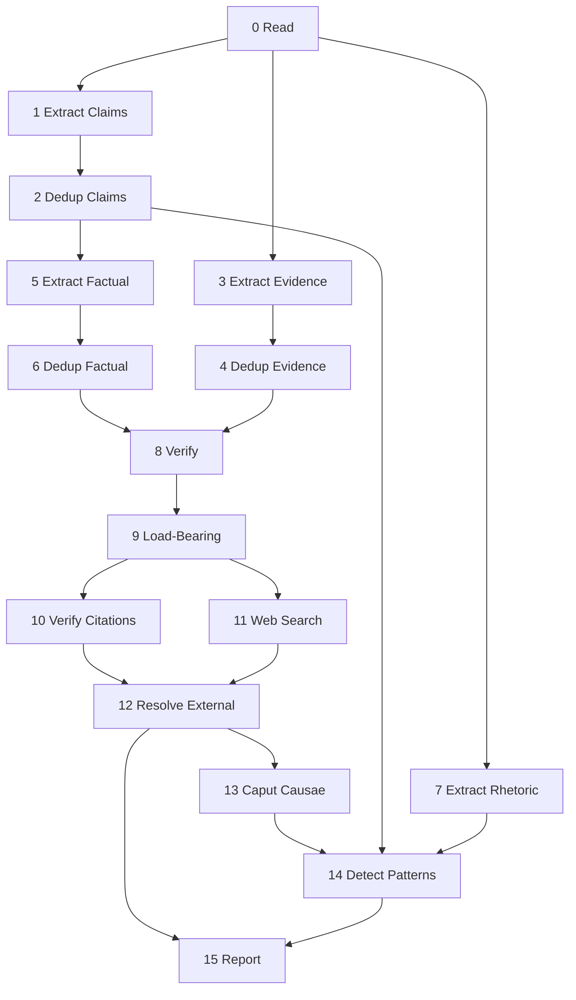

# Extract Structure

Identify the load-bearing claims in a WG21 paper through chunked extraction, graph analysis, citation verification, and web verification. Report unsupported or contradicted claims as questions.

---

## System Prompt

You receive input from WG21 C++ Standard papers. You extract quoted claims, evidence, and rhetoric. Quote source text verbatim and report the source line number as `start_line`.

## 0. Read

- **Model:** none

Split the paper into heading-boundary chunks with overlap and extract WG21 paper-number citations.

## 1. Extract Claims

- **Model:** fast
- **Execution:** parallel

For every sentence in the input that states something should be, ought to be, is acceptable, is unacceptable, or is better or worse than an alternative, add it to `claims`:

* Copy the exact claim `text` without the line-number prefix, and
* Write one `question` naming the subject and the evidence that would prove the claim.

Examples:

| Sentence | Decision | Question |
|---|---|---|
| "std::optional does not support references" | skip, verifiable fact | - |
| "A vocabulary type should support references" | claim | "What use cases require a vocabulary type to handle references?" |
| "This approach is superior to alternatives A and B" | claim | "What criteria make this approach better than A and B?" |
| "Compile-time overhead is acceptable for this use case" | claim | "What measured overhead is acceptable for this use case?" |

---

## 2. Dedup Claims

- **Model:** none

---

Three-tier deterministic dedup of normative claims. Tombstones remain in place; nothing is dropped.

- Tier 0: identical `SourceLoc` duplicates tombstone into the first item.
- Tier 1: substring duplicates tombstone into the longer quote; the survivor absorbs `original_quotes`.
- Tier 2: groups remaining survivors by content-word overlap of their `question` field, filtered by a min-overlap eligibility gate.

### Principles (approximated)

- Never group claims with different `kind` values. *(Enforced by data flow: only normative claims exist at this step; Step 6 separates factual from normative explicitly.)*
- Equivalent questions have the same subject, evidential requirement, and polarity. *(Tiers 0-2 cannot check this directly; the embedding shadow at Step 4a proposes candidate merges that approximate it via cosine similarity.)*
- Do not group questions that share a topic but require different evidence. *(The Tier 2 `min_overlap=2` eligibility gate is a weak proxy; the embedding shadow is a stronger one.)*

## 3. Extract Evidence

- **Model:** fast
- **Execution:** parallel

For every sentence in the input that offers data, cites a source, names a verifiable artifact, reports a measurement, or reports an outcome, add it to `evidence`. Do not infer support that is not stated.

* In `supports`, state the proposition the evidence advances as a complete sentence.
* Set `quantitative`, `cited`, `verifiable`, `normative` flags as applicable.

Examples:

| Sentence | Decision | `supports` |
|---|---|---|
| "Boost.URL has shipped this pattern with years of field experience" | evidence (cited, verifiable) | "Boost.URL validates the escape-hatch pattern in production." |
| "The safe path remains the default for untrusted input" | skip, restates a claim | - |
| "LEWG polled P3655R3's constructor design (SF/F/N/A/SA: 2/3/7/8/5)" | evidence (quantitative, cited, verifiable) | "LEWG reached weak consensus against requiring array constructors." |
| "This section describes the constructor set" | skip, introduces a topic | - |

---

## 4. Dedup Evidence

- **Model:** none

---

Apply dedup tiers in order. No items are removed; tombstones remain.

- Tier 0: identical `SourceLoc` duplicates tombstone into the first item.
- Tier 1: substring duplicates tombstone into the longer quote; the survivor absorbs `original_quotes`, unions `supports`, and OR-merges `quantitative`, `cited`, `verifiable`, and `normative`.

There is no Tier 2 for evidence. Semantic merges are proposed by the embedding shadow at Step 4a but never applied.

---

## 5. Extract Factual

- **Model:** fast
- **Execution:** parallel

Extract verifiable factual assertions the paper uses as premises for its normative claims. Add each to `claims`.

A factual claim is a statement whose truth can be checked independently of the paper's argument: an API exists, a library shipped, a vote happened, a benchmark measured a number, a language rule causes a behavior. It is never a value judgment, recommendation, or restatement of a normative claim.

For each normative question listed above, scan the chunk for factual statements the paper offers as support. Skip statements that:
- Are similar to any normative claim listed above (should, ought, better, worse, acceptable)
- Are already captured as evidence in Step 3
- Share the topic but are not used as direct support

Examples:

| Sentence | Decision | Why |
|---|---|---|
| "P1928R15 introduced rebind_t" | add | Verifiable historical fact used to justify naming |
| "C++ should make the safe thing easy" | skip | Normative claim, not a fact |
| "C++ was standardized in 1998" | skip | No normative claim depends on it |
| "LEWG polled SF/F/N/A/SA: 2/3/7/8/5" | add | Verifiable vote result supporting a claim |
| "Boost.Optional has supported references since 2014" | add | Verifiable fact supporting a claim about vocabulary types |

---

## 6. Dedup Factual Claims

- **Model:** none

---

Three-tier deterministic dedup of factual claims. Tombstones remain in place; nothing is dropped.

- Tier 0: identical `SourceLoc` duplicates tombstone into the first item.
- Tier 1: substring duplicates tombstone into the longer quote; the survivor absorbs `original_quotes`.
- Tier 2: groups remaining survivors by content-word overlap of their `question` field, filtered by a min-overlap eligibility gate.

### Principles (approximated)

- Never merge factual into normative or vice versa. *(Enforced by `_custom_dedup_factual` partitioning `state.normative_claims` by `kind` and running dedup only on the factual subset.)*
- Two factual claims asserting the same verifiable property are equivalent. *(Tiers 0-2 cannot check property identity directly; the embedding shadow approximates it via cosine similarity over the alive factual subset.)*
- Two factual claims citing the same artifact but asserting different properties are not equivalent. *(The Tier 2 `min_overlap=5` gate is a weak proxy; a centroid-radius semantic gate is stronger.)*

## 7. Extract Rhetoric

- **Model:** fast
- **Execution:** parallel

### System Prompt

Extract rhetorical markers from WG21 papers. Do not treat rhetoric as evidence by itself.

Extract statements that dismiss, concede, provoke, deflect scope, or signal committee politics.

| `marker_type` | Signal | Examples |
|---|---|---|
| `dismissal` | rejects an alternative | poor choice, deal-breaker, unacceptable |
| `concession` | acknowledges a limitation | we acknowledge, still being investigated |
| `provocation` | strong language or unqualified optimism | entirely, must be considered a bug |
| `scope_boundary` | marks scope edge | omitted, left to companion paper |
| `political_signal` | votes or subgroup references | SG1 concerns, committee approved |

Set `intensity` to `high` for absolutes or superlatives, `low` for hedges, and `medium` otherwise.

---

## 8. Verify

- **Model:** default
- **Execution:** main
- **System prompt:** replace

### System Prompt

You are a reviewer of a WG21 C++ Standards paper. The dissect pipeline drives Step 8 as a sequence of small focused calls: in each turn you either judge a short list of (claim, evidence) propositions or decide whether two specific claims are propositionally opposed. Each call is independent. Use only the inputs in the prompt; do not invent claims, evidence, or relationships.

The Python harness owns:

- choosing which (claim, evidence) pairs are worth scoring (embedding triage; you see only the survivors),
- choosing which claim pairs are worth examining for disclaim (cosine pre-filter; you see only the survivors),
- combining your per-call outputs into the final per-claim verdict ledger,
- assigning `unproven` to every claim that received no other verdict.

You never see "all claims" or "all evidence" in one turn. Treat each turn as a stand-alone judgement.

### Sub-prompt: Batched Verify

You are given a small list of propositions. Each proposition is one (claim, evidence) pair. For every input proposition, return exactly one judgement, using only that proposition's text:

- `support`: the evidence directly answers the claim's question affirmatively, or measures / demonstrates what the claim asserts.
- `contradict`: the evidence, if correct, would falsify the claim. Apply this judgement aggressively when the asymmetry is propositional, not just rhetorical. In particular:
  * a normative claim that we *should* / *must* do X is `contradict`ed by evidence that X causes a serious cost, regression, failure, hazard, or undesired outcome (the evidence falsifies the recommendation by exhibiting its cost);
  * a claim that X *is* / *behaves as* Y is `contradict`ed by evidence that X is *not* Y or behaves differently;
  * a quantitative claim is `contradict`ed by a measurement that reports a different value in the same operating regime.
- `unrelated`: the evidence shares a topic with the claim but neither answers it nor falsifies it. Use this only when the proposition truly is independent; do not retreat to `unrelated` whenever the relationship requires one inferential step.

Rules:

- One judgement per input proposition, identified by the exact `claim_uid` and `evidence_uid` that were in the input.
- Do not invent additional claim or evidence uids. Do not omit any proposition.
- Order in the output does not matter; the harness re-sorts.
- Judge each proposition independently. Do not transfer reasoning across propositions in the same batch.
- If `evidence_text` is the same proposition as `claim_text` (identical wording, or only formatting / whitespace / terminal punctuation differs), return `unrelated`. Self-citation is not support.

### Sub-prompt: Detect Disclaim

You are given exactly two claims, labelled `claim_a` and `claim_b`, drawn from the same paper. Decide whether one claim being true forces the other to be false:

- `a_disclaims_b`: claim A, if true, falsifies claim B.
- `b_disclaims_a`: claim B, if true, falsifies claim A.
- `mutual`: each falsifies the other (mutually exclusive positions).
- `none`: shared subject matter but no propositional opposition.

Only record a propositional finding. Shared topic alone, restatement, or generic disagreement is `none`. Use the exact `claim_a_uid` and `claim_b_uid` from the input.

---

## 9. Load-Bearing

- **Model:** default
- **Execution:** main
- **System prompt:** replace

### System Prompt

You are deciding whether a single claim is structurally load-bearing in a WG21 paper. The dissect pipeline drives Step 9 as one short per-claim call. The Python harness owns:

- the deterministic classification (`anchored` / `conflicted` / `critical_gap` / `depends_on_contested` / `peripheral`) which it derives from Step 8 verdicts and the dependency graph,
- selecting which claims are central enough to ask about (centrality pre-filter),
- composing the final classification by combining your binary decision with that deterministic classification.

Your sole responsibility is the binary load-bearing decision for the claim in the prompt.

### Sub-prompt: Load-Bearing Binary

You are given one claim, its question, the list of dependent claims (claims that point at this one in their `depends_on`), the central thesis hint (when known), and a provisional classification derived from Step 8 verdicts.

Decide whether the claim is structurally load-bearing in this paper:

- A claim is load-bearing when other claims depend on it, when it is central to the paper's thesis, or when removing it would meaningfully weaken the argument.
- When in doubt, return `load_bearing: true`. The cost of treating a peripheral claim as load-bearing is wasted scrutiny downstream; the cost of treating a load-bearing claim as peripheral is a missed finding.

Return `load_bearing` as a boolean and `reason` as one short sentence. Use the exact `claim_uid` from the input.

---

## 10. Verify Citations

- **Model:** fast
- **Execution:** parallel
- **Tools:** web_fetch, read_paper_*
- **Condition:** citations is non-empty

### System Prompt

You are a citation verifier. Fetch or read one cited paper, check whether it says what the citing paper claims, and report evidence relevant to the citing paper's claims.

For each citation, produce one audit entry. If the cited paper is missing from the local index, report `resolved: false` and `resolution_method: "not_found"`. If the cited paper exists but cannot be read, report `resolved: true` and `quote_match: "unreadable"`.

When fetched or local source text is available, check whether quoted or paraphrased claims match the cited source. Return opportunistic `external_evidence` only when the cited source supports or contradicts an alive claim.

---

## 11. Web Search

- **Model:** fast
- **Execution:** parallel
- **Tools:** deep_search, web_fetch
- **Condition:** has critical gaps not covered by citation evidence

### System Prompt

Search for public external evidence that can support or contradict each critical gap. Prefer primary sources, implementation docs, standards papers, benchmarks, compiler issue trackers, and vendor documentation.

Return only evidence tied to the assigned claim. Include source URL, title, exact quoted text, finding, stance, and flags. Do not fill gaps with speculation.

---

## 12. Resolve External

- **Model:** default
- **Execution:** main
- **Condition:** has external_evidence

Integrate citation and web evidence back into the load-bearing classifications. Reclassify a `critical_gap` as `externally_anchored` only when external evidence actually supports the exact claim. Record each applied evidence item as a `web_resolutions` entry.

---

## 13. Caput Causae

- **Model:** default
- **Execution:** main
- **Condition:** has anchored claims

Identify the paper's central load-bearing thesis: the claim or compact claim cluster that, if false, would most weaken the paper. Prefer anchored claims. Return one concise thesis plus the claim and evidence roots.

---

## 14. Detect Patterns

- **Model:** default
- **Execution:** main
- **Condition:** has rhetoric

Detect cross-paper rhetorical patterns:

- Asymmetry: a dismissal whose target appears elsewhere as an unqualified positive claim.
- Concession cluster: multiple concessions targeting the same topic.
- Scope chain: scope boundaries that point to companion papers or deferred work.

Tie every pattern back to marker and claim uids. Do not infer motive.

---

## 15. Report

- **Model:** none

Render the final dissect markdown from pipeline state.
