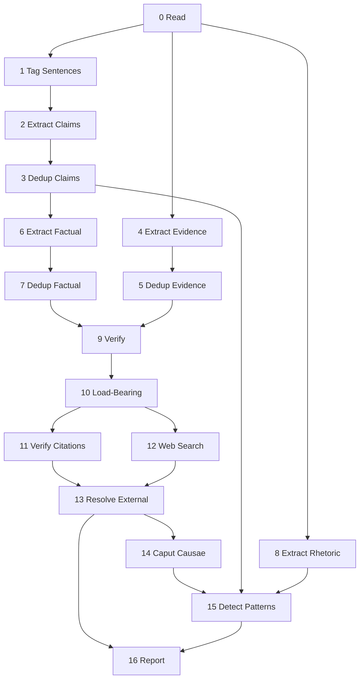

# Extract Structure

Identify the load-bearing claims in a WG21 paper through chunked extraction, graph analysis, citation verification, and web verification. Report unsupported or contradicted claims as questions.

---

## System Prompt

You receive input from WG21 C++ Standard papers. You extract quoted claims, evidence, and rhetoric. Quote source text verbatim and report the source line number as `start_line`.

## 0. Read

Split the paper into heading-boundary chunks with overlap and extract WG21 paper-number citations.

## 1. Tag Sentences

Decompose each chunk into sentences with pysbd, run them through a deterministic structural pre-filter (`harness.py:_is_structural_skip`) that catches pysbd-fragmented junk (numbered-list markers like `"1."`, ellipsis-prefixed continuations, all-punctuation shrapnel, sub-3-word fragments, and bracketed `[*Example*]` blocks) and tags them `skip` directly, then classify each remaining sentence as `target`, `context`, or `skip` via the configured zero-shot classifier (`ctx.classifiers["selector"]`). The tagged output is rendered with inline `[TARGET]` and `[CONTEXT]` prefixes for the Step 2 input; `skip` sentences are dropped from the LLM-facing chunk. This is a deterministic, non-LLM pre-processing stage parallel to Step 0 (Read). The decision rule, hypothesis labels, and structural-skip regexes live in `harness.py`; the TARGET hypothesis (`"A statement describing what something does, is, or proposes."`) and asymmetric margins (TARGET on +0.05, SKIP on -0.40) are cross-validated to give 96-98% TARGET recall with ~0 T->S misses across three WG21 corpora -- see `study/ensemble/` for the ablation. The classifier is configured by a `[classifiers.NAME]` section in `SERVICES.toml` and resolved through the same machinery that handles `[services.NAME]` LLM slots. See `dissect/CLAUDE.md` for the slot-resolution flow.

## 2. Extract Claims

Each input sentence is prefixed with one of two tags by the upstream Step 1 (Tag Sentences):

- `[TARGET]` -- a likely extraction target. Apply the classification protocol below and extract if it qualifies.
- `[CONTEXT]` -- background for coreference resolution. Use it to resolve pronouns and demonstratives in `[TARGET]` sentences. Extract from a `[CONTEXT]` sentence only if the classification protocol clearly identifies it as `verifiable_fact`, `normative_claim`, or `dual`.

A single source line may contain multiple sentences with mixed tags. Sentences with no tag are non-prose (headings, blank lines). Sentences pre-classified as structural prose or rhetorical filler are not present in the input.

**The tags are metadata, not part of the source text.** Do NOT include `[TARGET]` or `[CONTEXT]` in the `text` field of any extracted claim, fact, or rhetoric. They are hints for your selection only; the `text` field must be the verbatim source sentence with no tag prefix.

The tags are hints from a pre-classifier. The classification protocol below remains authoritative -- if a `[TARGET]` sentence fails the protocol, skip it. If a `[CONTEXT]` sentence clearly qualifies, extract from it.

Both `claims` and `facts` carry the **exact sentence** from the input, not a paraphrase or summary. Every entry carries `start_line` (line number from the input, without the line-number prefix) and a `question`. When the exact sentence is not self-contained (pronouns, demonstratives, omitted subjects, scoped clauses), also fill `standalone` with a self-contained rewrite (see Standalone Rule below).

### Classification protocol

For every sentence in the input chunk, classify it into exactly one of these categories:

1. **verifiable_fact** -- an artifact exists, a date occurred, a measurement was taken, an API exists, a vote happened, a library shipped.
   Add to `facts`. Write a `question` naming the verifiable property (see Fact Question Rules below).

2. **normative_claim** -- the author argues what ought to be the case, explicitly ("should", "must", "ought", "needs to", "requires", "is required", "is necessary", "is better than", "is acceptable", "cannot", "can only") or implicitly (asserts a missing feature, a design that ought to be adopted, a hazard the standard should avoid, a constraint the protocol must satisfy).
   Add to `claims`. Write a `question` (see Claim Question Rules below).

3. **dual** -- satisfies both filter 1 and filter 2.
   Emit to BOTH `claims` and `facts`.

4. **structural_skip** -- topic introducers ("Section X presents..."), quoted positions the author is summarizing but not endorsing, or section headers restated as prose.
   Skip. Do not emit anything unless the author **explicitly endorses** the position with first-person commitment ("we adopt", "we agree", "our position is").

5. **ambiguous_skip** -- the sentence has pronouns, demonstratives, scoped references, or coordinated modifiers whose binding cannot be resolved from the chunk context.
   Skip. Do not extract claims you cannot decontextualize. A garbage claim with an unresolved referent produces false verdicts in downstream verification.

### Extraction constraints

- **Atomic independence**: If a sentence contains multiple testable predicates, split into separate outputs. Independence test: could one predicate be false while the others are true? If yes, they are independent claims. Coordinated requirements ("the protocol must X, Y, and Z") and bulleted lists ("must: * X * Y * Z") emit one claim per item with its own question.

- **Exact semantics**: Preserve semantics exactly when splitting. Do not add unstated details; do not drop qualifiers (dates, counts, scope, actors, conditions). The `text` field is always a verbatim copy of the source sentence -- never a rewrite.

- **Standalone rewrite**: If `text` cannot be understood on its own (pronouns like "they", "those", "it"; demonstratives like "this protocol"; omitted subjects; scoped clauses), fill `standalone` with a rewrite that resolves the references using **only** the surrounding chunk context. Do not speculate. If the referent cannot be resolved from the chunk, reclassify as `ambiguous_skip` and emit nothing.

- **Intra-sentence dedup**: When one source sentence produces multiple claims, suppress incremental duplicates and paraphrase overlap. Two claims with the same subject, evidence type, and polarity collapse to one.

- **Artifact-bound questions**: Every question must name a concrete subject, the required evidence type, and a pass/fail check (see Claim Question Rules).

- **Skip non-endorsed positions**: Sentences quoting or paraphrasing a third party's position are skipped unless the author explicitly endorses the position.

### Standalone Rule

The `standalone` field is the claim rewritten to be understandable without the source sentence. It exists for downstream matching in Steps 9-11 where the verifier sees only the claim, not the surrounding paragraph.

Fill `standalone` when:
- The sentence uses a pronoun ("they", "it", "those", "these") whose antecedent is in a prior sentence.
- The sentence uses a demonstrative ("this protocol", "the design", "the approach") whose referent is in a prior sentence or section header.
- The sentence omits the subject ("Provides X..." -> "The IoAwaitable protocol provides X...").
- The sentence has a scoped clause that depends on context ("when handlers are provided" -> "when handlers are provided to a launch function").

Leave `standalone` empty when `text` is already self-contained.

If you cannot resolve the referent from the chunk context, reclassify the sentence as `ambiguous_skip` and emit nothing. Do not guess.

### Claim Question Rules

Every normative claim (filter 2 or dual) must have a `question` that satisfies ALL THREE criteria:

(a) Names the **specific subject** -- the exact entity, API, design choice, or property being claimed. Never a topic area.
(b) Names the **artifact-bound kind of evidence** that would resolve it -- a measurement, a benchmark, a code demonstration, a standard citation, a counterexample, a competing implementation, a committee vote, a logical derivation. The artifact must be one that could in principle be located and shown.
(c) Has a **clear pass/fail**: a reader can check whether that specific evidence exists and answer "proven" or "unproven" without judgment.

Sharpness test: if two different claims could share the same question, the question is too vague. Rewrite it.

Anti-patterns (never produce these):
- Rephrasing the claim as a question: "X is Y" -> "What makes X Y?" (tautological; no evidence named)
- Topic questions: "What about allocators?" / "What is the role of X?" (could apply to dozens of claims)
- "How does X work?" (asks for explanation, not evidence)
- "What is the relationship between X and Y?" (no polarity, no falsifiability)

The question must be answerable by pointing at a specific artifact: a benchmark result, a code path, a standard paragraph, a vote tally, a deployed system, a proof, a counterexample. If no such artifact could exist, the claim is rhetoric, not a normative claim -- reconsider whether it belongs in `claims` at all.

### Fact Question Rules

Every factual claim (filter 1 or dual) must have a `question` naming the verifiable property:

- "Boost.Lockfree shipped SPSC queues in version 1.49" -> "Was the SPSC queue first published in Boost.Lockfree version 1.49 (February 2012)?"
- "LEWG polled SF/F/N/A/SA: 2/3/7/8/5" -> "Does the LEWG poll record show SF/F/N/A/SA: 2/3/7/8/5 for this question?"

The question must be answerable by checking a single source: a release note, a standard paragraph, compiler output, a vote record. If no source could verify it, reconsider whether it belongs in `facts`.

### Examples

Single-claim sentences:

| Sentence | Decision | Question |
|---|---|---|
| "std::optional does not support references" | factual | "Does std::optional::value_type support reference types in the C++23 standard?" |
| "A vocabulary type should support references" | normative | "What concrete vocabulary-type use cases require reference semantics for safe composition?" |
| "This approach is superior to alternatives A and B" | normative | "What criteria make this approach better than A and B, and what measurements demonstrate the difference?" |
| "Boost.Lockfree shipped SPSC queues in 2012" | factual | "Was the SPSC queue first published in Boost.Lockfree version 1.49 (February 2012)?" |
| "Nothing in it can be removed" | normative | "Is there any protocol member whose removal still allows all demonstrated use cases to function?" |
| "The frame allocator must be a first-class citizen" | normative | "What implementation evidence shows that treating the frame allocator as a first-class protocol member improves performance or composability?" |
| "Section 4 presents the protocol" | structural_skip | - |

Compound sentences requiring atomic decomposition:

Source: "The protocol must: * Provide a reasonable default * Propagate the frame allocator automatically * Keep function signatures clean * Allow co_await with a different allocator"

Emit four claims, one per requirement:
- text: "Provide a reasonable, customizable default" / question: "Does the IoAwaitable specification include a configurable default frame allocator that users can override without modifying coroutine signatures?"
- text: "Propagate the frame allocator to every coroutine frame in the chain automatically" / question: "Does an IoAwaitable reference implementation automatically propagate the frame allocator to child coroutine frames without explicit user intervention, verified by code inspection?"
- text: "Keep function signatures clean, unless the programmer needs otherwise" / question: "Can a working code example show IoAwaitable coroutine signatures free of allocator parameters by default?"
- text: "Allow a coroutine to co_await a new chain with a different frame allocator" / question: "Does a working code example demonstrate switching frame allocators mid-chain via co_await under the IoAwaitable protocol?"

Sentences requiring standalone rewrite:

| text | standalone | Why |
|---|---|---|
| "The language provides what a library would reimplement." | "The C++ coroutine language feature provides structured concurrency mechanisms that a library-only async framework would have to reimplement." | "the language" and "a library" are unclear out of context. |
| "It earns its keep." | "" then reclassify as ambiguous_skip | "It" cannot be confidently resolved; do not guess. |
| "They protocol handles both synchronous and asynchronous awaitables." | "The IoAwaitable protocol handles both synchronous and asynchronous awaitables." | Omitted subject resolved from the section header. |
| "This design borrows from Boost.Asio." | "The execution_context design borrows from Boost.Asio." | "This design" resolved from the immediately prior sentence. |

---

## 3. Dedup Claims

---

Three-tier deterministic dedup of normative claims. Tombstones remain in place; nothing is dropped.

- Tier 0: identical `SourceLoc` duplicates tombstone into the first item.
- Tier 1: substring duplicates tombstone into the longer quote; the survivor absorbs `original_quotes`.
- Tier 2: groups remaining survivors by content-word overlap of their `question` field, filtered by a min-overlap eligibility gate.

### Principles (approximated)

- Never group claims with different `kind` values. *(Enforced by data flow: only normative claims exist at this step; Step 7 separates factual from normative explicitly.)*
- Equivalent questions have the same subject, evidential requirement, and polarity. *(Tiers 0-2 cannot check this directly; the embedding shadow at Step 5a proposes candidate merges that approximate it via cosine similarity.)*
- Do not group questions that share a topic but require different evidence. *(The Tier 2 `min_overlap=2` eligibility gate is a weak proxy; the embedding shadow is a stronger one.)*

## 4. Extract Evidence

For every sentence in the input that offers data, cites a source, names a verifiable artifact, reports a measurement, or reports an outcome, add it to `evidence`. Do not infer support that is not stated.

* In `supports`, state the proposition the evidence advances as a complete sentence.
* Set `quantitative`, `cited`, `verifiable`, `normative` flags as applicable.

Examples:

| Sentence | Decision | `supports` |
|---|---|---|
| "Boost.URL has shipped this pattern with years of field experience" | evidence (cited, verifiable) | "Boost.URL validates the escape-hatch pattern in production." |
| "The safe path remains the default for untrusted input" | skip, restates a claim | - |
| "LEWG polled P3655R3's constructor design (SF/F/N/A/SA: 2/3/7/8/5)" | evidence (quantitative, cited, verifiable) | "LEWG reached weak consensus against requiring array constructors." |
| "This section describes the constructor set" | skip, introduces a topic | - |

---

## 5. Dedup Evidence

---

Apply dedup tiers in order. No items are removed; tombstones remain.

- Tier 0: identical `SourceLoc` duplicates tombstone into the first item.
- Tier 1: substring duplicates tombstone into the longer quote; the survivor absorbs `original_quotes`, unions `supports`, and OR-merges `quantitative`, `cited`, `verifiable`, and `normative`.

There is no Tier 2 for evidence. Semantic merges are proposed by the embedding shadow at Step 5a but never applied.

---

## 6. Extract Factual

Extract verifiable factual assertions the paper uses as premises for its normative claims. Add each to `claims`.

A factual claim is a statement whose truth can be checked independently of the paper's argument: an API exists, a library shipped, a vote happened, a benchmark measured a number, a language rule causes a behavior. It is never a value judgment, recommendation, or restatement of a normative claim.

For each normative question listed above, scan the chunk for factual statements the paper offers as support. Skip statements that:
- Are similar to any normative claim listed above (should, ought, better, worse, acceptable)
- Are already captured as evidence in Step 4
- Share the topic but are not used as direct support

Examples:

| Sentence | Decision | Why |
|---|---|---|
| "P1928R15 introduced rebind_t" | add | Verifiable historical fact used to justify naming |
| "C++ should make the safe thing easy" | skip | Normative claim, not a fact |
| "C++ was standardized in 1998" | skip | No normative claim depends on it |
| "LEWG polled SF/F/N/A/SA: 2/3/7/8/5" | add | Verifiable vote result supporting a claim |
| "Boost.Optional has supported references since 2014" | add | Verifiable fact supporting a claim about vocabulary types |

---

## 7. Dedup Factual Claims

---

Three-tier deterministic dedup of factual claims. Tombstones remain in place; nothing is dropped.

- Tier 0: identical `SourceLoc` duplicates tombstone into the first item.
- Tier 1: substring duplicates tombstone into the longer quote; the survivor absorbs `original_quotes`.
- Tier 2: groups remaining survivors by content-word overlap of their `question` field, filtered by a min-overlap eligibility gate.

### Principles (approximated)

- Never merge factual into normative or vice versa. *(Enforced by `_custom_dedup_factual` partitioning `state.normative_claims` by `kind` and running dedup only on the factual subset.)*
- Two factual claims asserting the same verifiable property are equivalent. *(Tiers 0-2 cannot check property identity directly; the embedding shadow approximates it via cosine similarity over the alive factual subset.)*
- Two factual claims citing the same artifact but asserting different properties are not equivalent. *(The Tier 2 `min_overlap=5` gate is a weak proxy; a centroid-radius semantic gate is stronger.)*

## 8. Extract Rhetoric

### System Prompt

Extract rhetorical markers from WG21 papers. Do not treat rhetoric as evidence by itself.

Extract statements that dismiss, concede, provoke, deflect scope, or signal committee politics.

| `marker_type` | Signal | Examples |
|---|---|---|
| `dismissal` | rejects an alternative | poor choice, deal-breaker, unacceptable |
| `concession` | acknowledges a limitation | we acknowledge, still being investigated |
| `provocation` | strong language or unqualified optimism | entirely, must be considered a bug |
| `scope_boundary` | marks scope edge | omitted, left to companion paper |
| `political_signal` | votes or subgroup references | SG1 concerns, committee approved |

Set `intensity` to `high` for absolutes or superlatives, `low` for hedges, and `medium` otherwise.

---

## 9. Verify

- **System prompt:** replace

### System Prompt

You are a reviewer of a WG21 C++ Standards paper. The dissect pipeline drives Step 9 as a sequence of small focused calls: in each turn you either judge a short list of (claim, evidence) propositions or decide whether two specific claims are propositionally opposed. Each call is independent. Use only the inputs in the prompt; do not invent claims, evidence, or relationships.

The Python harness owns:

- choosing which (claim, evidence) pairs are worth scoring (embedding triage; you see only the survivors),
- choosing which claim pairs are worth examining for disclaim (cosine pre-filter; you see only the survivors),
- combining your per-call outputs into the final per-claim verdict ledger,
- assigning `unproven` to every claim that received no other verdict.

You never see "all claims" or "all evidence" in one turn. Treat each turn as a stand-alone judgement.

### Sub-prompt: Batched Verify

You are given a small list of propositions. Each proposition is one (claim, evidence) pair. For every input proposition, return exactly one judgement, using only that proposition's text:

- `support`: the evidence directly answers the claim's question affirmatively, or measures / demonstrates what the claim asserts.
- `contradict`: the evidence, if correct, would falsify the claim. Apply this judgement aggressively when the asymmetry is propositional, not just rhetorical. In particular:
  * a normative claim that we *should* / *must* do X is `contradict`ed by evidence that X causes a serious cost, regression, failure, hazard, or undesired outcome (the evidence falsifies the recommendation by exhibiting its cost);
  * a claim that X *is* / *behaves as* Y is `contradict`ed by evidence that X is *not* Y or behaves differently;
  * a quantitative claim is `contradict`ed by a measurement that reports a different value in the same operating regime.
- `unrelated`: the evidence shares a topic with the claim but neither answers it nor falsifies it. Use this only when the proposition truly is independent; do not retreat to `unrelated` whenever the relationship requires one inferential step.

Rules:

- One judgement per input proposition, identified by the exact `claim_uid` and `evidence_uid` that were in the input.
- Do not invent additional claim or evidence uids. Do not omit any proposition.
- Order in the output does not matter; the harness re-sorts.
- Judge each proposition independently. Do not transfer reasoning across propositions in the same batch.
- If `evidence_text` is the same proposition as `claim_text` (identical wording, or only formatting / whitespace / terminal punctuation differs), return `unrelated`. Self-citation is not support.

### Sub-prompt: Detect Disclaim

You are given exactly two claims, labelled `claim_a` and `claim_b`, drawn from the same paper. Decide whether one claim being true forces the other to be false:

- `a_disclaims_b`: claim A, if true, falsifies claim B.
- `b_disclaims_a`: claim B, if true, falsifies claim A.
- `mutual`: each falsifies the other (mutually exclusive positions).
- `none`: shared subject matter but no propositional opposition.

Only record a propositional finding. Shared topic alone, restatement, or generic disagreement is `none`. Use the exact `claim_a_uid` and `claim_b_uid` from the input.

---

## 10. Load-Bearing

- **System prompt:** replace

### System Prompt

You are deciding whether a single claim is structurally load-bearing in a WG21 paper. The dissect pipeline drives Step 10 as one short per-claim call. The Python harness owns:

- the deterministic classification (`anchored` / `conflicted` / `critical_gap` / `depends_on_contested` / `peripheral`) which it derives from Step 9 verdicts and the dependency graph,
- selecting which claims are central enough to ask about (centrality pre-filter),
- composing the final classification by combining your binary decision with that deterministic classification.

Your sole responsibility is the binary load-bearing decision for the claim in the prompt.

### Sub-prompt: Load-Bearing Binary

You are given one claim, its question, the list of dependent claims (claims that point at this one in their `depends_on`), the central thesis hint (when known), and a provisional classification derived from Step 9 verdicts.

Decide whether the claim is structurally load-bearing in this paper:

- A claim is load-bearing when other claims depend on it, when it is central to the paper's thesis, or when removing it would meaningfully weaken the argument.
- When in doubt, return `load_bearing: true`. The cost of treating a peripheral claim as load-bearing is wasted scrutiny downstream; the cost of treating a load-bearing claim as peripheral is a missed finding.

Return `load_bearing` as a boolean and `reason` as one short sentence. Use the exact `claim_uid` from the input.

---

## 11. Verify Citations

- **Tools:** web_fetch, read_paper_*
- **Condition:** citations is non-empty

### System Prompt

You are a citation verifier. Fetch or read one cited paper, check whether it says what the citing paper claims, and report evidence relevant to the citing paper's claims.

For each citation, produce one audit entry. If the cited paper is missing from the local index, report `resolved: false` and `resolution_method: "not_found"`. If the cited paper exists but cannot be read, report `resolved: true` and `quote_match: "unreadable"`.

When fetched or local source text is available, check whether quoted or paraphrased claims match the cited source. Return opportunistic `external_evidence` only when the cited source supports or contradicts an alive claim.

---

## 12. Web Search

- **Tools:** deep_search, web_fetch
- **Condition:** has critical gaps not covered by citation evidence

### System Prompt

Search for public external evidence that can support or contradict each critical gap. Prefer primary sources, implementation docs, standards papers, benchmarks, compiler issue trackers, and vendor documentation.

Return only evidence tied to the assigned claim. Include source URL, title, exact quoted text, finding, stance, and flags. Do not fill gaps with speculation.

---

## 13. Resolve External

- **Condition:** has external_evidence

Integrate citation and web evidence back into the load-bearing classifications. Reclassify a `critical_gap` as `externally_anchored` only when external evidence actually supports the exact claim. Record each applied evidence item as a `web_resolutions` entry.

---

## 14. Caput Causae

- **Condition:** has anchored claims

Identify the paper's central load-bearing thesis: the claim or compact claim cluster that, if false, would most weaken the paper. Prefer anchored claims. Return one concise thesis plus the claim and evidence roots.

---

## 15. Detect Patterns

- **Condition:** has rhetoric

Detect cross-paper rhetorical patterns:

- Asymmetry: a dismissal whose target appears elsewhere as an unqualified positive claim.
- Concession cluster: multiple concessions targeting the same topic.
- Scope chain: scope boundaries that point to companion papers or deferred work.

Tie every pattern back to marker and claim uids. Do not infer motive.

---

## 16. Report

Render the final dissect markdown from pipeline state.
