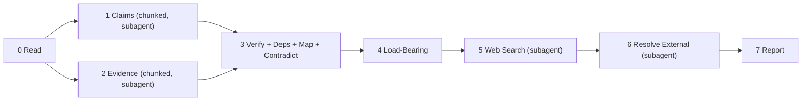

# Extract Structure

This tool presents the load-bearing claims in a paper which are either unsupported or contradicted by evidence.

Identify the load-bearing claims in a WG21 paper through chunked extraction, graph analysis, and web verification.



---

**Execution model:**
- Steps 0, 3, 4, 7: main agent
- Steps 1, 2: subagent per chunk, parallel with each other
- Step 5: single web search subagent
- Step 6: single resolution subagent
- **RULE:** Raw HTML and fetched content never enter the main agent context. The web search subagent consumes raw content and returns only structured `external_evidence[]` items.
- **RULE:** The LLM extracts exact quotes. A code harness computes `SourceLoc` by searching for each quote in the source file. The LLM never counts characters.

**Visibility:** Steps 0–6 are internal. Collect all structured data but do not display it. The only visible output is Step 7.

---

## SourceLoc

Every claim and evidence item is keyed by its location in the source file. The code harness computes this from the exact quote extracted by the LLM.

- `line` — line number in the source file (1-based)
- `start_char` — character offset of the quote's first character within that line
- `end_char` — character offset of the quote's last character within that line

All cross-references (`depends_on`, `merged_into`, `evidence_locs`, `claim_loc`, `dependents`) use `SourceLoc`. No array indices appear anywhere in the pipeline.

**Ordering:** SourceLocs are ordered by `line` first, then `start_char`.

**Resolution of LLM references:** The LLM cannot compute SourceLocs. When the LLM needs to reference another item (e.g., in `depends_on`), it quotes the `text` of the target item. The code harness resolves quoted text to SourceLocs by matching against known items.

---

## Dedup Protocol

Used by both Steps 1 and 2 after chunk results are collected. No items are removed from the array. Tombstones remain in place.

### Claims

| Tier | Signal | LLM? | Action |
|------|--------|------|--------|
| 0 | Exact `SourceLoc` match | No | Auto-tombstone. Guaranteed overlap duplicate. |
| 1 | Substring on `text` | No | Tombstone shorter. Longer absorbs `original_quotes`. |
| 2 | `question` equivalence | Yes (one call) | Group by question. Longest `text` survives. No synthesis. |

- **RULE: Tier 0 — WHEN two claims have identical `SourceLoc`** the second becomes a tombstone. `merged_into` points to the first.
- **RULE: Tier 1 — FOR survivors of Tier 0** (items where `merged_into is None`): WHEN one claim's `text` is a substring of another's, the shorter becomes a tombstone. `merged_into` points to the longer. The longer absorbs the shorter's `original_quotes`.
- **RULE: Tier 2 — FOR survivors of Tiers 0 and 1** (items where `merged_into is None`): group by semantic equivalence of `question` (one LLM call). For each group, the claim with the longest `text` survives. All others become tombstones. Survivor absorbs all `original_quotes` and keeps its own `question`. No synthesis sentence is produced.

### Evidence

| Tier | Signal | LLM? | Action |
|------|--------|------|--------|
| 0 | Exact `SourceLoc` match | No | Auto-tombstone. Guaranteed overlap duplicate. |
| 1 | Substring on `text` | No | Tombstone shorter. Longer absorbs `original_quotes`. |
| 2 | Synthesis | Yes (one call) | Group duplicates. Produce one synthesis sentence per group. |

- **RULE: Tier 0 — WHEN two evidence items have identical `SourceLoc`** the second becomes a tombstone. `merged_into` points to the first.
- **RULE: Tier 1 — FOR survivors of Tier 0** (items where `merged_into is None`): WHEN one evidence item's `text` is a substring of another's, the shorter becomes a tombstone. `merged_into` points to the longer. The longer absorbs the shorter's `original_quotes`.
- **RULE: Tier 2 — FOR survivors of Tiers 0 and 1** (items where `merged_into is None`): group by semantic equivalence of `supports` (one LLM call: "which of these evidence items are supporting the same assertion?"). For each group, produce one synthesis sentence. The synthesis sentence becomes `text` on the lowest-`SourceLoc` item. All others become tombstones. Survivor absorbs all `original_quotes`, unions all flags, and preserves all distinct `supports` values.

### Downstream Resolution

- **RULE: WHEN any `depends_on` or `evidence_locs` entry points to a tombstone** follow `merged_into` to the survivor.
- **RULE: WHEN any step iterates over claims or evidence** skip items where `merged_into is not None`.

---

## Step 0 — Read

Read the paper end to end. Measure character count.

- **RULE: WHEN the paper is <= 70,000 characters** proceed as a single chunk. Line offset is 1. Steps 1 and 2 each run once.
- **RULE: WHEN the paper exceeds 70,000 characters** split into N chunks of <= 70,000 characters each. Each split point must fall at a markdown heading. Adjacent chunks overlap by 5 lines: the next chunk starts 5 lines before the split point (but never before line 1). Each chunk carries its starting line number from the original file. The code harness uses the chunk's line offset when computing `SourceLoc`.

---

## Step 1 — Extract Claims (chunked)

Chunked pass. Each chunk is processed independently by a subagent. For each substantive statement, one binary test: does this assert that something should be a certain way?

- **RULE: WHEN a statement asserts something should be a certain way** classify as claim. Extract into `claims[]`.
- **RULE: WHEN a statement describes a verifiable property of the standard, the world, or an implementation** it is NOT a claim. Skip.
- **RULE: WHEN a statement is a scope disclaimer, concession, or explicit non-goal** it is NOT a claim. Skip.
- **RULE: WHEN a statement is a definition or a term introduction** it is NOT a claim. Skip.
- **RULE: FOR EACH claim** phrase a single question whose answer would constitute sufficient evidence. This is what a reasonable reader would ask — the shape of the needed evidence, not evidence found in the paper.

### Boundary Examples

These are calibration. Include them in your reasoning when a statement is ambiguous.

| Statement | Classification | Why | Question |
|-----------|---------------|-----|----------|
| "std::optional does not support references" | NOT a claim | Verifiable fact about the standard | — |
| "A vocabulary type should support references" | CLAIM | Normative assertion — argues something ought to be true | "What use cases require a vocabulary type to handle references?" |
| "We do not propose changes to std::variant" | NOT a claim | Scope boundary | — |
| "This approach is superior to alternatives A and B" | CLAIM | Value judgment requiring support | "What criteria make this approach better than A and B?" |
| "Boost.Optional has supported references since 2014" | NOT a claim | Historical fact | — |
| "The committee should adopt this design" | CLAIM | Normative — requests action | "What evidence demonstrates this design is ready for adoption?" |
| "P1234R2 proposed a similar mechanism" | NOT a claim | Citation of prior art | — |
| "Compile-time overhead is acceptable for this use case" | CLAIM | Judgment call — "acceptable" is normative | "What is the measured compile-time overhead and what threshold defines acceptable?" |

### Dependencies

- **RULE: WHEN claim B's truth requires claim A to hold first** B depends on A. Quote A's `text` in B's `depends_on`. The code harness resolves quoted text to `SourceLoc`.
- **RULE: WHEN two claims address the same subject but neither requires the other** no dependency. Independent.
- **RULE: WHEN in doubt about a dependency** do not record it. False edges are worse than missing edges.
- **RULE:** `depends_on` is intra-chunk only. Cross-chunk dependencies are resolved in Step 3.

### Output per claim (LLM emits)

- `text` — exact quote from the paper
- `original_quotes` — `[text]` (single element at extraction time)
- `section` — section header or number where it appears
- `question` — single question whose answer would satisfy the claim
- `depends_on` — list of quoted `text` of claims this one requires. Empty if self-standing. The code harness resolves to `SourceLoc`.
- `merged_into` — `None`

The code harness adds `loc: SourceLoc` by searching for `text` in the source file.

### Dedup

After all chunks are collected, apply the claim Dedup Protocol.

---

## Step 2 — Extract Evidence (chunked, blind)

Chunked pass. Each chunk is processed independently by a subagent. The subagent sees only the paper chunk. Claims are NOT injected. For each substantive statement, one binary test: is this offered in support of another assertion?

- **RULE: WHEN a statement is offered in support of another assertion** classify as evidence. Extract into `evidence[]`.
- **RULE: WHEN a statement stands alone and supports nothing** it is NOT evidence. Skip.
- **RULE: WHEN a statement merely introduces context or background without supporting a specific assertion** it is NOT evidence. Skip.
- **RULE: WHEN a statement concedes a limitation or acknowledges a strength of an alternative** classify as evidence. The `supports` phrase names the conceded proposition.

### Flags

Four boolean flags per evidence item. Multiple can be true simultaneously.

- **RULE: WHEN the evidence contains a specific numeric quantity, digit or word** set `quantitative = true`. Vague quantifiers (several, many, few, most) do not qualify.
- **RULE: WHEN the evidence references an external source by name or number** set `cited = true`.
- **RULE: WHEN the evidence names a specific inspectable artifact — a standard section, language keyword, code entity, named type, or URL** set `verifiable = true`. The test: could a reader look this up without relying on the author? If yes, verifiable. Vibes, impressions, and sentiment do not qualify.
- **RULE: WHEN the evidence contains any word from this list** set `normative = true`: *should, must, negligible, acceptable, superior, inferior, practical, impractical, sufficient, insufficient, reasonable, unreasonable, appropriate, inappropriate, trivial, significant, essential, unnecessary.* No synonym expansion. If the exact word is not present, the flag is false.

### Output per evidence item (LLM emits)

- `text` — exact quote from the paper
- `original_quotes` — `[text]` (single element at extraction time)
- `section` — section header or number where it appears
- `supports` — `[phrase]` (single-element list. A complete assertion this evidence advances: subject, verb, stance. Not a topic label.)
- `quantitative`, `cited`, `verifiable`, `normative` — boolean flags
- `merged_into` — `None`

The code harness adds `loc: SourceLoc` by searching for `text` in the source file.

### `supports` Boundary Examples

| Evidence text | Bad `supports` | Good `supports` |
|---|---|---|
| "If you are not bothered by allocations and indirections" | "coroutines" | "coroutine costs are acceptable for ergonomic users" |
| "developers mix-and-match between sender algorithms and coroutines" | "field experience" | "coroutines are practical alongside senders in production" |
| "the TBB example that inspired this one leaks memory" | "structured concurrency" | "structured concurrency prevents resource leaks that unstructured designs allow" |

### Dedup

After all chunks are collected, apply the evidence Dedup Protocol.

---

## Step 3 — Verify + Deps + Map + Contradict

Main agent. Four jobs on the same data, single step.

**Input:** deduped `claims[]`, deduped `evidence[]` (from Steps 1 and 2).

### Job 1 — Verify Evidence Synthesis-Merges

- **RULE: FOR EACH evidence item with multiple `original_quotes`** check: does the synthesis sentence preserve the meaning of each original quote?
- **RULE: WHEN the synthesis does NOT preserve the meaning of an original** split the merge: restore the survivor's `text` from its own `original_quotes[0]`, clear `merged_into` on the tombstones, restore each tombstone's `text` from its `original_quotes[0]`.
- **RULE:** The verification check uses LLM judgment. The split is pure data.

Claims are excluded from this check — their survivors are original quotes, not syntheses.

### Job 2 — Resolve Cross-Chunk Dependencies

- **RULE: FOR EACH pair of verified claims** (where `merged_into is None`): does B's truth require A to hold first? If yes, add A's `SourceLoc` to B's `depends_on`.
- **RULE: WHEN in doubt about a dependency** do not record it. False edges are worse than missing edges.

### Job 3 — Map Support

- **RULE: FOR EACH claim** (where `merged_into is None`) scan `evidence[]` for items (where `merged_into is None`) whose `supports` field references the same subject as the claim's `text` or the claim's `question`. Record matching evidence `SourceLoc`s.
- **RULE: WHEN matching on subject** use semantic overlap, not string identity. Match evidence `supports` against both the claim's `text` and the claim's `question`. A match on ANY value in the evidence's `supports` list counts.
- **RULE: WHEN a claim has zero matching evidence AND zero transitive support via `depends_on`** mark as `unsupported`.
- **RULE: WHEN a claim's only support comes through another claim (via `depends_on`) that is itself supported** mark as `transitively_supported`. The transitive chain must terminate at a `directly_supported` claim.
- **RULE: WHEN a claim has at least one direct evidence match** mark as `directly_supported`.

### Job 4 — Map Contradictions

Two-pass internal contradiction detection.

- **Pass 1 (narrowing):** For each claim C, collect all evidence items whose `supports` phrase references the same subject as C's `text` or `question`, but pulls in the opposite direction.
- **Pass 2 (confirmation):** For each candidate pair (E, C), make a binary judgment: "Does evidence E undermine claim C?" Only pairs that clear this gate are recorded.

- **RULE: WHEN evidence E is offered in support of an assertion that is incompatible with claim C's assertion** record `InternalContradiction(evidence_loc=E.loc, claim_loc=C.loc)`.
- **RULE: WHEN a charitable reading resolves the apparent tension** (e.g., different scopes, opt-in vs. mandatory, basis vs. user-facing layer) do NOT record. Err on the side of not recording.
- **RULE: WHEN the same rhetorical move reframes the cost without resolving it** (same cost called "deal-breaker" in one place and "if you are not bothered by" in another) DO record.

### Output

- Verified `claims[]` (merges split where needed)
- Verified `evidence[]` (merges split where needed)
- `support_map[]` — each entry:
  - `claim_loc` — `SourceLoc` of the claim
  - `evidence_locs` — list of `SourceLoc` of evidence items that support this claim
  - `status` — one of: `directly_supported`, `transitively_supported`, `unsupported`
- `internal_contradictions[]` — each entry:
  - `evidence_loc` — `SourceLoc` of the paper's own evidence that contradicts
  - `claim_loc` — `SourceLoc` of the claim being undermined

---

## Step 4 — Identify Load-Bearing Claims

Graph analysis on the structures from Steps 1 and 3. No new reading.

- **RULE: WHEN removing a claim from the dependency graph would leave at least one downstream dependent with zero support (direct or transitive)** that claim is `load_bearing`.
- **RULE: WHEN a claim is load_bearing AND has an entry in `internal_contradictions[]`** classify as `internally_contested`.
- **RULE: WHEN a claim is load_bearing AND unsupported** classify as `critical_gap`.
- **RULE: WHEN a claim is load_bearing AND directly_supported or transitively_supported** classify as `anchored`.
- **RULE: WHEN a claim is NOT load_bearing** classify as `peripheral` regardless of support status.
- **RULE: WHEN in doubt about whether a claim is load-bearing** classify it as `load_bearing`. False alarms are visible; missed gaps are silent.

### Output

`load_bearing_claims[]` — each entry:
- `claim_loc` — `SourceLoc` of the claim
- `dependents` — list of `SourceLoc` of claims that depend on this one
- `classification` — one of: `internally_contested`, `critical_gap`, `anchored`, `peripheral`

Every `critical_gap` is a question for the human reviewer: does the paper establish this, or does it assume the reader already agrees?

Every `internally_contested` is the paper arguing against itself.

---

## Step 5 — Web Search

Single subagent. Raw HTML and fetched content stay inside the subagent and never enter the main agent context.

**Input:** `claims[]`, `evidence[]`, `support_map[]`, `load_bearing_claims[]`.

### Trigger

- **RULE: WHEN a claim is `critical_gap`** it enters this step.
- **RULE: WHEN a claim is `anchored` but EVERY one of its direct evidence items satisfies at least one of these conditions** it enters this step: (a) `normative` is `true`, or (b) `cited` is `true` AND `verifiable` is `false`.

### Actions

- **RULE: WHEN formulating a search query for a triggered claim** use the claim's `question` as the primary search query.
- **RULE: WHEN a triggered claim is unsupported** search for relevant sources. Extract the passage and record the URL.
- **RULE: WHEN a triggered claim has cited-only evidence** fetch the cited source. Extract the passage relevant to the specific claim. Record the URL.
- **RULE: WHEN no results are found** record nothing. The claim's classification is unchanged.
- **RULE: FOR EACH result found** classify `stance` as `supports` or `contradicts` — does the found evidence support or contradict the claim's assertion?

### Constraints

- **RULE:** No authority judgments. The subagent does not judge whether a source is authoritative. It records what it found and where. The reader decides.
- **RULE:** Internal evidence is immutable. This step produces a separate `external_evidence[]` list. It never modifies `evidence[]`.

### Output per external evidence item

- `claim_loc` — `SourceLoc` of the claim this evidence addresses
- `source_url` — exact hyperlink
- `source_title` — name of the page, paper, or document
- `text` — extracted passage from the source (full, for report rendering)
- `finding` — one sentence, max 30 words, stating the compressed result
- `stance` — one of: `supports`, `contradicts`
- `quantitative`, `cited`, `verifiable`, `normative` — boolean flags (same rules as Step 2)

---

## Step 6 — Resolve External

Single subagent. Receives `claims[]`, `support_map[]`, `load_bearing_claims[]`, `external_evidence[]`.

### Supporting evidence rules

- **RULE: FOR EACH `external_evidence` item where `stance == supports`** match against the claim at `claim_loc`. If the `finding` answers the claim's `question` in the affirmative, mark the claim as `externally_anchored`.
- **RULE: FOR EACH claim newly marked `externally_anchored`** walk dependents in `load_bearing_claims[]`. Any dependent whose ONLY unsupported root was this claim is now `transitively_supported`. Repeat until no more promotions.
- **RULE:** Produce a `WebResolution` entry listing the URL and the full chain of claims resolved.

### Contradicting evidence rules

- **RULE: FOR EACH `external_evidence` item where `stance == contradicts`** match against the claim at `claim_loc`. If the `finding` contradicts the claim's assertion, mark the claim as `externally_contested`.
- **RULE: FOR EACH claim that depends_on an `externally_contested` claim** (directly or transitively) mark as `depends_on_contested`.
- **RULE:** Produce a `WebResolution` entry listing the URL and the full chain of claims now on contested ground.

### Output

- Updated `load_bearing_claims[]` with promoted/contested classifications
- `web_resolutions[]`

---

## Step 7 — Report

No new analysis. Render the results as two sections of bulleted questions.

### Unsupported Load-Bearing Claims

One bullet per claim where `classification` is `critical_gap`. Each bullet is the claim's `question` — the question whose answer would constitute sufficient evidence.

- **RULE: WHEN there are zero `critical_gap` claims** emit: "No questions."
- **RULE: Order by `SourceLoc`** (line, then start_char).
- **RULE:** Each bullet is a bare question. No claim text, no explanation, no attribution.

### Unsupported Peripheral Claims

One bullet per claim where `classification` is `peripheral` AND `status` is `unsupported`. Each bullet is the claim's `question`.

- **RULE: WHEN there are zero unsupported peripheral claims** emit: "No questions."
- **RULE: Order by `SourceLoc`** (line, then start_char).
- **RULE:** Each bullet is a bare question. No claim text, no explanation, no attribution.

---

## What This Does NOT Do

- No verdicts. No "this is wrong."
- No challenge phase. No kill gates.
- No political interpretation.
- No authority judgments on external sources.
- Steps 0–6 are collected internally but not displayed. Only Step 7 is visible output.

---

## Classes

```python
from __future__ import annotations
from pydantic import BaseModel


class SourceLoc(BaseModel, frozen=True):
    line: int
    start_char: int
    end_char: int


class Claim(BaseModel, frozen=True):
    loc: SourceLoc
    text: str                        # original quote, or "" if tombstone
    original_quotes: list[str]       # exact quotes from the paper
    section: str
    question: str                    # what a reader would need answered to accept this claim
    depends_on: list[SourceLoc]
    merged_into: SourceLoc | None = None


class Evidence(BaseModel, frozen=True):
    loc: SourceLoc
    text: str                        # synthesis sentence, original, or "" if tombstone
    original_quotes: list[str]       # exact quotes from the paper
    section: str
    supports: list[str]              # complete assertions this evidence advances
    quantitative: bool
    cited: bool
    verifiable: bool
    normative: bool
    merged_into: SourceLoc | None = None


class SupportLink(BaseModel, frozen=True):
    claim_loc: SourceLoc
    evidence_locs: list[SourceLoc]
    status: str                      # directly_supported | transitively_supported | unsupported


class InternalContradiction(BaseModel, frozen=True):
    evidence_loc: SourceLoc          # the paper's own evidence that contradicts
    claim_loc: SourceLoc             # the claim being undermined


class LoadBearingResult(BaseModel, frozen=True):
    claim_loc: SourceLoc
    dependents: list[SourceLoc]
    classification: str              # internally_contested | externally_contested | externally_anchored | critical_gap | anchored | depends_on_contested | peripheral


class ExternalEvidence(BaseModel, frozen=True):
    claim_loc: SourceLoc
    source_url: str
    source_title: str
    text: str                        # full passage for report rendering
    finding: str                     # max 30 words, compressed for subagent
    stance: str                      # supports | contradicts
    quantitative: bool
    cited: bool
    verifiable: bool
    normative: bool


class WebResolution(BaseModel, frozen=True):
    external_loc: SourceLoc          # claim_loc from the ExternalEvidence item
    source_url: str
    stance: str                      # supports | contradicts
    finding: str                     # max 30 words
    resolved_claims: list[SourceLoc] # all claims this web result resolved or contested (direct + transitive)


class ExtractionResult(BaseModel, frozen=True):
    claims: list[Claim]
    evidence: list[Evidence]
    support_map: list[SupportLink]
    internal_contradictions: list[InternalContradiction]
    load_bearing_claims: list[LoadBearingResult]
    external_evidence: list[ExternalEvidence]
    web_resolutions: list[WebResolution]
```

---

## License

All content in this file is dedicated to the public domain under [CC0 1.0 Universal](https://creativecommons.org/publicdomain/zero/1.0/).
