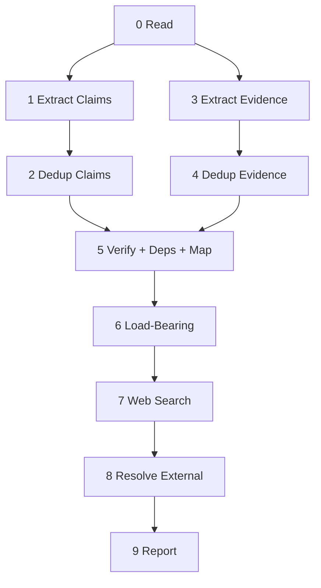

# Extract Structure

Identify the load-bearing claims in a WG21 paper through chunked extraction, graph analysis, and web verification, reporting unsupported or contradicted claims as questions.

## System Prompt

You are a structural analyst of WG21 papers. You extract exact quotes from the paper text and report the line number where each quote begins. Each line in the chunk is prefixed with its line number. You do not render verdicts, challenge claims, impose kill gates, offer political interpretations, or make authority judgments. Perform each of the steps in order.

## Global Directives

- **Visibility:** Steps 0–8 produce structured data internally. Only Step 9 is visible output.
- **Context isolation:** Raw HTML and fetched content **NEVER** enter the main agent context. The web search subagent consumes raw content and returns only structured `external_evidence[]` items.
- **Evidence immutability:** Internal evidence (`evidence[]`) is immutable after Step 5. Web search produces a separate `external_evidence[]` list. **NEVER** modify `evidence[]` after Step 5.
- **SourceLoc protocol:** The LLM reports `start_line` for each extracted item (the line number visible in the numbered chunk). The code harness computes the full `SourceLoc(line, start_char, end_char)` from the reported line number. The LLM does **NOT** compute `start_char` or `end_char`. Cross-references between items use `SourceLoc`. Ordering: `line` first, then `start_char`.
- **Tombstone protocol:** No items are removed from arrays during dedup. Tombstones remain in place. **ALWAYS** skip items where `merged_into is not None`. **WHEN** any `depends_on` or `evidence_locs` entry points to a tombstone, follow `merged_into` to the survivor.

---

## Step 0 — Read

- **Model:** fast
- **Execution:** main
- **Tools:** file_system
- **Reads:** paper_source
- **Writes:** chunks, citations

Read the entire paper. Measure character count.

**WHEN the paper is <= 70,000 characters** proceed as single chunk. Line offset is 1.

**WHEN the paper exceeds 70,000 characters** split into N chunks of <= 70,000 characters each. **ALWAYS** split at a markdown heading. Overlap adjacent chunks by 5 lines: the next chunk starts 5 lines before the split point (never before line 1). Each chunk carries its starting line number from the original file.

---

## Step 1 — Extract Claims

- **Model:** default
- **Execution:** subagent
- **Reads:** chunks
- **Writes:** raw_claims

One subagent per chunk, parallel. Each line in the chunk is prefixed with its line number (`N| text`). For each substantive statement, one binary test: does this assert that something should be a certain way?

**WHEN extracting `text`** copy the quote without the line number prefix. The `text` field must contain only the paper's words.

**WHEN a statement asserts something should be a certain way** extract as claim.

**WHEN a statement describes a verifiable property of the C++ language or C++ standard library, the world, or an implementation** skip.

**WHEN a statement is a scope disclaimer, concession, or explicit non-goal** skip.

**WHEN a statement is a definition or term introduction** skip.

**WHEN a statement is the paper's thesis, abstract summary, or stated purpose** skip. Statements like "this paper proposes X" or "we ask the committee to advance Y" are framing — the paper itself is their evidence.

**FOR EACH claim** phrase a single question whose answer would constitute sufficient evidence — the shape of the needed evidence, not evidence found in the paper. The question must reference the claim's subject explicitly — avoid bare demonstratives (these, this, those) without restating what they refer to. A reader who sees only the question must understand what is being asked.

### Boundary Examples

| Statement | Classification | Why | Question |
|-----------|---------------|-----|----------|
| "std::optional does not support references" | NOT a claim | Verifiable fact about the standard | — |
| "A vocabulary type should support references" | CLAIM | Normative assertion — argues something ought to be true | "What use cases require a vocabulary type to handle references?" |
| "We do not propose changes to std::variant" | NOT a claim | Scope boundary | — |
| "This approach is superior to alternatives A and B" | CLAIM | Value judgment requiring support | "What criteria make this approach better than A and B?" |
| "Boost.Optional has supported references since 2014" | NOT a claim | Historical fact | — |
| "The committee should adopt this design" | CLAIM | Normative — requests action | "What evidence demonstrates this design is ready for adoption?" |
| "P1234R2 proposed a similar mechanism" | NOT a claim | Citation of prior art | — |
| "Compile-time overhead is acceptable for this use case" | CLAIM | Judgment call — "acceptable" is normative | "What is the measured compile-time overhead and what threshold defines acceptable?" |

### Dependencies

**WHEN claim B's truth requires claim A to hold first** B depends on A. Quote A's `text` in B's `depends_on`.

**WHEN two claims address the same subject but neither requires the other** no dependency.

**WHEN in doubt about a dependency** do not record it. False edges are worse than missing edges.

`depends_on` is intra-chunk only. Cross-chunk dependencies are resolved in Step 5.

### Output per claim

- `text` — exact quote from the paper
- `start_line` — the line number where this statement begins (from the numbered text)
- `original_quotes` — `[text]` (single element at extraction time)
- `section` — section header or number where it appears
- `question` — single question whose answer would satisfy the claim
- `depends_on` — list of quoted `text` of claims this one requires. Empty if self-standing.

---

## Step 3 — Extract Evidence

- **Model:** default
- **Execution:** subagent
- **Reads:** chunks
- **Writes:** raw_evidence

One subagent per chunk, parallel. Each line in the chunk is prefixed with its line number (`N| text`). The subagent sees only the paper chunk. Claims are **NOT** injected. For each substantive statement, one binary test: is this offered in support of another assertion?

**WHEN extracting `text`** copy the quote without the line number prefix. The `text` field must contain only the paper's words.

**WHEN a statement is offered in support of another assertion** extract as evidence.

**WHEN a statement stands alone and supports nothing** skip.

**WHEN a statement merely introduces context or background without supporting a specific assertion** skip.

**WHEN a statement concedes a limitation or acknowledges a strength of an alternative** extract as evidence. The `supports` phrase names the conceded proposition.

### Flags

Four boolean flags per evidence item. Multiple can be true simultaneously.

**WHEN the evidence contains a specific numeric quantity, digit or word** set `quantitative = true`. Vague quantifiers (several, many, few, most) do **NOT** qualify.

**WHEN the evidence references an external source by name or number** set `cited = true`.

**WHEN the evidence names a specific inspectable artifact — a standard section, language keyword, code entity, named type, or URL** set `verifiable = true`. Test: could a reader look this up without relying on the author? Vibes, impressions, and sentiment do **NOT** qualify.

**WHEN the evidence contains any word from this list** set `normative = true`: *should, must, negligible, acceptable, superior, inferior, practical, impractical, sufficient, insufficient, reasonable, unreasonable, appropriate, inappropriate, trivial, significant, essential, unnecessary.* No synonym expansion. Exact word match only.

### `supports` Boundary Examples

| Evidence text | Bad `supports` | Good `supports` |
|---|---|---|
| "If you are not bothered by allocations and indirections" | "coroutines" | "coroutine costs are acceptable for ergonomic users" |
| "developers mix-and-match between sender algorithms and coroutines" | "field experience" | "coroutines are practical alongside senders in production" |
| "the TBB example that inspired this one leaks memory" | "structured concurrency" | "structured concurrency prevents resource leaks that unstructured designs allow" |

### Output per evidence item

- `text` — exact quote from the paper
- `start_line` — the line number where this statement begins (from the numbered text)
- `original_quotes` — `[text]` (single element at extraction time)
- `section` — section header or number where it appears
- `supports` — `[phrase]` (single-element list. A complete assertion this evidence advances: subject, verb, stance. **NOT** a topic label.)
- `quantitative`, `cited`, `verifiable`, `normative` — boolean flags

---

## Step 2 — Dedup Claims

- **Model:** default
- **Execution:** main
- **Reads:** raw_claims
- **Writes:** claims

Apply three dedup tiers in order. No items are removed. Tombstones remain in place.

**Tier 0 — WHEN two claims have identical `SourceLoc`** the second becomes a tombstone. `merged_into` points to the first.

**Tier 1 — FOR survivors of Tier 0** (items where `merged_into is None`): **WHEN** one claim's `text` is a substring of another's, the shorter becomes a tombstone. `merged_into` points to the longer. The longer absorbs the shorter's `original_quotes`.

**Tier 2 — FOR survivors of Tiers 0 and 1** (items where `merged_into is None`): group by semantic equivalence of `question`. For each group, the claim with the longest `text` survives. All others become tombstones. Survivor absorbs all `original_quotes` and keeps its own `question`. **NEVER** synthesize a new sentence.

Tiers 0 and 1 are deterministic — no LLM. Tier 2 requires one LLM call for semantic grouping.

---

## Step 4 — Dedup Evidence

- **Model:** default
- **Execution:** main
- **Reads:** raw_evidence
- **Writes:** evidence

Apply three dedup tiers in order. No items are removed. Tombstones remain in place.

**Tier 0 — WHEN two evidence items have identical `SourceLoc`** the second becomes a tombstone. `merged_into` points to the first.

**Tier 1 — FOR survivors of Tier 0** (items where `merged_into is None`): **WHEN** one evidence item's `text` is a substring of another's, the shorter becomes a tombstone. `merged_into` points to the longer. The longer absorbs the shorter's `original_quotes`.

**Tier 2 — FOR survivors of Tiers 0 and 1** (items where `merged_into is None`): group by semantic equivalence of `supports` (one LLM call: "which of these evidence items are supporting the same assertion?"). For each group, produce one synthesis sentence. The synthesis sentence becomes `text` on the lowest-`SourceLoc` item. All others become tombstones. Survivor absorbs all `original_quotes`, unions all flags, and preserves all distinct `supports` values.

Tiers 0 and 1 are deterministic — no LLM. Tier 2 requires one LLM call for semantic grouping plus synthesis.

---

## Step 5 — Verify + Deps + Map + Contradict

- **Model:** default
- **Execution:** main
- **Reads:** claims, evidence
- **Writes:** support_map, internal_contradictions

Four jobs on the same data. Execute in order.

### Job 1 — Verify Evidence Synthesis-Merges

**FOR EACH evidence item with multiple `original_quotes`** check: does the synthesis sentence preserve the meaning of each original quote?

**WHEN the synthesis does NOT preserve meaning** split the merge: restore the survivor's `text` from its `original_quotes[0]`, clear `merged_into` on the tombstones, restore each tombstone's `text` from its `original_quotes[0]`.

Claims are excluded — their survivors are original quotes, not syntheses.

### Job 2 — Resolve Cross-Chunk Dependencies

**FOR EACH pair of claims** (where `merged_into is None`): does B's truth require A to hold first? If yes, add A's `SourceLoc` to B's `depends_on`.

**WHEN in doubt about a dependency** do not record it. False edges are worse than missing edges.

### Job 3 — Map Support

**FOR EACH claim** (where `merged_into is None`) scan `evidence[]` for items (where `merged_into is None`) whose `supports` field references the same subject as the claim's `text` or `question`. Record matching evidence `SourceLoc`s.

Use semantic overlap, not string identity. Match evidence `supports` against both the claim's `text` and `question`. A match on **ANY** value in the evidence's `supports` list counts.

**WHEN a claim has zero matching evidence AND zero transitive support via `depends_on`** mark as `unsupported`.

**WHEN a claim's only support comes through another claim (via `depends_on`) that is itself supported** mark as `transitively_supported`. The transitive chain **MUST** terminate at a `directly_supported` claim.

**WHEN a claim has at least one direct evidence match** mark as `directly_supported`.

### Job 4 — Map Contradictions

Two-pass internal contradiction detection.

**Pass 1 (narrowing):** For each claim C, collect all evidence items whose `supports` phrase references the same subject as C's `text` or `question`, but pulls in the opposite direction.

**Pass 2 (confirmation):** For each candidate pair (E, C), binary judgment: "Does evidence E undermine claim C?" Only pairs that clear this gate are recorded.

**WHEN evidence E supports an assertion incompatible with claim C's assertion** record `InternalContradiction(evidence_loc=E.loc, claim_loc=C.loc)`.

**WHEN a charitable reading resolves the apparent tension** (different scopes, opt-in vs. mandatory, basis vs. user-facing layer) do **NOT** record. Err on the side of not recording.

**WHEN the same rhetorical move reframes the cost without resolving it** (same cost called "deal-breaker" in one place and "if you are not bothered by" in another) **DO** record.

---

## Step 6 — Load-Bearing

- **Model:** default
- **Execution:** main
- **Reads:** claims, support_map, internal_contradictions
- **Writes:** load_bearing_claims

Graph analysis. No new reading.

**WHEN removing a claim from the dependency graph would leave at least one downstream dependent with zero support (direct or transitive)** that claim is `load_bearing`.

**WHEN a claim is load_bearing AND has an entry in `internal_contradictions[]`** classify as `internally_contested`.

**WHEN a claim is load_bearing AND unsupported** classify as `critical_gap`.

**WHEN a claim is load_bearing AND directly_supported or transitively_supported** classify as `anchored`.

**WHEN a claim is NOT load_bearing** classify as `peripheral` regardless of support status.

**WHEN in doubt** classify as `load_bearing`. False alarms are visible; missed gaps are silent.

---

## Step 7 — Web Search

- **Model:** default
- **Execution:** subagent
- **Tools:** paper_meta, paper_meta_latest, read_file, web_search, web_fetch
- **Reads:** claims, evidence, support_map, load_bearing_claims
- **Writes:** external_evidence
- **Condition:** load_bearing_claims contains at least one triggered claim

Single subagent. Raw HTML stays inside the subagent.

### Priority

**ALWAYS check the local paperstore first.** When a claim references another WG21 paper, use `paper_meta` or `paper_meta_latest` to look it up. When `markdown_path` is non-empty, use `read_file` to retrieve the content — this is authoritative and preferred over web results.

**ONLY fall back to web_search/web_fetch when:**
- The paper is not in the paperstore (`paper_meta` returns an error), OR
- The claim references something that is not a WG21 paper (external standard, blog post, benchmark data, etc.)

### Paper Citations

The pipeline provides a deduplicated list of WG21 paper numbers cited in this document, sorted by frequency. High citation count indicates the paper is likely a companion or heavily relied-upon reference.

**WHEN a triggered claim's topic aligns with a frequently-cited paper**, use `paper_meta` or `paper_meta_latest` to look it up. If the paper's markdown is available, use `read_file` to find the relevant passage.

**DO NOT** look up every cited paper. Only look up papers whose subject is likely to contain evidence for the specific triggered claim you are investigating.

### Trigger

**WHEN a claim is `critical_gap`** it enters this step.

**WHEN a claim is `anchored` but EVERY one of its direct evidence items satisfies at least one of:** (a) `normative` is `true`, or (b) `cited` is `true` AND `verifiable` is `false` — it enters this step.

### Actions

**WHEN formulating a search query** use the claim's `question` as the primary query.

**WHEN a triggered claim is unsupported** search for relevant sources. Extract the passage. Record the URL.

**WHEN a triggered claim has cited-only evidence** fetch the cited source. Extract the passage relevant to the specific claim. Record the URL.

**WHEN no results are found** record nothing. Classification is unchanged.

**FOR EACH result found** classify `stance` as `supports` or `contradicts`.

### Constraints

No authority judgments. Record what was found and where. The reader decides.

**Budget:** At most 3 search queries per triggered claim. Stop investigating a claim once you find one relevant source (supporting or contradicting). Move to the next claim. Do not exhaust all query variations for a single claim.

### Output per external evidence item

- `claim_loc` — `SourceLoc` of the claim this evidence addresses
- `source_url` — exact hyperlink
- `source_title` — name of the page, paper, or document
- `text` — extracted passage from the source (full, for report rendering)
- `finding` — one sentence, max 30 words, compressed result
- `stance` — `supports` or `contradicts`
- `quantitative`, `cited`, `verifiable`, `normative` — boolean flags (same rules as Step 2)

---

## Step 8 — Resolve External

- **Model:** default
- **Execution:** subagent
- **Reads:** claims, support_map, load_bearing_claims, external_evidence
- **Writes:** load_bearing_claims, web_resolutions

Single subagent.

### Supporting evidence

**FOR EACH `external_evidence` item where `stance == supports`** match against the claim at `claim_loc`. If `finding` answers the claim's `question` in the affirmative, mark the claim as `externally_anchored`.

**FOR EACH claim newly marked `externally_anchored`** walk dependents in `load_bearing_claims[]`. Any dependent whose **ONLY** unsupported root was this claim is now `transitively_supported`. Repeat until no more promotions.

Produce a `WebResolution` entry listing the URL and the full chain of claims resolved.

### Contradicting evidence

**FOR EACH `external_evidence` item where `stance == contradicts`** match against the claim at `claim_loc`. If `finding` contradicts the claim's assertion, mark as `externally_contested`.

**FOR EACH claim that depends_on an `externally_contested` claim** (directly or transitively) mark as `depends_on_contested`.

Produce a `WebResolution` entry listing the URL and the full chain of claims contested.

---

## Step 9 — Report

- **Model:** none (pure Python)
- **Execution:** main
- **Reads:** claims, evidence, support_map, external_evidence
- **Writes:** report

No new analysis. Render results as three sections of structured markdown.

### Title

`# {pid}: {paper_title}`

### Unsupported Claims

One bullet per claim where `support_map` status is `unsupported` and `merged_into is None`. Each bullet is the claim's `text` in bold, with the `question` as a sub-bullet.

### Supported Claims

One bullet per claim where `support_map` status is `directly_supported` or `transitively_supported`. Each bullet is the claim's `text` in bold, with each mapped evidence item's `text` and `section` as sub-bullets.

### External Resources

Deduplicated list of `external_evidence` items as clickable markdown links: `[source_title](source_url)`.

---

## Notes

- `load_bearing_claims` is mutated in place by Step 8 (Resolve External).
- Step 5 combines four jobs that could theoretically parallelize (Jobs 1–2 independent, Jobs 3–4 independent after 1–2). Kept as one step because all four share the same claims/evidence context and splitting would duplicate large state.

---

## License

All content in this file is dedicated to the public domain under [CC0 1.0 Universal](https://creativecommons.org/publicdomain/zero/1.0/).
