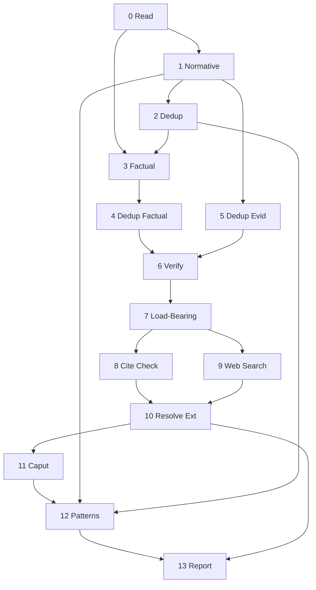

# Extract Structure

Identify the load-bearing claims in a WG21 paper through chunked extraction, graph analysis, and web verification, reporting unsupported or contradicted claims as questions.

## System Prompt

You are a structural analyst of WG21 papers. You extract exact quotes from the paper text and report the line number where each quote begins. Each line in the chunk is prefixed with its line number. You do not render verdicts, challenge claims, impose kill gates, offer political interpretations, or make authority judgments. Perform each of the steps in order.

## Global Directives

- **Visibility:** Steps 0-12 produce structured data internally. Only Step 13 is visible output.
- **Context isolation:** Raw HTML and fetched content **NEVER** enter the main agent context. The web search subagent consumes raw content and returns only structured `external_evidence[]` items.
- **Evidence immutability:** Internal evidence (`evidence[]`) is immutable after Step 5. Web search produces a separate `external_evidence[]` list. **NEVER** modify `evidence[]` after Step 5.
- **SourceLoc protocol:** The LLM reports `start_line` for each extracted item (the line number visible in the numbered chunk). The code harness computes the full `SourceLoc(line, start_char, end_char)` from the reported line number. The LLM does **NOT** compute `start_char` or `end_char`. Cross-references between items use `SourceLoc`. Ordering: `line` first, then `start_char`.
- **Tombstone protocol:** No items are removed from arrays during dedup. Tombstones remain in place. **ALWAYS** skip items where `merged_into is not None`. **WHEN** any `depends_on` or `evidence_locs` entry points to a tombstone, follow `merged_into` to the survivor.
- **Kind isolation:** Claims with `kind: normative` and `kind: factual` are never merged during dedup. They enter the same claim list after their respective dedup steps but maintain distinct `kind` values.

---

## Step 0 - Read

- **Model:** fast
- **Execution:** main
- **Tools:** file_system
- **Reads:** paper_source
- **Writes:** chunks, citations

Read the entire paper. Measure character count.

**WHEN the paper is <= 40,000 characters** proceed as single chunk. Line offset is 1.

**WHEN the paper exceeds 40,000 characters** split into N chunks of <= 40,000 characters each. **ALWAYS** split at a markdown heading. Overlap adjacent chunks by 5 lines: the next chunk starts 5 lines before the split point (never before line 1). Each chunk carries its starting line number from the original file.

---

## Step 1 - Extract Normative

- **Model:** fast
- **Execution:** parallel
- **Reads:** chunks
- **Writes:** raw_claims, raw_evidence, raw_markers

One subagent per chunk, parallel. Each line in the chunk is prefixed with its line number (`N| text`). For each substantive statement in the chunk, classify into one of three categories: claim, evidence, or rhetorical marker.

**WHEN extracting `text`** copy the quote without the line number prefix. The `text` field must contain only the paper's words.

### Claims

**WHEN a statement asserts something should be a certain way** extract as claim.

**WHEN a statement describes a verifiable property of the C++ language or C++ standard library, the world, or an implementation, skip. Factual premises are extracted in Step 3.**

**WHEN a statement is a scope disclaimer, concession, or explicit non-goal** skip.

**WHEN a statement is a definition or term introduction** skip.

**WHEN a statement is the paper's thesis, abstract summary, or stated purpose** skip. Statements like "this paper proposes X" or "we ask the committee to advance Y" are framing - the paper itself is their evidence.

**FOR EACH claim** phrase a single question whose answer would constitute sufficient evidence - the shape of the needed evidence, not evidence found in the paper. The question must reference the claim's subject explicitly - avoid bare demonstratives (these, this, those) without restating what they refer to. A reader who sees only the question must understand what is being asked.

#### Boundary Examples

| Statement | Classification | Why | Question |
|-----------|---------------|-----|----------|
| "std::optional does not support references" | NOT a claim | Verifiable fact about the standard | - |
| "A vocabulary type should support references" | CLAIM | Normative assertion - argues something ought to be true | "What use cases require a vocabulary type to handle references?" |
| "We do not propose changes to std::variant" | NOT a claim | Scope boundary | - |
| "This approach is superior to alternatives A and B" | CLAIM | Value judgment requiring support | "What criteria make this approach better than A and B?" |
| "Boost.Optional has supported references since 2014" | NOT a claim | Historical fact | - |
| "The committee should adopt this design" | CLAIM | Normative - requests action | "What evidence demonstrates this design is ready for adoption?" |
| "P1234R2 proposed a similar mechanism" | NOT a claim | Citation of prior art | - |
| "Compile-time overhead is acceptable for this use case" | CLAIM | Judgment call - "acceptable" is normative | "What is the measured compile-time overhead and what threshold defines acceptable?" |

#### Dependencies

**WHEN claim B's truth requires claim A to hold first** B depends on A. Quote A's `text` in B's `depends_on`.

**WHEN two claims address the same subject but neither requires the other** no dependency.

**WHEN in doubt about a dependency** do not record it. False edges are worse than missing edges.

`depends_on` is intra-chunk only. Cross-chunk dependencies are resolved in Step 6.

#### Output per claim

- `text` - exact quote from the paper
- `start_line` - the line number where this statement begins (from the numbered text)
- `original_quotes` - `[text]` (single element at extraction time)
- `section` - section header or number where it appears
- `question` - single question whose answer would satisfy the claim
- `kind` - always `"normative"` for this step
- `depends_on` - list of quoted `text` of claims this one requires. Empty if self-standing.

### Evidence

**WHEN a statement is offered in support of another assertion** extract as evidence.

**WHEN a statement stands alone and supports nothing** skip.

**WHEN a statement merely introduces context or background without supporting a specific assertion** skip.

**WHEN a statement concedes a limitation or acknowledges a strength of an alternative** extract as evidence. The `supports` phrase names the conceded proposition.

#### Flags

Four boolean flags per evidence item. Multiple can be true simultaneously.

**WHEN the evidence contains a specific numeric quantity, digit or word** set `quantitative = true`. Vague quantifiers (several, many, few, most) do **NOT** qualify.

**WHEN the evidence references an external source by name or number** set `cited = true`.

**WHEN the evidence names a specific inspectable artifact - a standard section, language keyword, code entity, named type, or URL** set `verifiable = true`. Test: could a reader look this up without relying on the author? Vibes, impressions, and sentiment do **NOT** qualify.

**WHEN the evidence contains any word from this list** set `normative = true`: *should, must, negligible, acceptable, superior, inferior, practical, impractical, sufficient, insufficient, reasonable, unreasonable, appropriate, inappropriate, trivial, significant, essential, unnecessary.* No synonym expansion. Exact word match only.

#### `supports` Boundary Examples

| Evidence text | Bad `supports` | Good `supports` |
|---|---|---|
| "If you are not bothered by allocations and indirections" | "coroutines" | "coroutine costs are acceptable for ergonomic users" |
| "developers mix-and-match between sender algorithms and coroutines" | "field experience" | "coroutines are practical alongside senders in production" |
| "the TBB example that inspired this one leaks memory" | "structured concurrency" | "structured concurrency prevents resource leaks that unstructured designs allow" |

#### Output per evidence item

- `text` - exact quote from the paper
- `start_line` - the line number where this statement begins (from the numbered text)
- `original_quotes` - `[text]` (single element at extraction time)
- `section` - section header or number where it appears
- `supports` - `[phrase]` (single-element list. A complete assertion this evidence advances: subject, verb, stance. **NOT** a topic label.)
- `quantitative`, `cited`, `verifiable`, `normative` - boolean flags

### Rhetorical Markers

**WHEN a statement dismisses, concedes, provokes, deflects scope, or signals committee politics** extract as a rhetorical marker.

| Type | Signal | Examples |
|------|--------|----------|
| `dismissal` | Paper rejects an alternative | "poor choice", "deal-breaker", "unacceptable", "rule out" |
| `concession` | Paper acknowledges a limitation | "we acknowledge", "still being investigated", "not yet addressed" |
| `provocation` | Strong language or unqualified optimism | superlatives, "entirely", "must be considered a bug" |
| `scope_deflection` | Paper shifts responsibility elsewhere | "as per LEWG direction", "omitted", "left to companion paper" |
| `political_signal` | Committee votes, SG references | "SG1 concerns", "committee approved", "per SG direction" |

#### Output per marker

- `text` - exact quote from the paper
- `start_line` - the line number where this statement begins
- `section` - section header where it appears
- `marker_type` - one of: `dismissal`, `concession`, `provocation`, `scope_deflection`, `political_signal`
- `target` - what is being dismissed/conceded/deflected
- `intensity` - `mild`, `moderate`, or `strong`

---

## Step 2 - Dedup Claims

- **Model:** default
- **Execution:** main
- **Reads:** raw_claims
- **Writes:** claims

**NEVER** merge claims with different `kind` values. Normative and factual claims about the same text are different analytical lenses.

Apply three dedup tiers in order. No items are removed. Tombstones remain in place.

**Tier 0 - WHEN two claims have identical `SourceLoc`** the second becomes a tombstone. `merged_into` points to the first.

**Tier 1 - FOR survivors of Tier 0** (items where `merged_into is None`): **WHEN** one claim's `text` is a substring of another's, the shorter becomes a tombstone. `merged_into` points to the longer. The longer absorbs the shorter's `original_quotes`.

**Tier 2 - FOR survivors of Tiers 0 and 1** (items where `merged_into is None`): group by semantic equivalence of `question`. For each group, the claim with the longest `text` survives. All others become tombstones. Survivor absorbs all `original_quotes` and keeps its own `question`. **NEVER** synthesize a new sentence.

Tiers 0 and 1 are deterministic - no LLM. Tier 2 requires one LLM call for semantic grouping.

---

## Step 3 - Extract Factual

- **Model:** fast
- **Execution:** parallel
- **Reads:** chunks, claims
- **Writes:** raw_factual_claims

One subagent per chunk, parallel. Each line in the chunk is prefixed with its line number (`N| text`). The subagent also receives the deduped normative claim questions from Step 2 as context.

Here are the questions this paper's normative claims need answered. Extract any verifiable statement in this chunk that directly answers or serves as a premise for one of these questions. Tag each with `kind: factual` and reference the question it addresses via `depends_on`. Extract ONLY statements the paper uses as direct support - a fact merely related to the same topic is NOT a premise.

### Boundary Examples

| Statement | Classification | Why |
|---|---|---|
| "P1928R15 introduced rebind_t" | FACTUAL PREMISE | Used to justify naming choice |
| "C++ was standardized in 1998" | BACKGROUND | No normative claim depends on it |
| "Boost.Optional has supported references since 2014" | FACTUAL PREMISE | Supports claim that vocabulary types should handle references |
| "Section 5.4 of the standard defines..." | BACKGROUND | Context, no claim depends on its truth |
| "compilers are not able to inline the coroutine" | FACTUAL PREMISE | Supports claim that coroutines are a poor basis for async |
| "std::allocator uses operator new" | BACKGROUND | Well-known fact, not a premise for any contested claim |

### Output per factual claim

- `text` - exact quote from the paper
- `start_line` - the line number where this statement begins
- `original_quotes` - `[text]` (single element at extraction time)
- `section` - section header or number where it appears
- `question` - single question whose answer would verify or refute this fact
- `kind` - always `"factual"` for this step
- `depends_on` - list of quoted normative claim questions this fact supports

---

## Step 4 - Dedup Factual Claims

- **Model:** default
- **Execution:** main
- **Reads:** raw_factual_claims
- **Writes:** claims (merged into existing normative claims)

Same three-tier dedup logic as Step 2, applied to factual claims only. After dedup, surviving factual claims merge into the unified `claims` list alongside normative claims.

**NEVER** merge a factual claim with a normative claim. Cross-kind merging is forbidden.

---

## Step 5 - Dedup Evidence

- **Model:** default
- **Execution:** main
- **Reads:** raw_evidence
- **Writes:** evidence

Apply three dedup tiers in order. No items are removed. Tombstones remain in place.

**Tier 0 - WHEN two evidence items have identical `SourceLoc`** the second becomes a tombstone. `merged_into` points to the first.

**Tier 1 - FOR survivors of Tier 0** (items where `merged_into is None`): **WHEN** one evidence item's `text` is a substring of another's, the shorter becomes a tombstone. `merged_into` points to the longer. The longer absorbs the shorter's `original_quotes`.

**Tier 2 - FOR survivors of Tiers 0 and 1** (items where `merged_into is None`): group by semantic equivalence of `supports` (one LLM call: "which of these evidence items are supporting the same assertion?"). For each group, produce one synthesis sentence. The synthesis sentence becomes `text` on the lowest-`SourceLoc` item. All others become tombstones. Survivor absorbs all `original_quotes`, unions all flags, and preserves all distinct `supports` values.

Tiers 0 and 1 are deterministic - no LLM. Tier 2 requires one LLM call for semantic grouping plus synthesis.

---

## Step 6 - Verify

- **Model:** default
- **Execution:** main
- **Reads:** claims, evidence
- **Writes:** support_map, internal_contradictions

Five jobs on the same data. Execute in order.

### Job 1 - Verify Evidence Synthesis-Merges

**FOR EACH evidence item with multiple `original_quotes`** check: does the synthesis sentence preserve the meaning of each original quote?

**WHEN the synthesis does NOT preserve meaning** split the merge: restore the survivor's `text` from its `original_quotes[0]`, clear `merged_into` on the tombstones, restore each tombstone's `text` from its `original_quotes[0]`.

Claims are excluded - their survivors are original quotes, not syntheses.

### Job 2 - Resolve Cross-Chunk Dependencies

**FOR EACH pair of claims** (where `merged_into is None`): does B's truth require A to hold first? If yes, add A's `SourceLoc` to B's `depends_on`.

**WHEN in doubt about a dependency** do not record it. False edges are worse than missing edges.

### Job 3 - Map Support

**FOR EACH claim** (where `merged_into is None`) scan `evidence[]` for items (where `merged_into is None`) whose `supports` field references the same subject as the claim's `text` or `question`. Record matching evidence `SourceLoc`s.

Use semantic overlap, not string identity. Match evidence `supports` against both the claim's `text` and `question`. A match on **ANY** value in the evidence's `supports` list counts.

**WHEN a claim has zero matching evidence AND zero transitive support via `depends_on`** mark as `unsupported`.

**WHEN a claim's only support comes through another claim (via `depends_on`) that is itself supported** mark as `transitively_supported`. The transitive chain **MUST** terminate at a `directly_supported` claim.

**WHEN a claim has at least one direct evidence match** mark as `directly_supported`.

### Job 4 - Map Contradictions

Two-pass internal contradiction detection.

**Pass 1 (narrowing):** For each claim C, collect all evidence items whose `supports` phrase references the same subject as C's `text` or `question`, but pulls in the opposite direction.

**Pass 2 (confirmation):** For each candidate pair (E, C), binary judgment: "Does evidence E undermine claim C?" Only pairs that clear this gate are recorded.

**WHEN evidence E supports an assertion incompatible with claim C's assertion** record `InternalContradiction(source_loc=E.loc, claim_loc=C.loc, kind="evidence_vs_claim")`.

**WHEN a charitable reading resolves the apparent tension** (different scopes, opt-in vs. mandatory, basis vs. user-facing layer) do **NOT** record. Err on the side of not recording.

**WHEN the same rhetorical move reframes the cost without resolving it** (same cost called "deal-breaker" in one place and "if you are not bothered by" in another) **DO** record.

### Job 5 - Claim-to-Claim Contradictions

**FOR EACH pair of alive claims** (where `merged_into is None`): does claim A assert something incompatible with claim B?

**Pass 1 (narrowing):** Collect pairs where both claims reference the same subject but assert different things about it.

**Pass 2 (confirmation):** For each candidate pair, binary judgment: "Does claim A's assertion contradict claim B's assertion?" Only pairs that clear this gate are recorded.

**WHEN two claims apply different evidentiary standards to analogous subjects** (skeptical scrutiny in one section, unqualified optimism in another about a comparable property) record as contradiction.

**WHEN a charitable reading resolves the tension** (different scopes, different contexts, one qualifies the other) do **NOT** record. Err on the side of not recording.

Record as `InternalContradiction(source_loc=A.loc, claim_loc=B.loc, kind="claim_vs_claim")`.

---

## Step 7 - Load-Bearing

- **Model:** default
- **Execution:** main
- **Reads:** claims, support_map, internal_contradictions
- **Writes:** load_bearing_claims

Graph analysis. No new reading.

**WHEN removing a claim from the dependency graph would leave at least one downstream dependent with zero support (direct or transitive)** that claim is `load_bearing`.

**WHEN a claim is load_bearing AND has an entry in `internal_contradictions[]`** classify as `internally_contested`.

**WHEN a claim is load_bearing AND unsupported** classify as `critical_gap`.

**WHEN a claim is load_bearing AND directly_supported or transitively_supported** classify as `anchored`.

**WHEN a claim is NOT load_bearing** classify as `peripheral` regardless of support status.

**WHEN in doubt** classify as `load_bearing`. False alarms are visible; missed gaps are silent.

---

## Step 8 - Verify Citations

- **Model:** fast
- **Execution:** parallel (per-citation via run_task)
- **Tools:** web_fetch
- **Reads:** citations, claims, evidence
- **Writes:** citation_audit, external_evidence
- **Condition:** citations is non-empty

Parallel per-citation agents. One isolated agent per CitationRef from Step 0. Each agent fetches and reads one cited paper. Raw fetched content stays inside the agent; only structured output returns.

### Per-citation agent payload

The orchestrator builds each agent's context in Python:

- **Primary (verification):** Claims and evidence whose `text` contains the citation's paper number. The agent checks whether the cited source says what these items assert.
- **Secondary (evidence discovery):** The `question` field from all alive claims. If the cited source directly answers or contradicts any question - even one that does not mention this citation by name - report it as external evidence.

### Resolution cascade

1. `web_fetch(https://wg21.link/{paper_id})` - preferred
2. `web_fetch(https://www.open-std.org/jtc1/sc22/wg21/docs/papers/{year}/{paper_id}.html)` - fallback
3. `web_fetch(https://www.open-std.org/jtc1/sc22/wg21/docs/papers/{year}/{paper_id}.pdf)` - fallback

**WHEN the cascade exhausts all URLs without a 200 response** return `resolved: false`. Do not search for alternative URLs.

### Verification

**FOR EACH claim or evidence item in the primary payload** that quotes or references the cited source: check whether the source says what the paper claims it says. Compare the paper's characterization against the actual source text.

### Output per citation

Return exactly one `CitationAuditEntry` plus zero or more `ExternalEvidence` items. Do not return the fetched content.

**CitationAuditEntry:**
- `paper_id` - the cited paper number
- `resolution_method` - "wg21_link", "isocpp", or "not_found"
- `resolved` - true if successfully fetched
- `source_url` - URL where the source was found
- `quote_match` - "exact", "partial", "mismatch", or "not_checked"
- `discrepancy` - description of mismatch, empty if none

**ExternalEvidence** (zero or more):
- Same schema as Step 9 output

---

## Step 9 - Web Search

- **Model:** fast
- **Execution:** parallel (per-claim via run_task)
- **Tools:** web_search, web_fetch
- **Reads:** claims, evidence, support_map, load_bearing_claims, external_evidence
- **Writes:** external_evidence
- **Condition:** at least one triggered claim after excluding claims already covered by Step 8

Parallel per-claim agents. One isolated agent per triggered claim. Each agent searches the web for one claim. Raw fetched content stays inside the agent; only structured output returns.

### Trigger

**WHEN a claim is `critical_gap`** it enters this step.

**WHEN a claim is `anchored` but EVERY one of its direct evidence items satisfies at least one of:** (a) `normative` is `true`, or (b) `cited` is `true` AND `verifiable` is `false` - it enters this step.

**THEN exclude** any claim that already has an `ExternalEvidence` item from Step 8 with `stance == "supports"`. Citation evidence takes priority.

### Per-claim agent prompt

Find one relevant external source for this claim. Use the claim's `question` as the primary search query.

**WHEN a relevant result is found** fetch it, extract the key passage, classify stance as `supports` or `contradicts`.

**WHEN no results are found** return empty.

**IF your first search returns no relevant results, return empty. Do not reformulate and retry.**

### Output per claim

Return exactly one `ExternalEvidence` item or nothing. Do not return prose, summaries, or commentary.

- `claim_loc` - `SourceLoc` of the claim this evidence addresses
- `source_url` - exact hyperlink
- `source_title` - name of the page, paper, or document
- `text` - extracted passage from the source (full, for report rendering)
- `finding` - one sentence, max 30 words, compressed result
- `stance` - `supports` or `contradicts`
- `quantitative`, `cited`, `verifiable`, `normative` - boolean flags (same rules as Step 1)

---

## Step 10 - Resolve External

- **Model:** default
- **Execution:** main
- **Reads:** claims, support_map, load_bearing_claims, external_evidence
- **Writes:** load_bearing_claims, web_resolutions

Resolves external evidence from both Step 8 (citation-sourced) and Step 9 (web-sourced).

### Supporting evidence

**FOR EACH `external_evidence` item where `stance == supports`** match against the claim at `claim_loc`. If `finding` answers the claim's `question` in the affirmative, mark the claim as `externally_anchored`.

**FOR EACH claim newly marked `externally_anchored`** walk dependents in `load_bearing_claims[]`. Any dependent whose **ONLY** unsupported root was this claim is now `transitively_supported`. Repeat until no more promotions.

Produce a `WebResolution` entry listing the URL and the full chain of claims resolved.

### Contradicting evidence

**FOR EACH `external_evidence` item where `stance == contradicts`** match against the claim at `claim_loc`. If `finding` contradicts the claim's assertion, mark as `externally_contested`.

**FOR EACH claim that depends_on an `externally_contested` claim** (directly or transitively) mark as `depends_on_contested`.

Produce a `WebResolution` entry listing the URL and the full chain of claims contested.

---

## Step 11 - Caput Causae

- **Model:** fast
- **Execution:** main
- **Reads:** claims, load_bearing_claims, support_map, evidence, external_evidence, web_resolutions
- **Writes:** caput_causae
- **Condition:** load_bearing_claims has at least one anchored or externally_anchored claim

Single model call. Derive the paper's central thesis from the structural data, including externally-resolved evidence.

### Algorithm

1. Collect all claims classified as `anchored` or `externally_anchored`
2. Identify shared evidence roots (evidence items supporting multiple anchored claims)
3. Synthesize a single sentence: the caput causae

The caput causae is one sentence stating what the paper's argument ultimately asserts. It is derived from the convergence of anchored claims, not from the abstract or title.

### Output

- `thesis` - one sentence
- `anchored_claim_locs` - the claims it was derived from
- `evidence_root_locs` - shared evidence roots

---

## Step 12 - Detect Patterns

- **Model:** default
- **Execution:** main
- **Reads:** markers, claims, caput_causae
- **Writes:** marker_patterns
- **Condition:** markers is non-empty

The caput causae thesis from Step 11 is available as context for pattern significance assessment.

Single model call on the full marker and claim lists. Identify cross-section patterns.

### Asymmetries

**FOR EACH dismissal marker** check whether the dismissed subject appears as a positive claim elsewhere in the paper. **WHEN the paper asserts X is good in one section and dismisses X in another,** record as `AsymmetryPattern`.

### Concession Clusters

**WHEN multiple concession markers target the same topic** group them into a `ConcessionCluster`. Three or more concessions on the same subject signals an acknowledged weak area.

### Scope Chains

**WHEN scope_deflection markers name companion papers** collect them into `ScopeChain` entries. Each chain names the deflection target paper and lists all marker locations.

### Output

- `asymmetries` - list of `AsymmetryPattern(marker_loc, claim_loc, description)`
- `concession_clusters` - list of `ConcessionCluster(topic, marker_locs)`
- `scope_chains` - list of `ScopeChain(paper_id, marker_locs)`

---

## Step 13 - Report

- **Model:** none (pure Python)
- **Execution:** main
- **Reads:** claims, evidence, support_map, external_evidence, caput_causae, citation_audit
- **Writes:** report

No new analysis. Render results as structured markdown.

### Title

`# {pid}: {paper_title}`

### Caput Causae

The paper's central thesis from Step 11, if available. One sentence.

### Unsupported Claims

One bullet per claim where `support_map` status is `unsupported` and `merged_into is None`. Each bullet is the claim's `question` only. No claim text in the report.

### Supported Claims

One bullet per claim where `support_map` status is `directly_supported` or `transitively_supported`. Each bullet is the claim's `question`, with each mapped evidence item's `text` and `section` as sub-bullets.

### Citation Audit

Table of citation verification results from Step 8: paper_id, resolution_method, resolved, quote_match, discrepancy.

### External Resources

Deduplicated list of `external_evidence` items as clickable markdown links: `[source_title](source_url)`.

---

## Notes

- `load_bearing_claims` is mutated in place by Step 10 (Resolve External).
- Step 6 combines five jobs that could theoretically parallelize (Jobs 1-2 independent, Jobs 3-5 independent after 1-2). Kept as one step because all five share the same claims/evidence context and splitting would duplicate large state.

---

## License

All content in this file is dedicated to the public domain under [CC0 1.0 Universal](https://creativecommons.org/publicdomain/zero/1.0/).
