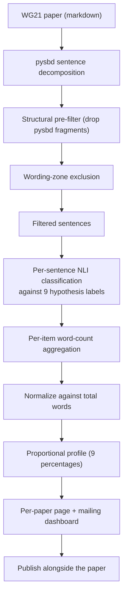

# Proposal Requirements Instrument

A design report on building an automated instrument that grades WG21 papers against the [P4133R0](https://wg21.link/p4133r0) checklist, the game theory that makes the instrument self-reinforcing, and a high-level implementation strategy that rides on existing paperflow infrastructure.

- **Audience:** WG21 chairs, paper authors, tooling implementers, anyone evaluating whether this instrument should be built.
- **Companion papers:** [P4133R0](https://wg21.link/p4133r0) (what every proposal must contain), [P4050R0](https://wg21.link/p4050r0) (failure modes), [P4034R0](https://wg21.link/p4034r0) (institutional memory).
- **Scope:** strategy and mechanism design. Not a technical specification.

---

## 1. The Problem

WG21 measures whether the train runs on time. It does not measure whether the passengers arrived at the right destination.

The committee tracks process metrics: meetings held, polls taken, standards shipped on schedule, papers reviewed. It does not track outcome metrics: whether adopted features achieved their claimed benefits, whether predictions held, whether the cost of standardization was justified over ecosystem delivery. [P4133R0](https://wg21.link/p4133r0) names this gap and proposes a nine-item checklist of artifacts that every library proposal should contain. The checklist is the inverse of failure modes documented across [P4050R0](https://wg21.link/p4050r0), [P4094R0](https://wg21.link/p4094r0), and [P4098R0](https://wg21.link/p4098r0). Each item exists because its absence has produced a documented failure.

The checklist has no teeth until something measures compliance. SD-7 describes how to format a paper. It does not describe what a paper must contain. Chairs schedule papers under severe time pressure with no readiness signal beyond personal judgment. Authors have no public yardstick against which to compare their work. The public has no view into the evaluation because no evaluation artifact exists.

This document describes an instrument that closes that gap.

---

## 2. The P4133 Checklist (Summary)

The nine library-proposal items, each one a section that the proposal must contain:

1. **Evidence of Need** - Why standardization provides more value than ecosystem delivery, with a cost-benefit justification.
2. **Complete Implementation** - A working library with benchmarks, unit tests, and documentation. Not a sketch.
3. **Steel Man Against Standardization** - The strongest argument for why this should not be standardized, confronted and defeated.
4. **Steel Man of Competing Designs** - The strongest case for alternative designs, fairly presented before being rejected.
5. **Post-Adoption Metrics** - Falsifiable success criteria defined before adoption.
6. **Forced Retrospective Trigger** - A mandatory look-back after a defined interval (two releases or six years).
7. **Decision Record** - Why this design, what was traded away, what alternatives were rejected, under what conditions to revisit.
8. **Domain Coverage Attestation** - Which domains were represented when the poll was taken.
9. **Prediction Registry** - Claims made during adoption, recorded with falsifiable criteria and a revisit date.

Language proposals carry the same items with two substitutions (proof-of-concept compiler fork instead of complete library, plus a teaching story). The instrument design is identical; only the hypothesis labels change.

---

## 3. The Instrument

The instrument runs on every paper in every mailing. For each paper it produces a **proportional profile**: a vector of nine percentages reporting how much of the paper's word count was devoted to each checklist item. The profile is published alongside the paper. Chairs see the profile at a glance and use it as a scheduling signal. Authors see the profile and know exactly how their paper compares. The public sees the profile and can question or defend the underlying methodology.

The instrument does not pass or fail a paper. It does not judge whether a section is well-argued. It reports allocation of authorial attention. A paper that devotes 5% of its words to confronting the strongest argument against its own standardization has taken the exercise seriously. A paper that devotes 0.1% has not. The reader draws the conclusion. The instrument supplies the data.

This separation between measurement and judgment is the design move that makes the rest possible.

---

## 4. Why Word Proportion, Not Binary Detection

The naive design asks: "Does this paper contain a steel man against standardization, yes or no?" That framing fails. Deciding whether a section is a genuine steel man rather than a dismissive paragraph requires the model to know what the strongest opposing argument *would be* in the WG21 domain context, then judge whether the author presented it fairly. That is rhetorical and domain expertise that small and mid-sized open-weight models do not possess. Even a 22B model would systematically over-detect, flagging any "we considered alternatives" paragraph as evidence of a steel man.

The word-proportion reframing sidesteps the entire quality-judgment problem. The question becomes: "What fraction of this paper's words discuss the strongest argument against standardization?" That is topic segmentation, not quality assessment. It is structurally identical to the sentence tagger already validated in the paperflow ensemble study (see [study/ensemble/results/final_findings.md](study/ensemble/results/final_findings.md)). A small zero-shot NLI classifier with the right hypothesis label achieved 96-98% recall on the analogous TARGET classification task across three radically different corpora.

The continuous signal carries its own quality signal indirectly:

- A one-sentence dismissal scores around 0.1% of a 10,000-word paper.
- A 500-word genuine confrontation scores around 5%.
- Padding shows up as proportion without substance, and the community reads the paper.

The worst case is gaming. The next section shows that gaming is dominated. But even if gaming were the rational strategy, the worst-case gamed paper contains more information than the current baseline of zero. A cynically written one-paragraph "why this should not be standardized" section is still more than the nothing that exists today, because it surfaces the question for committee members who would not otherwise have asked it.

**Wording zones can be safely excluded.** The Phase 2 ensemble result was that the formal specification text of [P2300R10](https://wg21.link/p2300r10) was the claim-densest region of the paper for the TARGET task. But the nine P4133 checklist items concern *argumentation, justification, and process*. Formal wording describes what a feature does. It does not justify standardization over ecosystem delivery, present competing designs, or define success criteria. Excluding wording zones (detected by the structural patterns in [study/ensemble/profile_corpus.py](study/ensemble/profile_corpus.py): `*Effects:*`, `*Mandates:*`, `<ins>/<del>`, "Let X denote", "expression-equivalent") removes ~20-80% of input volume on wording-heavy papers without losing checklist signal. Recommended: **exclude wording zones (confidence: high, the nine items are about reasoning and the wording zone contains specification text)**.

---

## 5. How Transformers Help

The core technique is zero-shot natural-language-inference classification at sentence level. Given a sentence and a hypothesis label, an NLI cross-encoder produces entailment, neutral, and contradiction scores. The instrument runs each sentence against nine hypothesis labels (one per checklist item) and aggregates the entailment scores into per-item word counts.

This is the architecture already in production in `dissect.harness._tag_sentences`. The Step 1 tagger decomposes a paper with pysbd, classifies each sentence against a TARGET hypothesis and a SKIP hypothesis, and assigns a tag. The proposal-requirements instrument is a generalization to nine labels.

The ensemble study established the decisive empirical finding: **hypothesis wording matters more than model size**. Changing the TARGET hypothesis from "A statement of fact or opinion" to "A statement describing what something does, is, or proposes" took the 33M-parameter DeBERTa-v3-small cross-encoder from 50% to 96% recall on the wording zone, with zero T-to-S misses, on a 33M-parameter model with no fine-tuning. A 22B model with poor hypothesis labels would underperform a 33M model with calibrated ones.

Feasibility per checklist item, under the word-proportion approach:

| Tier | Items | Confidence | Why |
|---|---|---|---|
| 1 (lexically distinctive) | 3.2, 3.5, 3.6, 3.8, 3.9 | very high | Distinctive vocabulary, rare in baseline, easy to separate. Even the existing 33M cross-encoder is enough. |
| 2 (semantic, separable) | 3.1, 3.7 | high | Requires distinguishing standardization-cost-justification from generic motivation, or alternatives-considered from rationale. A 304M model (DeBERTa-v3-large) is comfortable here. |
| 3 (argumentative direction) | 3.3, 3.4 | moderate-high | Requires classifying argumentative direction (for vs against the proposal). A 7-8B model handles this well; a 22B model adds margin. |

The whole system is a per-package classifier slot configuration in [SERVICES.toml](SERVICES.toml). The instrument never requires a frontier model. It can ship using only the local zero-shot classifiers already declared in the paperflow runtime, with no remote API calls and no per-paper cost beyond CPU time.

---

## 6. Game Theory

The instrument is not a gatekeeper. It is a lens that makes a previously invisible allocation of authorial attention legible to chairs, authors, the committee, and the public. Once the signal exists and is consumed, the strategic landscape for authors changes in a way that compounds.

### 6.1 The Four Author Strategies

| Strategy | Signal produced | Likely outcome | Payoff |
|---|---|---|---|
| Write genuine sections | High across the board | Scheduled. Presents. Succeeds or fails on merits. | **Best** |
| Write nothing | Low across the board | Deferred. Told what is missing. Revises next cycle. | Neutral (delayed) |
| Write thin sections | Medium | Possibly scheduled. Evaluated normally in the room. | Moderate |
| Pad sections with filler | High but hollow | Scheduled. Presents. Room sees the padding. Chair feels burned. | **Worst** |

The critical asymmetry: gaming is worse than not trying. An author who skips a section loses a mailing cycle. An author who pads a section to get scheduled and cannot defend it in the room has wasted the committee's time, burned the chair's personal trust, and proved to the entire working group that they tried to fake it. In a 200-300-person reputation-driven community, that is not a recoverable position.

The padding penalty is sharper than it looks because the proportions are zero-sum. Inflating one section shrinks the others. A profile showing 12% steel-man-against-standardization and 0.3% evidence-of-need is telling on itself: the author spent more words arguing against the proposal than for it.

### 6.2 The Trust Cascade

The chair-side adoption arc has three phases:

1. **Supplement.** Chair uses the signal alongside personal review. Instrument earns credibility by correctly flagging papers that the chair independently judged as incomplete.
2. **Reliance for low stakes.** Chair reads the papers that score high, defers the papers that score low without reading. Trust is calibrated against past correctness.
3. **Scheduling without reading.** Chair trusts the signal enough to make screening decisions on the profile alone. The instrument is now the screening layer.

At phase 3, the gaming penalty reaches maximum severity. The chair scheduled the paper *because of* the signal. The author shows up and cannot deliver. The chair does not blame the instrument, because the instrument reported the proportions correctly. The chair blames the author. The instrument's credibility is reinforced. The author's is destroyed.

### 6.3 The Competitive Ratchet

Once one paper in a working group ships a genuine section and gets scheduled ahead of a comparable paper that did not, every other author in that working group can see exactly what happened and why. The profile is published. The scheduling decision is visible. The causal chain is traceable.

The author who lost the slot does not need a reviewer to explain what to do. They can read the winning paper's steel man section, see the corresponding percentage, and understand the standard. Not a vague "address alternatives" comment - a concrete example of what a paper that got scheduled looks like, with the metric next to it.

This is a tournament dynamic. Chair time is finite. Papers compete for slots. The instrument makes the basis of competition legible. An author who does not write the sections is not failing an abstract standard. They are losing to specific named papers that did.

The ratchet only turns one direction. Dropping a section in a later revision shows up as visible regression in the profile history. "Revision 3 had 3% steel man; revision 4 has 0.2%." The committee notices. The chair notices. The public notices.

### 6.4 Goodhart in Reverse

The usual objection to a published metric is Goodhart's Law: when a measure becomes a target, it ceases to be a good measure. This applies when the measure is a *proxy* for the desired outcome. It does not apply when the measure *is* the outcome.

The checklist asks whether the author did the work. Optimizing for the measure means doing the work. There is no daylight between "write a paper that satisfies the instrument" and "write a paper that addresses documented failure modes." Authors who learn to write papers that score well are learning to write papers that contain the evidence the committee needs to make good decisions.

The learning has a one-time cost. Once an author has written one paper with a genuine steel man, the habit is internalized. The next paper comes with it by default. The instrument does not need to keep enforcing. It needs to get authors through the first cycle.

---

## 7. The Nash Equilibrium

The stable state has three properties:

1. **Chairs trust the signal.** Years of correct flagging make the instrument's profile a reliable summary. Screening on the profile alone is the rational scheduling rule.
2. **Authors write genuine sections.** Gaming is strictly dominated. Skipping sections is strictly dominated. The optimal strategy is to do the right thing.
3. **The public reads the profiles.** The community has a stake in the integrity of the metric. Gaming attempts are caught by the room. Bad hypothesis labels are visible to anyone who runs the analysis and gets a different answer.

In this equilibrium the instrument is essentially passive. Authors comply because non-compliance loses them slots. The committee benefits because every paper that reaches the room has done the work. The public benefits because the evaluation is public, the data is public, and any committee member or external observer can ask why a paper that scored zero on competing designs was scheduled.

The optimal strategy for every author, under this equilibrium, is exactly what [P4133R0](https://wg21.link/p4133r0) advocates as a moral position: produce the artifacts that close the feedback loop. The instrument's contribution is to make that strategy obviously, mechanically, and publicly optimal rather than merely virtuous.

---

## 8. Public Accountability

Today the committee is a closed feedback loop. The people who evaluate whether a paper is ready are the people in the room when it is scheduled. The public can read the papers but cannot see the evaluation, because no evaluation artifact exists.

Publishing the profiles changes this. The proportional profile is computed mechanically, published alongside the paper, and readable by anyone. A graduate student in Tokyo, a library maintainer in Berlin, a compiler engineer in Seattle can look at the profile and see immediately that a paper devotes 0% of its words to competing designs or 0.1% to justifying standardization. They do not need committee membership. They do not need to read the entire paper to find the gap. The number tells them where to look.

Two consequences:

**Scrutiny democratizes.** Domain experts outside the committee, the practitioners who use C++ daily but do not attend meetings, can see at a glance whether a proposal that affects their domain engaged with competing designs or consulted domain practitioners. A networking engineer who has never attended a WG21 meeting can point to a 0% domain-coverage cell on a paper that claims to cover networking and say so publicly, with evidence.

**A historical record accumulates.** Profile data across mailings makes structural patterns visible. "Working group X consistently scores 0% on post-adoption metrics." "Revision 4 of proposal Y still has no steel man against standardization despite three rounds of feedback." [P4050R0](https://wg21.link/p4050r0) had to audit years of papers manually to surface its failure modes. The instrument makes the same analysis automatic and continuous.

The committee's deliberation about which items belong on the checklist stops being internal. It becomes a public conversation with evidence. If the committee decides that a particular item is not useful, the historical data can be re-examined to ask whether papers that scored zero on that item had worse downstream outcomes than papers that scored nonzero. The feedback loop closes whether the committee adopts a standing document or not.

---

## 9. The Checklist Is Configuration

A predictable objection: "We disagree with the specific items on P4133's checklist." The instrument makes this objection trivial to act on.

Hypothesis labels are configuration, not code. The ensemble study proved this empirically. Changing one string in `dissect.harness` (`TARGET_HYPOTHESIS = "..."`) re-tunes the classifier without retraining and without retesting infrastructure. For the proposal-requirements instrument, the nine hypothesis labels are nine strings in `SERVICES.toml` or an equivalent config file. A faction that prefers a different item swaps the string and reruns. The classifier, the pipeline, the scoring, the output format, the publication mechanism: none of these change.

This separates two questions that the committee has historically conflated:

- **Should we measure anything at all?** A policy question, answerable yes or no.
- **What should we measure?** A policy question with many possible answers, decidable empirically by running the alternatives.

Competing hypothesis sets can be evaluated on the same corpus. The set that best separates papers the community considers good from papers the community considers incomplete wins on data, not opinion. The residual disagreements that data cannot resolve are exactly the disagreements worth having.

**Going from zero checklists to any checklist is infinite improvement, regardless of what is on the list.** The current state produces three things the instrument-plus-checklist state would have:

1. A legible basis for scheduling. Chairs schedule on personal judgment under time pressure. Any checklist gives them something to point to when explaining their choices.
2. A public record of what was evaluated. The current state has none. Any checklist creates one.
3. A starting point for improvement. A bad list can be revised. No list cannot.

The opponent of the system has to argue that no measurement is better than imperfect measurement. That is a hard position to hold publicly when the cost of the instrument is near zero, it runs on existing infrastructure, on papers that already exist, producing output that is already publishable, and the cost of the current state is documented across five retrospective papers.

---

## 10. Implementation Strategy

A high-level description, deliberately not a specification.

### 10.1 Pipeline Shape

The instrument is a new pipeline that reuses the building blocks already in the paperflow workspace.

### 10.2 What Already Exists

The first three stages are the existing Step 1 of `dissect`. `_decompose_sentences` runs pysbd. The structural pre-filter is the regex set already validated in Phase 2 of the ensemble study (number-only, ellipsis-prefix, length-after-strip-under-3, all-punct, `[*Example: ... *end example*]`). The classifier slot is already a configurable backend. The wording-zone detector is the regex set already in [study/ensemble/profile_corpus.py](study/ensemble/profile_corpus.py).

### 10.3 What Needs Building

- A nine-label hypothesis configuration block in [SERVICES.toml](SERVICES.toml) or an adjacent config file.
- A multi-label classification pass (run each sentence against each hypothesis; existing infrastructure already batches single-label calls).
- A word-count aggregator per label.
- A profile renderer (per-paper detail page plus a per-mailing dashboard showing every paper as a row of nine percentages).
- A wording-zone exclusion filter applied between structural pre-filter and classification.

### 10.4 Calibration

Run the instrument across a historical corpus of mailings. Inspect the per-item distributions. Establish empirical bands. A first-cut interpretation guide for a 10,000-word paper:

| Band | Word % | Interpretation |
|---|---|---|
| Absent | 0 to 0.2% | Not addressed |
| Mentioned | 0.2 to 1% | A sentence or two, likely not substantive |
| Addressed | 1 to 4% | A dedicated subsection |
| Thorough | 4% and above | Major section |

These bands are starting points, not commitments. The historical data refines them.

### 10.5 Model Sizing

Recommended: **start with the existing local classifiers (DeBERTa-v3-small and DeBERTa-v3-large), upgrade only the labels that cannot be calibrated to acceptable accuracy on the small models (confidence: high, the ensemble study showed that hypothesis wording dominates model size for this class of task)**. A 22B open-weight model is a fallback for the residual hard items (3.3 and 3.4 in particular), not a starting requirement. The whole instrument can ship on CPU with no remote API calls and no per-paper marginal cost.

### 10.6 Output

For each paper, a structured artifact with:

- Paper metadata (document number, revision, date, author).
- Total word count after filtering.
- Per-item word count and percentage.
- Per-item top-N supporting sentences (for transparency: a reader can see which sentences contributed).
- Pipeline version and hypothesis-label hashes (for reproducibility across runs).

For each mailing, a dashboard:

- One row per paper, nine columns (one per item), cells colored by band.
- Sortable by total coverage, by specific item, by paper number.
- Linkable to per-paper artifacts.

The dashboard is the chair's screening surface. The per-paper artifact is the author's and the public's diagnostic surface.

### 10.7 Risk Surface

Three risks worth naming explicitly:

1. **False negatives erode chair trust faster than false positives.** A genuine section scored as absent blocks a good paper. The instrument must be tuned for recall, not precision, on the items that matter most for scheduling.
2. **Determinism is non-negotiable.** Same paper, same hypotheses, same output. The paperflow determinism invariants (D1-D11 in [CLAUDE.md](CLAUDE.md)) apply.
3. **Community agreement on the checklist is separate from the instrument's correctness.** The instrument can ship before the committee adopts P4133. The hypotheses are configurable. The instrument's existence does not commit anyone to any specific checklist; it only commits the operator to publishing whatever profile results from whatever hypotheses are configured.

---

## 11. Closing Note

The instrument is mechanically simple. The hypotheses are configurable. The output is a small structured artifact per paper. None of this is technically remarkable.

What the instrument provides is *legibility*. The current process makes the allocation of authorial attention invisible by default. A chair under time pressure cannot see, at a glance, that a paper devotes zero words to competing designs. A working-group attendee cannot tell, before the meeting, whether a paper has done the work. A domain practitioner outside the committee cannot point to evidence that a proposal claiming to cover their domain failed to consult them.

The instrument makes all of this visible, mechanically, on every paper, in every mailing, in public.

Once visibility exists, the game-theoretic structure described above does the rest. Chairs schedule on the signal. Authors compete on the signal. The public scrutinizes the signal and its underlying hypotheses. The checklist evolves as the community's understanding of what matters evolves. The infrastructure built once supports policy that evolves indefinitely.

Final recommendation: **build the instrument as a thin extension of the existing `dissect` pipeline, ship it under hypothesis labels derived directly from P4133R0, and let the community argue about the hypotheses with evidence in hand (confidence: high, the technical prerequisites are already validated and the strategic case rests on documented failure modes rather than novel claims)**.
